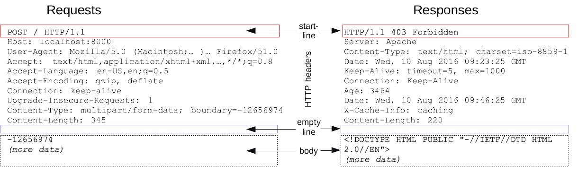

# Протокол HTTP
### Структура HTTP
HTTP запросы и ответы имеют близкую структуру. Они состоят из:
+ Стартовой строки, описывающей запрос, или статус (успех или сбой). Это всегда одна строка.
+ Произвольного набора HTTP заголовков, определяющих запрос или описывающих тело сообщения.
+ Пустой строки, указывающей, что вся мета информация отправлена.
+ Произвольного тела, содержащего пересылаемые с запросом данные (например, содержимое HTML-формы) или отправляемый в ответ документ. Наличие тела и его размер определяется стартовой строкой и заголовками HTTP.



### GET для безопасных действий, POST для опасных
GET-запросы лучше не использовать с приватной информацией, потому что:

+ Они кэшируются. Это значит, что логин и пароль, переданные через GET-запрос, могут остаться в интернете навсегда, например, в веб-архиве или кэше Гугла.
+ Остаются в истории браузера. Чтобы узнать, какие данные отправлялись, достаточно нажать Ctrl+H.
+ Сохраняются в закладках и пересылаются. Можно не обратить внимания и опубликовать в соцсетях или отправить ссылку с приватной информацией в GET-запросе.
+ Сохраняются в логах сервера. Например, нельзя отправлять данные банковских карт через GET-запрос, так как это создаёт риски для пользователей.

Таким образом, любые важные данные — логины, пароли, данные карты, персональные данные — лучше передавать с помощью метода POST, т.к. данные будут в body запроса и они не видны пользователю. Также метод POST поддерживает тип кодирования данных multipart/form-data, что позволяет передавать файлы.

### Методы
#### GET
+ Идемпотентный - сервер должен возвращать идентичные ответы на идентичные GET-запросы (при условии, что ресурс не изменился)
+ Не должен изменять данные на сервере
+ Данные передаются в урле
+ Доступно кеширование через заголовок Cache-control
+ Можно установить срок свежести кеша через max-age

#### POST
+ Предназначен для отправки данных на сервер.
+ Не идемпотентный - повторные запросы вызывают side-effect (создание новых сущностей)
+ Должен иметь тело - данные отправляются в теле
+ Тип тела запроса указывается в заголовке Content-Type.
+ Запрос POST обычно отправляется через форму HTML и приводит к изменению на сервере. 
+ Стандартный тип тела: 
    ```application/x-www-form-urlencoded```: значения кодируются в кортежах с ключом, разделенных символом '&', с '=' между ключом и значением. 
    + Не буквенно-цифровые символы - percent encoded: это причина, по которой этот тип не подходит для использования с двоичными данными

#### PUT
+ Заменяет ресурс если он существует или создает новый если его не было
+ Разница между PUT и POST состоит в том, что PUT является идемпотентным: 
повторное его применение дает тот же результат, что и при первом применении (то есть у метода нет побочных эффектов)
+ Тогда как повторный вызов одного и того же метода POST может иметь такие эффекты, 
как например, оформление одного и того же заказа несколько раз.
+ Пример:
  + До запроса PUT, GET http://localhost/cars:
    ```json
    {"id": 1, "name": "Mazda", "year": 2001}
    ```
  + Содержимое запроса PUT http://localhost/cars/1:
    ```json
    {"year": 2022}
    ```
  + После запроса PUT, GET http://localhost/cars:
    ```json
    {"id": 1, "year": 2022}
    ```
  + Т.е. PUT требует полного дублирования всех полей объекта вместе с измененным: непродублированные поля будут затерты

#### PATCH
+ Частично обновляет ресурс если он существует или возвращает ошибку если нет
+ Пример:
  + До запроса PATCH, GET http://localhost/cars:
    ```json
    {"id": 1, "name": "Mazda", "year": 2001}
    ```
  + Содержимое запроса PATCH http://localhost/cars/1:
    ```json
    {"year": 2022}
    ```
  + После запроса PATCH, GET http://localhost/cars:
    ```json
    {"id": 1, "name": "Mazda", "year": 2022}
    ```
  + Т.е. PATCH предоставляет возможность отправить несколько полей, чтобы произвести слияние

#### HEAD
+ То же что и GET, но не содержит тела ответа
+ Используется, например, для получения метаинформации о GET запросе

#### OPTIONS
+ Используется для описания параметров соединения с целевым ресурсом
+ Ответ на запрос OPTIONS может содержать список допустимых методов для данного ресурса в хедере Allow

#### CONNECT
+ Запускает двустороннюю связь с запрошенным ресурсом. 
+ Метод можно использовать для открытия туннеля

### Коды ответов
+ 1хх - информационные
+ 2хх - успешные
+ 3хх - редиректы
+ 4хх - клиентские ошибки (404 - не найден ресурс, 403 - сервер понял запрос но отказался обработать, 401 - unauthorized)
+ 5хх - серверные ошибки
