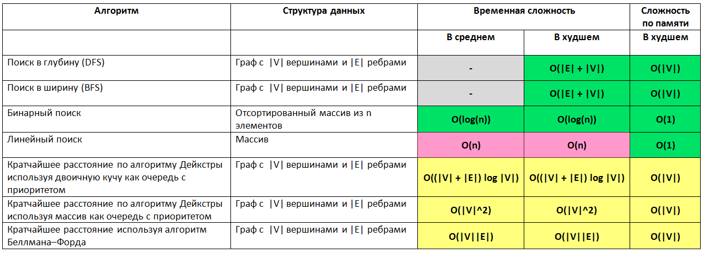

# Алгоритмы

### Категории алгоритмов
#### Массивы
Это структура данных, в которой хранятся элементы одного типа. Его можно представить, как набор пронумерованных ячеек, в каждую из которых можно поместить какие-то данные (один элемент данных в одну ячейку).

+ Хороши для поиска по индексу и вставок/удалений в конце
+ Плохи при вставках/удалениях в начало/середину, т.к. требуется копировать и перемещать часть массива
+ Если массив упорядочен, то для поиска элемента можно использовать двоичный поиск (сложность - O(log(n)), это быстрее линейного у которого O(n)) - брать элемент посередине, и сравнивать его с искомым. Если искомое больше, чем элемент сравнения, то сужаем область поиска до правой части массива, затем опять делим ее пополам и т.д.

#### Связанные списки
Элементы содержат ссылки на предыдущий и следующий и образуют цепочки (пример в Java - LinkedList)
+ Хороши для вставок/удалений в начале и конце
+ Плохи для поиска по индексу и вставок/удалений в середине, т.к. придется обходить элементы в цикле

#### Стек
LIFO (Last In First Out — последним пришёл — первым ушёл). Например, в Java для этого есть интерфейс Deque (push/pop методы) с реализацией через LinkedList.

#### Очередь
FIFO (First In First Out — первым пришёл — первым ушёл). Например, в Java для этого есть интерфейс Queue (add/poll методы) с реализацией через LinkedList.

#### Кучи
Особенности кучи:
+ Куча упорядочена в порядке увеличения, обычно делается через бинарное дерево (минимальный элемент на вершине)
+ Операция получения минимума за O(1)
+ Операция вставки/удаления за O(log n) - за счет heapify, т.к. производится ребалансировка дерева

В Java есть PriorityQueue - сортировка на основе компаратора.
<details><summary><b>Подробнее о PriorityQueue</b></summary>

The **`PriorityQueue`** in Java is implemented as a **binary heap**, which is a complete binary tree where each node satisfies the heap property:

1. **Min-Heap (default):** The key at each node is smaller than or equal to the keys of its children. This ensures the smallest element is always at the root.
2. **Max-Heap (custom comparator):** The key at each node is larger than or equal to the keys of its children.

**Key Features of `PriorityQueue`:**
- **Data Structure:** The underlying implementation uses a resizable array (a `Object[]` array).
- **Heap Operations:** Maintains the heap property using the **heapify** operations when elements are added or removed.
- **Dynamic Resizing:** The array grows when needed, similar to how an `ArrayList` works.
- **Thread Safety:** Not thread-safe; if you need thread safety, use a synchronized wrapper (`Collections.synchronizedCollection`) or `PriorityBlockingQueue`.

**Time Complexities:**
1. **Insertion (`add()` or `offer()`):**
   - Time complexity: **O(log n)**.
   - The element is added to the end of the array and "bubbled up" to maintain the heap property.

2. **Access the Root (`peek()`):**
   - Time complexity: **O(1)**.
   - The root element (smallest or largest) is always at the top of the heap.

3. **Removal (`poll()`):**
   - Time complexity: **O(log n)**.
   - The root is removed, and the last element is moved to the root, followed by a "heapify-down" operation to restore the heap property.

4. **Heap Construction:**
   - Adding `n` elements one at a time has a total time complexity of **O(n log n)**.
   - Bulk construction from an array (e.g., `PriorityQueue(Collection c)`) can be done in **O(n)** using the **heapify** algorithm.

5. **Space Complexity:**
   - Uses **O(n)** space for the array storage.

**Internal Operations:**
- **Heapify-Up (Percolate Up):**
  - When a new element is added, it is compared with its parent, and they are swapped if the heap property is violated.
  - Continues until the element is in the correct position or it becomes the root.

- **Heapify-Down (Percolate Down):**
  - When the root is removed, the last element replaces it, and it is compared with its children.
  - The element is swapped with the smaller child (for a min-heap) or larger child (for a max-heap) until the heap property is restored.

**Performance Insights:**
- **Fast Operations:** `PriorityQueue` is fast for typical priority-based operations but is not suitable for searching or iterating all elements.
- **Use Cases:**
  - Efficient for real-time priority scheduling.
  - Great for scenarios like Dijkstra's algorithm or event simulation where priority ordering is critical.

</details>

#### Деревья

Структуры состоящие из узлов (вершин), которые соединяются между собой ребрами. Верхний узел - корень. Позволяют хранить элементы, которые можно сравнивать по какому-либо ключу, чтобы правильно распределить их по узлам


+ Несбалансированные деревья - то есть большинство узлов сосредоточено с одной или с другой стороны корня
    + В несбалансированном дереве теряется возможность быстрого поиска (а также вставки или удаления).
+ Двоичные деревья - каждый узел дерева имеет не более двух потомков
    + Двоичное дерево сочетает в себе преимущества двух других структур: упорядоченного массива и связанного списка
    + Наибольшая эффективность достигается при вставке случайных значений. Если вставляемые значения уже упорядочены, двоичное дерево становится несбалансированным
    + Сложность всех операций в лучшем случае (дерево сбалансировано) - O(log(n))
    + Сложность всех операций в худшем случае (дерево в виде одной ветви) - O(n)
+ Красно-черные деревья - в отличии от двоичных состоит в том, что они всегда сбалансированы. При вставке/удалении структура такого дерева, меняется (балансируется)
    + Красно-черные правила:
        1. Каждый узел окрашен в красный или черный цвет.
        2. Корень всегда окрашен в черный цвет.
        3. Если узел красный, то его потомки должны быть черными (хотя обратное не всегда истинно).
        4. Все пути от корня к узлу или пустому потомку должны содержать одинаковое количество черных узлов.
    + Сложность всех операций не хуже O(log(n))
+ Деревья 2-3-4 - многопутевые деревья, у которых каждый узел может иметь до четырех потомков и трех элементов данных.
    + 

#### Хеш-таблицы
Суть в хранении данных в виде пар ключ-значение, где ключ - уникален. Позволяет быстро находить нужное значение по ключу, за O(1).

В Java есть готовая реализация в стандартной библиотеке - HashMap ([см. java.md](java.md#java-collections-api))

#### Графы
В Java нет готовой реализации. 

Примеры как можно реализовать:

**На основе матрицы смежности**. Требует больших затрат памяти, но быстрее доступ. Хорош для маленьких графов с фиксированным числом узлов и большим количеством ребер.
<details>
<summary>Пример 1 (в данном примере узлы типа int)</summary>
    
```java
public class GraphAdjMatrix {
    private int[][] adjacencyMatrix;
    private int numVertices;

    // Constructor
    public GraphAdjMatrix(int numVertices) {
        this.numVertices = numVertices;
        adjacencyMatrix = new int[numVertices][numVertices];
    }

    // Add an edge (directed)
    public void addEdge(int source, int destination) {
        adjacencyMatrix[source][destination] = 1;
    }

    // Add an edge (undirected)
    public void addUndirectedEdge(int vertex1, int vertex2) {
        adjacencyMatrix[vertex1][vertex2] = 1;
        adjacencyMatrix[vertex2][vertex1] = 1;
    }

    // Print the graph
    public void printGraph() {
        for (int i = 0; i < numVertices; i++) {
            for (int j = 0; j < numVertices; j++) {
                System.out.print(adjacencyMatrix[i][j] + " ");
            }
            System.out.println();
        }
    }

    public static void main(String[] args) {
        GraphAdjMatrix graph = new GraphAdjMatrix(4);
        graph.addEdge(0, 1);
        graph.addEdge(1, 2);
        graph.addUndirectedEdge(2, 3);

        graph.printGraph();
    }
}
```
</details>

**На основе списка смежности**. Более практичный, может расширяться, использует меньше памяти. Хорош для больших расширяющихся графов с меньшим ребер, но большим числом узлов
<details>
<summary>Пример 2 (в данном примере узлы дженерики могут быть любого типа)</summary>

```java
import java.util.*;

public class Graph<T> { 
    private Map<T, List<T>> adjacencyList;
     // Constructor
    public Graph(){ adjacencyList = new HashMap<>(); }

    // Add a vertex
    public void addVertex(T vertex){ adjacencyList.putIfAbsent(vertex, new ArrayList<>()); }
    
    // Add an edge
    public void addEdge(T source, T destination) {
        adjacencyList.putIfAbsent(source, new ArrayList<>());
        adjacencyList.get(source).add(destination);
    }
    
    // Add an undirected edge
    public void addUndirectedEdge(T vertex1, T vertex2) {
        addEdge(vertex1, vertex2);
        addEdge(vertex2, vertex1);
    }
    
    // Print the graph
    public void printGraph() {
        for (var entry : adjacencyList.entrySet()) {
            System.out.println(entry.getKey() + " -> " + entry.getValue());
        }
    }
    
    public static void main(String[] args) {
        Graph<String> graph = new Graph<>();
        graph.addVertex("A");
        graph.addVertex("B");
        graph.addEdge("A", "B");
        graph.addUndirectedEdge("B", "C");
    
        graph.printGraph();
    }
}
```
</details>

**Взвешенные графы** - отличаются наличием весов у ребер

#### Пирамиды

---

## Оценка сложности алгоритмов O(f(n))

### Что такое O(f(n))
+ O(1) - затраты времени не зависят от размера задачи
+ O(log(n)) - при увеличении размера задачи вдвое, затраты времени меняются на постоянную величину
    + log<sub>a</sub>(n) = x, где a - основание, n - результат возведения в степень, x - степень основания
        + Бывают ln (ln(n)= log<sub>e</sub>(n), e = 2,71828...) и lg (lg(n)= log<sub>10</sub>(n))
    + Основание нам не важно, главное порядок изменения сложности при увеличении объема входных данных (n)
+ O(n) - при увеличении размера задачи в 2 раза, затраты времени возрастут тоже в два раза
+ O(n<sup>2</sup>) - при увеличении размера задачи в 2 раза, затраты времени возрастут примерно в четыре раза
+ O(n\*log(n)) - при увеличении задачи в два раза, затраты времени возрастут в два раза, плюс некоторая прибавка, относительный вклад которой уменьшается с ростом n. При малых n может вносить очень большой вклад. O(n*log(n)) начинает расти как квадрат при малых n, но потом рост замедляется почти до линейного
+ 

### Примеры временной сложности O(f(n))
+ O(n) — линейная сложность

Такой сложностью обладает, например, алгоритм поиска наибольшего элемента в не отсортированном массиве. Нам придётся пройтись по всем n элементам массива, чтобы понять, какой из них максимальный.

+ O(log n) — логарифмическая сложность

Простейший пример — бинарный поиск. Если массив отсортирован, мы можем проверить, есть ли в нём какое-то конкретное значение, методом деления пополам. Проверим средний элемент, если он больше искомого, то отбросим вторую половину массива — там его точно нет. Если же меньше, то наоборот — отбросим начальную половину. И так будем продолжать делить пополам, в итоге проверим log n элементов.

+ O(n<sup>2</sup>) — квадратичная сложность

Такую сложность обычно имеют 2 вложенных цикла, например, алгоритм сортировки вставками. В канонической реализации он представляет из себя два вложенных цикла: один, чтобы проходить по всему массиву, а второй, чтобы находить место очередному элементу в уже отсортированной части. Таким образом, количество операций будет зависеть от размера массива как n * n, т. е. n<sup>2</sup>.

+ O(2<sup>n</sup>) - экспоненциальная сложность

Каждый дополнительный элемент увеличивает количество операций в два раза. Например, рекурсивный алгоритм Фибоначи.

+ O(n!) - факториальная сложность

Например, алгоритм перестановок. Количество перестановок для n элементов составляет n!.

### Сложности Java Collections API
+ ArrayList
    + лучшее O(1) - чтения из любого места (прямой доступ к памяти через массив) и вставка в конец (однако когда внутренний массив заполнится, то вставка в конец тоже приведет к копированию всего массива - O(n));
    + худшее O(n) - вставка - будет тем хуже чем ближе к началу, т.к. придется копировать больше элементов. Например если вставлять в середину то будет O(n/2)
	
+ LinkedList
    + лучшее O(1) - все операции с первым/последним элементом, а также вставка в середину если есть доступ к нужной ноде, например в Java через listIterator.add();
    + худшее O(n) - все операции с элементом в середине, т.к. придется делать обход в цикле	
    
+ HashMap/HashSet
    + лучшее O(1) - все операции, если коллизий нет и вставка даже если коллизий много (т.к. вставляется в начало или конец корзины - связного списка);
    + худшее O(log(n)) - чтение, если у всех элементов одинаковый hashCode - начиная с Java 8 после достижения определенного порога размера корзины вместо связанных списков используются сбалансированные деревья (до этого было O(n))
  	
+ LinkedHashMap/LinkedHashSet
    + O(1)/O(log(n)) - так же как и у HashMap, но чуть больше памяти на хранение связей;
        
+ TreeMap/TreeSet
    + гарантировано не хуже O(log(n)) - все операции, т.к. красно-черное дерево гарантирует такую сложность в худшем случае

#### Краткая таблица сложностей популярных структур данных и алгоритмов

| **Type**            | **Algorithm/Data Structure** | **Time Complexity**                             | **Space Complexity** | **Notes**                                                                      |
|---------------------|------------------------------|-------------------------------------------------|----------------------|--------------------------------------------------------------------------------|
| **Sorting**         | Bubble Sort                  | O(n<sup>2</sup>) (avg, worst) / O(n) (best)     | O(1)                 | Inefficient, only suitable for small datasets.                                 |
|                     | Merge Sort                   | O(n log n)                                      | O(n)                 | Stable, requires extra space for merging.                                      |
|                     | Quick Sort                   | O(n log n) (avg) / O(n<sup>2</sup>) (worst)     | O(n)                 | In-place but not stable. Worst case occurs with poor pivot selection.          |
| **Searching**       | Linear Search                | O(n)                                            | O(1)                 | Simple, works on unsorted data.                                                |
|                     | Binary Search                | O(log n)                                        | O(1)                 | Only works on sorted data.                                                     |
| **Data Structures** | Array                        | Access: O(1), Search: O(n), Insert/Delete: O(n) | O(n)                 | Fixed-size or dynamic (e.g., ArrayList).                                       |
|                     | Linked List                  | Access: O(n), Search: O(n), Insert/Delete: O(1) | O(n)                 | Insert/Delete is O(1) if you have a reference to the node, by index it's O(n). |
|                     | Stack (Array-based)          | Push/Pop: O(1)                                  | O(n)                 | LIFO structure.                                                                |
|                     | Queue                        | Enqueue/Dequeue: O(1)                           | O(n)                 | FIFO structure.                                                                |
|                     | Binary Search Tree (BST)     | Search/Insert/Delete: O(h)                      | O(n)                 | h is tree height. Balanced trees like AVL/Red-Black ensure h = O(log n).       |
|                     | Hash Table                   | Insert/Search/Delete: O(1) (avg) / O(n) (worst) | O(n)                 | Worst case occurs with poor hash functions.                                    |
|                     | Heap (Min/Max)               | Insert/Delete: O(log n), Access Min/Max: O(1)   | O(n)                 | Used in priority queues.                                                       |

#### Подробнее о сложностях популярных алгоритмов

**Легенда**


**Поиск**



**Сортировка**


**Структуры данных**


**Кучи**


**Представление графов**

Пусть дан граф с |V| вершинами и |E| ребрами, тогда


---

### Алгоритмы сортировки
+ [Пузырьковая сортировка](../_java_/src/main/java/examples/algorithms/BubbleSort.java)
+ [Быстрая сортировка](../_java_/src/main/java/examples/algorithms/QuickSort.java)
+ [Сортировка слиянием](../_java_/src/main/java/examples/algorithms/MergeSort.java)
+ [Сортировка вставками](../_java_/src/main/java/examples/algorithms/InsertionSort.java)

---

### Рекурсия
+ [Рекурсивное вычисление факториала и числа фибоначчи](../_java_/src/main/java/examples/algorithms/RecursionTest.java)

---

## Шифрование

### Симметричное

+ Используют всего один криптографический ключ. 
+ Ключ — это цифровая последовательность, с помощью которой можно зашифровать сообщение так, что расшифровать его обратно можно будет только с помощью того же ключа. 
+ Получив зашифрованное сообщение, злоумышленник теоретически сможет подобрать к нему ключ и расшифровать его, но на подбор ключа уходит тем больше времени, чем длиннее ключ, поэтому длину ключа надо подобрать такую, чтобы ни за какое разумное время взломать его было бы невозможно. 
+ Симметричный ключ в TLS-соединении имеет длину 128, 192 или 256 бит. 
+ Для его взлома, даже самым мощным современным компьютерам потребуются миллиарды лет.
+ Симметричное шифрование проще и быстрее, чем асимметричное

### Ассиметричное

+ Используется пара ключей. 
+ Сообщение, зашифрованное первым ключом, может быть расшифровано только с помощью второго ключа и наоборот - зашифрованное вторым, расшифровывается только первым. 
+ Один ключ публикуется в открытом доступе и спокойно пересылается по открытым каналам, он считается публичным/открытым.
+ Второй ключ — находится в приватном хранилище и неизвестен никому, кроме его владельца. Его называют приватным/закрытым ключом.
+ Если вам известен открытый ключ сервера, то вы можете зашифровать им своё сообщение, и никто, кроме сервера, не сможет его прочитать.
+ Также сервер может зашифровать сообщение приватным ключом и отправить его клиенту. Тогда клиент сможет расшифровать сообщение и верифицировать что сообщение именно от "правильного" сервера.
