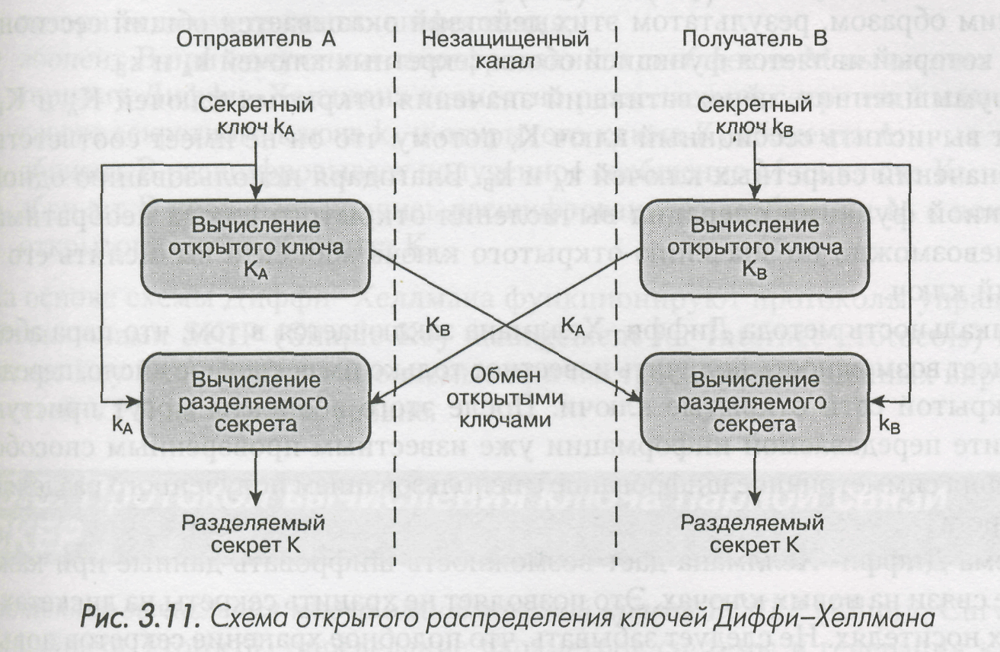

# Расскажи как компании Telegram удалось достичь приватности так, что ни один сотрудник не может посмотреть сообщения пользователей?

Компания Telegram добилась того уровня приватности, при котором сотрудники не имеют доступа к пользовательским сообщениям благодаря архитектурному выбору и технологиям шифрования: для обычных чатов используется облачное шифрование, а для секретных чатов применяется сквозное шифрование (end-to-end), при котором сообщения доступны только участникам переписки и не сохраняются на серверах Telegram.[^1_3][^1_5][^1_9]

### Архитектура Telegram

- Обычные чаты Telegram хранятся в облаке, но зашифрованы с помощью ключей, которыми сотрудники не могут распоряжаться для индивидуального доступа к сообщениям. Однако теоретически администрация сервиса может восстановить переписку при наличии запроса от правоохранительных органов.[^1_5]
- Секретные чаты реализованы как end-to-end: ключи шифрования создает и хранит только устройство участника чата. Сами сообщения не проходят через сервер Telegram и не остаются в облаке компании, а хранятся исключительно на устройствах пользователей, что не дает сотрудникам технической возможности для просмотра содержимого.[^1_9][^1_3][^1_5]

### Сквозное шифрование

- Сквозное шифрование — основа секретных чатов Telegram. Оно гарантирует, что сообщение может быть расшифровано только отправителем и получателем; третья сторона, включая телеграмовских сотрудников, доступа не имеет.[^1_3][^1_9]
- Ключи для шифрования и дешифрования генерируются на устройствах собеседников, а не на стороне сервера. Сервер Telegram лишь пересылает зашифрованные данные, не обладая инструментами для их расшифровки.[^1_9][^1_3]
- Секретные чаты не синхронизируются между устройствами, не поддерживаются для групп и в них невозможно облачное резервное копирование переписки, что минимизирует точки потенциальной утечки информации.[^1_3]

### Ограничения доступа

- Даже при физическом доступе к серверу сотрудники Telegram не могут прочитать сообщения секретных чатов, поскольку у них нет соответствующих криптографических ключей.
- Основная уязвимость — непосредственно устройства пользователей: если мошенник получит доступ к вашему телефону или ПК, архитектура Telegram не сможет защитить сообщения, поскольку они хранятся уже расшифрованными локально.[^1_5][^1_3]

Telegram достиг такого уровня приватности благодаря технической реализации: сообщения обычных чатов зашифрованы в облаке, а сообщения секретных — полностью изолированы от серверов и сотрудников за счет сквозного шифрования.
[^1_1][^1_10][^1_2][^1_4][^1_6][^1_7][^1_8]

⁂

[^1_1]: https://baj.media/be/karysnae/kak-zablokirovat-soobshenia-ot-neznakomyh-v-telegram/

[^1_2]: https://www.securitylab.ru/analytics/558145.php

[^1_3]: https://skyeng.ru/it-industry/it/sekrety-telegram-skryvayem-perepiski-legko/

[^1_4]: https://www.kaspersky.ru/blog/telegram-account-hacked/38711/

[^1_5]: https://tass.ru/obschestvo/21727755

[^1_6]: https://pikabu.ru/story/konfidentsialnost_polzovateley_telegram_snova_narushena_predstaviteli_messendzhera_trebuyut_ne_raskryivat_podrobnostey_8511495

[^1_7]: https://vc.ru/niksolovov/1262123-vidno-li-v-telegrame-tonkosti-privatnosti-i-chto-mogut-uvidet-drugie

[^1_8]: https://www.securitylab.ru/analytics/551226.php

[^1_9]: https://1ps.ru/blog/smm-i-smo/2021/sekretnyij-chat-v-telegram-dlya-biznesa-kak-ispolzovat-neobyichnuyu-funkcziyu-messendzhera/

[^1_10]: https://t-j.ru/udalim-telegram/

---

# расскажи подробнее о том как генерируются ключи в секретных чатах, как они передаются между юзерами и как ими шифруются сообщения

В секретных чатах Telegram ключи шифрования генерируются и передаются с использованием протокола Диффи-Хеллмана (Diffie-Hellman), который обеспечивает безопасный обмен ключами между двумя участниками без передачи секретной информации через серверы.

### Генерация ключей и обмен

- При создании секретного чата каждое устройство (пользователь А и пользователь Б) генерирует свой закрытый ключ: например, пользователь А генерирует ключ **a**, пользователь Б — ключ **b**.
- Оба пользователя получают параметры протокола Диффи-Хеллмана: большое простое число `p` и основание `g`, предоставляемые сервером Telegram для создания надежной криптографической базы.
- Пользователь А вычисляет открытый ключ `g^a mod p` и отправляет его пользователю Б.
- Пользователь Б, в свою очередь, вычисляет открытый ключ `g^b mod p` и отправляет его пользователю А.
- После обмена открытыми ключами оба пользователя локально вычисляют общий секретный ключ `K = (g^a)^b mod p = (g^b)^a mod p`, который становится основой для шифрования сообщений.
- Важный момент: закрытые ключи **a** и **b** никогда не покидают устройств пользователей, что обеспечивает высокую степень приватности и невозможность перехвата ключа посредниками, включая серверы Telegram.[^2_1][^2_2][^2_6][^2_7]

### Шифрование сообщений

- Общий секретный ключ `K` используется для симметричного шифрования сообщений с помощью алгоритма AES-256 в режиме IGE (Infinite Garble Extension), который предотвращает структурные уязвимости и обеспечивает защиту целостности и конфиденциальности.
- Каждое сообщение шифруется этим ключом на устройстве отправителя и расшифровывается на устройстве получателя, без возможности расшифровки на сервере.
- Помимо шифрования, Telegram применяет проверку целостности и метки времени, чтобы защититься от атак повторного воспроизведения и обеспечить правильный порядок сообщений.[^2_6][^2_1]

### Проверка безопасности

- Для подтверждения отсутствия посредников в чатах Telegram позволяет пользователям сравнивать визуальный отпечаток (хэш) общего ключа. Если отпечатки совпадают, это гарантирует, что канал защищён и не прослушивается.
- Этот отпечаток — это 32-байтное значение, показываемое пользователям в интерфейсе секретного чата для визуального сравнения и сверки вживую.[^2_2][^2_7][^2_10]

Таким образом, весь процесс шифрования в секретных чатах Telegram построен на протоколе Диффи-Хеллмана для безопасного обмена ключами и симметричном AES-256 для защищённой передачи сообщений. Закрытые ключи хранятся только на устройствах участников, что исключает возможность доступа сотрудников или серверов Telegram к содержимому.[^2_7][^2_1][^2_2][^2_6]
[^2_3][^2_4][^2_5][^2_8][^2_9]

⁂

[^2_1]: https://ru.wikipedia.org/wiki/MTProto

[^2_2]: https://ru.stackoverflow.com/questions/678220/Алгоритм-генерации-секретного-ключа-в-чата-Телеграмм

[^2_3]: https://github.com/wrwrabbit/Partisan-Telegram-Android/wiki/Секретные-группы

[^2_4]: https://rookee.ru/blog/sekretnyy-chat-v-telegram-chto-eto-takoe-i-kak-ego-sozdat/

[^2_5]: https://1ps.ru/blog/smm-i-smo/2021/sekretnyij-chat-v-telegram-dlya-biznesa-kak-ispolzovat-neobyichnuyu-funkcziyu-messendzhera/

[^2_6]: https://te-st.org/2018/05/18/tecnhnology-of-encryption/

[^2_7]: https://www.topnomer.ru/blog/sekretnye-chaty-telegram-i-drugie-poleznye-fishki-messendzhera.html

[^2_8]: https://www.calltouch.ru/blog/chto-takoe-sekretnyj-chat-v-telegrame-instrukcziya-po-sozdaniyu/

[^2_9]: https://habr.com/ru/articles/419551/

[^2_10]: https://media.halvacard.ru/tech/sekretnyi-chat-v-telegrame-kak-sozdat-kak-udalit-i-zachem-on-nuzhen

---

# Алгоритм Диффи-Хеллмана

Протокол Диффи-Хеллмана — это криптографический метод, который позволяет двум сторонам безопасно создать общий секретный ключ шифрования через незащищённый канал связи. Главная идея в том, что стороны обмениваются открытыми данными, из которых каждая вычисляет один и тот же общий секрет, при этом сам секрет не передаётся напрямую и не может быть получен злоумышленником даже при прослушивании канала.

Как работает протокол:

1. Обе стороны договариваются об общих публичных параметрах — большом простом числе `p` и основании `g`, которые могут свободно передаваться по сети.
2. Каждая сторона генерирует свой закрытый (приватный) ключ — случайное число, которое хранится в секрете.
3. С помощью публичных параметров и своего закрытого ключа каждая сторона вычисляет открытый ключ, который отправляется другой стороне.
4. Получив открытый ключ другой стороны, каждая сторона использует его вместе со своим закрытым ключом и публичными параметрами, чтобы вычислить одинаковый общий секретный ключ.

Пример: если пользователь А с закрытым ключом `a` и пользователь Б с закрытым ключом `b` обмениваются открытыми ключами `g^a mod p` и `g^b mod p`, то обе стороны вычисляют общий ключ `K = (g^b)^a mod p = (g^a)^b mod p` одинаково. По этой формуле легко вычислить значение туда, но крайне сложно — обратно, что обеспечивает безопасность.

Полученный общий секретный ключ можно использовать для симметричного шифрования сообщений, например, алгоритмом AES. Протокол Диффи-Хеллмана используется во многих системах шифрования и коммуникации, включая секретные чаты Telegram, для безопасного обмена ключами без риска, что ключ перехватят посредники.[^3_1][^3_2][^3_4][^3_5][^3_6]
[^3_10][^3_3][^3_7][^3_8][^3_9]

⁂

[^3_1]: https://encyclopedia.kaspersky.ru/glossary/diffie-hellman-protocol-dh/

[^3_2]: https://hostpro.by/blog/kak-algoritm-diffi-khellmana-obespechivaet-bezopasnost-dannykh

[^3_3]: https://alfa-brain.com/blog/ddee7496-3739-48ba-9115-861e314dd7ba

[^3_4]: https://dzen.ru/a/ZSrls8CVuEEaysdr

[^3_5]: https://ru.wikipedia.org/wiki/Протокол_%D0%94%D0%B8%D1%84%D1%84%D0%B8_%E2%80%94_%D0%A5%D0%B5%D0%BB%D0%BB%D0%BC%D0%B0%D0%BD%D0%B0

[^3_6]: https://habr.com/ru/articles/726324/

[^3_7]: https://tproger.ru/translations/diffie-hellman-key-exchange-explained

[^3_8]: http://kaf403.rloc.ru/POVS/Crypto/DiffieHellman.html

[^3_9]: https://www.youtube.com/watch?v=vFjq9pID4-E

[^3_10]: https://crypto-kantiana.com/elena.kirshanova/teaching/infosec_2022/Lecture4.pdf

---

# Поясни шаги обмена ключами на примере с числами p, g, a, b

Рассмотрим обмен ключами по протоколу Диффи-Хеллмана на конкретном примере с числами:

Пусть:

- `p = 23` — большое простое число (модуль),
- `g = 5` — основание (порождающий элемент),
- `a = 6` — закрытый ключ пользователя А (Алисы),
- `b = 15` — закрытый ключ пользователя Б (Боба).

### Шаги обмена:

1. Алиса вычисляет открытый ключ:
   - `A = g^a mod p = 5^6 mod 23 = 15625 mod 23 = 8`
1. Алиса посылает число `8` Бобу.
1. Боб вычисляет открытый ключ:
   - `B = g^b mod p = 5^15 mod 23 = 19`
1. Боб посылает число `19` Алисе.
1. Теперь Алиса рассчитывает общий секретный ключ:
   - `K = B^a mod p = 19^6 mod 23`.
   - Вычисляем остаток `19^6 mod 23 = 2`
1. Боб рассчитывает общий секретный ключ:
   - `K = A^b mod p = 8^15 mod 23`.
   - Вычисляем остаток `8^15 mod 23` — также получаем 2.

Оба получили одинаковый общий секретный ключ `K = 2 ` (симметричный ключ шифрования), который могут отправитель будет использовать для шифрования, а получатель для дешифрования сообщений.

Важно, что атакующему, который знает `p, g, A, B`, без знания закрытых ключей `a, b` чрезвычайно сложно вычислить общий секретный ключ из-за трудности вычисления дискретного логарифма.[^4_1][^4_3]
[^4_10][^4_2][^4_4][^4_5][^4_6][^4_7][^4_8][^4_9]

⁂

[^4_1]: http://www.williamspublishing.com/PDF/5-8459-0847-7/part.pdf

[^4_2]: https://ru.wikipedia.org/wiki/Oakley_%D0%BF%D1%80%D0%BE%D1%82%D0%BE%D0%BA%D0%BE%D0%BB

[^4_3]: https://www.securitylab.ru/analytics/478912.php

[^4_4]: https://cph.phys.spbu.ru/documents/First/infoPMF/CryptoMy2.pdf

[^4_5]: https://www.reddit.com/r/explainlikeimfive/comments/nqxpzs/eli5_how_exactly_does_the_math_of_rsa_encryption/

[^4_6]: https://studfile.net/preview/16378196/page:10/

[^4_7]: https://apmi.bsu.by/assets/files/std/belt-spec27.pdf

[^4_8]: https://portal.sibadi.org/pluginfile.php/126471/mod_folder/content/0/%D0%A0%D1%8F%D0%B1%D0%BA%D0%BE%20%D0%9A%D1%80%D0%B8%D0%BF%D1%82%D0%BE%D0%B3%D1%80%D0%B0%D1%84%D0%B8%D1%87%D0%B5%D1%81%D0%BA%D0%B8%D0%B5%20%D0%BC%D0%B5%D1%82%D0%BE%D0%B4%D1%8B.pdf?forcedownload=1

[^4_9]: https://old.mccme.ru/free-books/izdano/2013/crypto-2013.pdf

[^4_10]: https://habr.com/ru/articles/523282/

---

# В реальности ключи действительно являются числами? Мне всегда казалось что это строки из букв и цифр

Действительно, в реальности криптографические ключи — это числовые значения, обычно очень большие числа, представленные в двоичном виде. Например, в протоколе Диффи-Хеллмана ключи — это целые числа (например, 2048-битные) — с которыми производят математические операции по модулю большого простого числа.

То, что вы видите как «хэши из букв и цифр», на самом деле — это текстовое, обычно шестнадцатеричное или base64 представление этих чисел или байтов. Такое текстовое представление удобно для хранения, передачи и визуализации, но по сути это просто кодировка двоичных данных.

В Telegram для криптографии используются числовые ключи, а для удобства и совместимости они кодируются в строки, состоящие из букв и цифр. Эти строки — ключи в удобном виде, производные от больших чисел, с которыми работают протоколы шифрования. Поэтому ключи — это не «хэши», это именно числовые значения, но часто отображаемые в формате, похожем на «случайные» сочетания букв и цифр
