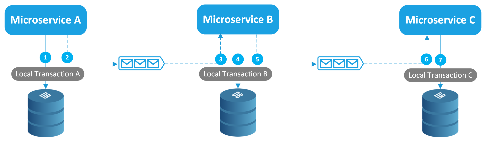
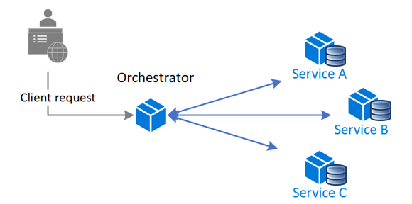

# High load

### Основные подходы
+ Масштабирование (модульные монолиты, микросервисы)
+ Микросервисы должны быть stateless, т.к. stateful приложение масштабировать очень сложно
+ Обмен сообщениями между микросервисами обычно организуют через брокеры сообщений (Rabbit MQ, [Kafka](kafka.md) и др.)
+ Распределенные транзакции между микросервисами с разными БД обеспечиваются такими паттернами как, например, [Сага](high_load.md#Сага)
+ Репликации и шардирование БД, но лучше чтобы у каждого сервиса была своя БД
+ Переход на реактивщину - позволит обеспечить работу сервиса при большом количестве запросов (используется асинхронный и неблокирующий код) - см. [Reactivity](concurrency.md#Реактивность)

### Паттерны микросервисов

#### Сага
+ Этот паттерн предназначен для управления распределенными транзакциями в микросервисной архитектуре.
+ При использовании паттерна каждая локальная транзакция обновляет данные в хранилище в рамках одного микросервиса и публикует событие или сообщение, которые, в свою очередь, запускают следующую локальную транзакцию и так далее.
+ Если локальная транзакция завершается с ошибкой, выполняется серия компенсирующих транзакций, которые отменяют изменения предыдущих транзакций.

Для координации транзакций существует два основных способа:
+ Хореография. Децентрализованная координация, при которой каждый микросервис прослушивает события/сообщения другого микросервиса и решает, следует предпринять действие или нет.

+ Оркестровка. Централизованная координация, при которой отдельный компонент (оркестратор) сообщает микросервисам, какое действие необходимо выполнить далее.

