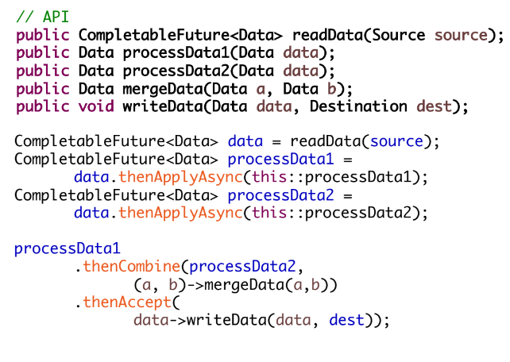
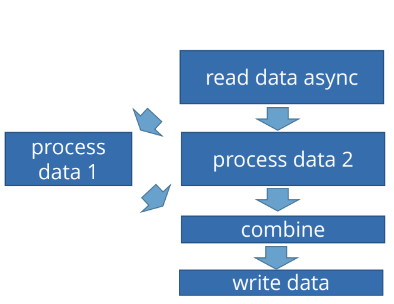

# Java
## JVM

### JVM компоненты
+ Classloader - загрузка классов из classpath
+ Garbage Collector - автоматическое управление памятью - heap (см. ниже)
+ JIT-компилятор - динамическая компиляция байт-кода в машинный код
+ Компоненты управления потоками
+ и др.

### Java memory model (JMM)
Подробнее: [habr](https://habr.com/ru/articles/685518/)

Ключевые понятия:
+ Memory Ordering - порядок выполнения инструкций может быть изменен, но JMM гарантирует порядок внутри потока и между потоками если они правильно синхронизированы
+ Happens-Before Relationship - набор гарантий порядка выполнения инструкций, подробнее ниже
+ Atomicity - атомарность операций с примитивами (кроме long/double), volatile (long/double), synchronized блоков
+ Data Races - нет гарантий корректного чтения данных если несколько потоков одновременно работают (и хотя бы один из них пишет) с одним и тем же объектом без синхронизации

<details>
<summary><b>Подробнее</b></summary>

---
The **Java Memory Model (JMM)** is a part of the Java Language Specification that defines how threads interact through memory and what behaviors are guaranteed when accessing shared variables. Understanding JMM principles is critical for writing correct and efficient concurrent code. Here are the key principles:

#### Memory Ordering
The compiler or CPU may reorder instructions for optimization, but JMM ensures that:

- Within a single thread, results appear consistent with the program order.
- Across threads, synchronization primitives like `volatile` and `synchronized` prevent problematic reorderings.

#### Happens-Before Relationship
The **happens-before** relationship is a fundamental concept in the JMM, defining the visibility of changes between threads. If one action `A` happens-before another action `B`, then:

1. `A`'s result is visible to `B`.
2. `A` is guaranteed to occur before `B`.

Key Happens-Before Rules:
1. **Program Order Rule**: In a single thread, actions appear to execute in program order.
2. **Monitor Lock Rule**: An unlock on a monitor happens-before every subsequent lock on the same monitor.
3. **Volatile Variable Rule**: A write to a `volatile` variable happens-before every subsequent read of the same variable.
4. **Thread Start Rule**: A call to `Thread.start()` on a thread happens-before any actions in the started thread.
5. **Thread Join Rule**: A call to `Thread.join()` happens-before the thread's termination and its results are visible to the thread calling `join`.
6. **Transitivity Rule**: if `A` happens-before `B` and `B` happens-before `C`, then `A` happens-before `C`.

#### Atomicity

**Atomicity** in the JMM refers to operations that are performed as a single, indivisible unit of execution. These operations are guaranteed to either complete entirely or have no visible effect, even in the presence of concurrent threads.

Key Points About Atomicity:
1. **Primitive Operations:**
   - Reads and writes to reference variables are atomic.
   - Reads and writes to variables of primitives (except `long` and `double`) are atomic.
   - Reads and writes to `volatile` variables of types `long` and `double` are also atomic.

2. **Compound Operations:**
   - Compound actions (e.g., `x++`, `x += y`) are **not atomic**, as they involve multiple steps (read-modify-write).

3. **Synchronization and Atomicity:**
   - To ensure atomicity for compound actions, use synchronization constructs like `synchronized` blocks or locks.

4. **Atomic Classes:**
   - Java provides classes in the `java.util.concurrent.atomic` package (e.g., `AtomicInteger`, `AtomicReference`) to perform atomic operations without explicit synchronization.

Example of Non-Atomic Behavior:
```java
int counter = 0;
counter++; // Not atomic: internally, it does a read-modify-write.
```
If multiple threads execute `counter++`, the final value might be incorrect because threads can read the same initial value before the write step occurs.

#### Data Race
A **data race** occurs when two or more threads access a shared variable concurrently, and at least one access is a write, without proper synchronization. The JMM guarantees correctness only in race-free programs.

#### Final Fields
The JMM provides special guarantees for `final` fields:

- Immutable Guarantees: A properly constructed object (i.e., no reference to it "leaks" before construction finishes) guarantees visibility of `final` fields to other threads without synchronization.
- Prevention of Reordering: The JMM prevents reordering of writes to final fields and the object reference during construction.

---
</details>

### JVM memory structure
+ Metaspace (до Java 8 это был PermGen, который хранился в heap) - информация о классах, интерфейсах, методах, типах полей, статические переменные и т.д.
+ Heap - хранятся объекты (а также их так называемый header в котором находится lock-монитор), чистится GC, общий на все приложение. Состоит из:
  + Young Generation — область для новых объектов, состоит из Eden и двух Survivor-областей (S0, S1).
  + Old Generation (Tenured) — хранит «долгоживущие» объекты, которые пережили несколько сборок мусора в Young.
+ Stack - хранятся локальные примитивы в методах и ссылки на объекты, чистится при завершении метода, потокобезопасен (отдельный стек на каждый поток)
+ Program Counter (PC) Register - небольшая зона, хранящая инструкции о том что сейчас JVM должна выполнить (отдельная у каждого потока, не используется для нативных методов) 
+ Native Method Stack - память для нативных методов (например, написанных на C или C++)

<details>
<summary><b>Подробнее</b></summary>

---
**1. Metaspace (Method Area)**
- **Definition**: A shared memory area that stores class-level data.
- **Key Contents**:
  - Class Metadata: Information about classes, interfaces, methods, and fields.
  - Runtime Constant Pool: Stores constant values (e.g., literals, references to methods or fields).
  - Static Variables: Shared among all instances of a class.
  - Method Code: Bytecode of methods defined in a class.
- **Characteristics**:
  - Shared among all threads.
  - Created at JVM startup.
  - May expand dynamically but typically has a fixed upper limit.

**2. Heap**
- **Definition**: The primary memory area for allocating objects and JRE classes.
- **Key Contents**:
  - **Objects**: Instances of classes.
  - **Instance Variables**: Data specific to each object.
  - **Arrays**: Both primitive and object arrays.
- **Division**:
  - **Young Generation**:
    - **Eden Space**: New objects are initially allocated here.
    - **Survivor Spaces (S0 and S1)**: Objects that survive garbage collection in the Eden Space are moved here.
  - **Old Generation (Tenured)**: Long-lived objects that survived multiple garbage collection cycles in the Young Generation.
- **Garbage Collection**:
  - Young Generation: Minor GC.
  - Old Generation: Major/Full GC.
- **Characteristics**:
  - Shared among all threads.
  - Dynamically managed by garbage collection.

**3. Stack**
- **Definition**: A thread-private memory area that stores method-specific data.
- **Key Contents**:
  - **Stack Frames**: Each method call creates a new stack frame, which includes:
    - **Local Variables**: Primitive types and references to objects.
    - **Operand Stack**: Temporary variables for bytecode execution.
    - **Frame Data**: Includes method return address and exception handling information.
- **Characteristics**:
  - Each thread has its own stack.
  - Memory is allocated and deallocated in a Last-In-First-Out (LIFO) manner.
  - No garbage collection in the stack (automatically managed).

**4. Program Counter (PC) Register**
- **Definition**: A small memory area that holds the address of the next JVM instruction to be executed.
- **Key Contents**:
  - The address of the current instruction in the method being executed.
- **Characteristics**:
  - Each thread has its own PC register.
  - For native methods, the value is undefined.

**5. Native Method Stack**
- **Definition**: A thread-private memory area for executing native (non-Java) code, often written in C or C++.
- **Key Contents**:
  - Data and instructions for native method execution.
- **Characteristics**:
  - Each thread has its own native method stack.
  - Used when Java interacts with underlying system resources or libraries.

---
</details>

Heap dump - снепшот памяти приложения в JVM:
+ Автоматический дамп в файл при OutOfMemoryError: `java -XX:+HeapDumpOnOutOfMemoryError -XX:HeapDumpPath=/tmp/heap.dump`
+ Утилиты для получения дампа - jmap: `jmap -dump:live,format=b,file=prime_number_heap_dump.bin <process_id>`
+ Утилита jcmd: `jcmd <pid> GC.heap_dump <file-path>`
+ Как получить дамп на поде k8s: [baeldung](https://www.baeldung.com/ops/java-heap-dump-from-kubernetes-pod)
+ Подробнее о различных способах получения дампа: [baeldung](https://www.baeldung.com/java-heap-dump-capture)

Профилирование через VisualVM Java приложения в k8s:
+ Включаем для Java приложения JMX добавлением в env переменную JAVA_OPTS в k8s deployment:
    ```yaml
    env:
    - name: JAVA_OPTS
      value: >
        -Dcom.sun.management.jmxremote
        -Dcom.sun.management.jmxremote.port=1099
        -Dcom.sun.management.jmxremote.rmi.port=1099
        -Dcom.sun.management.jmxremote.local.only=true
        -Dcom.sun.management.jmxremote.authenticate=false
        -Dcom.sun.management.jmxremote.ssl=false
        -Djava.rmi.server.hostname=127.0.0.1
    ```
+ Пробрасываем порт 1099 на локальную машину:
    ```bash
    kubectl port-forward <pod-name> 1099:1099
    ```
+ Подключаем JMX connection `localhost:1099` в VisualVM в разделе Local

### Garbage Collector
Подробнее: [habr](https://habr.com/ru/post/269621/)

Типы:
+ Serial - самый простой вариант для приложений с небольшим объемом данных и не требовательных к задержкам. Редко когда используется, но на слабых компьютерах может быть выбран виртуальной машиной в качестве сборщика по умолчанию.
+ Parallel - наследует подходы к сборке от последовательного сборщика, но добавляет параллелизм в некоторые операции, а также возможности по автоматической подстройке под требуемые параметры производительности. Если на вашем компьютере больше одного процессорного ядра и вы явно не указали, какой сборщик хотите использовать в своей программе, то почти наверняка JVM остановит свой выбор на Parallel GC
+ CMS - нацелен на снижение максимальных задержек путем выполнения части работ по сборке мусора параллельно с основными потоками приложения. Подходит для работы с относительно большими объемами данных в памяти.
+ G1 - Создан для постепенной замены CMS, особенно в серверных приложениях, работающих на многопроцессорных серверах и оперирующих большими объемами данных.
+ ZGC - Самые короткие паузы, но требует большого объема heap-памяти (по сравнению с другими сборщиками). Подробнее [habr](https://habr.com/ru/articles/680038/)

<details>
<summary><b>Подробнее</b></summary>

___

**Garbage Collection (GC)** in the **Java Virtual Machine (JVM)** is an automatic memory management process. It identifies and removes unused objects from memory to free up resources and prevent memory leaks. This allows Java programs to manage memory efficiently without requiring explicit deallocation by developers, reducing the likelihood of errors like dangling pointers or memory corruption.

2. **GC Algorithms in JVM**
   JVM uses multiple algorithms for garbage collection, each optimized for different needs:

   - **Serial GC**:
     - Uses a single thread for GC.
     - Suitable for applications running on single-core processors.
   - **Parallel GC** (Throughput Collector):
     - Uses multiple threads for GC.
     - Designed for high throughput applications with large heap sizes.
   - **CMS (Concurrent Mark-Sweep) GC**:
     - Minimizes GC pauses by doing most of the work concurrently with the application.
     - Suitable for low-latency applications.
   - **G1 (Garbage First) GC**:
     - Breaks the heap into regions and collects garbage in priority order (regions with the most garbage first).
     - Balances throughput and latency.
   - **ZGC (Z Garbage Collector)** and **Shenandoah GC**:
     - Low-latency collectors designed for applications requiring large heaps and minimal pause times.

3. **Phases of GC**

   Garbage collection generally involves the following phases:

   A. Minor GC (Young Generation GC):
   - Focuses on cleaning the **Young Generation** (Eden and Survivor spaces).
   - Steps:
     1. Identify unreachable objects in Eden space.
     2. Move surviving objects to Survivor spaces or Old Generation.
   - Occurs frequently as most objects in Young Gen are short-lived.

   B. Major GC (Old Generation GC):
   - Cleans the **Old Generation**, where long-lived objects reside.
   - Less frequent but more time-consuming than Minor GC.
   - Triggers when the Old Gen is nearly full.

   C. Full GC:
   - Cleans both Young and Old Generations.
   - Pauses the entire application (Stop-the-World event).
   - Should be avoided as it can severely impact application performance.

4. **Mark-Sweep-Compact Algorithm**
   Many JVM GC implementations follow the **Mark-Sweep-Compact** process:
   
   - **Mark**: Traverse object references to identify reachable (live) objects. So if some objects have only cyclic references to each other, but can't be reachable from the root by GC traversal then they will be removed on the next step.
   - **Sweep**: Remove unreachable objects and reclaim memory.
   - **Compact**: Rearrange memory to eliminate fragmentation, ensuring efficient allocation.

5. **GC Tuning and Monitoring**
   - Use JVM options to control GC behavior, e.g.:
     - `-XX:+UseG1GC` (Enable G1 GC)
     - `-Xms` and `-Xmx` (Set initial and maximum heap size)
   - Monitoring tools:
     - **VisualVM**, **JConsole**, or **Java Mission Control**.
   - Key metrics:
     - GC frequency, duration, and pause times.


Advantages of JVM Garbage Collection:
- Simplifies memory management for developers.
- Prevents common issues like memory leaks or dangling references.
- Ensures efficient use of system memory.


Disadvantages:
- Introduces GC pauses that may impact real-time applications.
- Requires tuning for optimal performance in specific use cases.

By leveraging modern GC algorithms like G1 or ZGC, Java applications can achieve better performance and responsiveness while maintaining robust memory management.

---
</details>

#### Паузы GC
Подробнее [habr](https://habr.com/ru/articles/116578)

<details>
<summary><b>Как бороться с паузами GC?</b></summary>

---

Preventing or minimizing **GC pauses** in JVM requires strategies tailored to your application's requirements and workload. Here’s a detailed guide:

1. **Choose the Right Garbage Collector**
   - **G1 GC (Garbage First GC)**: Designed for low-latency applications by limiting pause times.
     - Use `-XX:+UseG1GC` to enable it.
     - Tune pause time goals with `-XX:MaxGCPauseMillis=<time-in-ms>`.

   - **ZGC (Z Garbage Collector)** and **Shenandoah GC**:
     - Designed for ultra-low-latency applications, with pause times measured in milliseconds or less.
     - Enable ZGC with `-XX:+UseZGC` or Shenandoah GC with `-XX:+UseShenandoahGC`.

2. **Optimize Heap Size**
   - Set an **appropriate heap size** to minimize GC overhead:
     - `-Xms<size>`: Set the initial heap size.
     - `-Xmx<size>`: Set the maximum heap size.
   - Avoid too-small heaps that cause frequent GC and too-large heaps that increase GC pause times.

3. **Tuning Young and Old Generation Sizes**
   - Adjust **Young Generation** and **Old Generation** sizes to match your application's allocation patterns:
     - Use `-XX:NewRatio` to control the ratio of Young Generation to Old Generation.
     - Use `-XX:SurvivorRatio` to balance Eden and Survivor spaces.

4. **Reduce Object Allocation Rate**
   - Excessive object creation leads to frequent GC cycles. Optimize your code to:
     - **Reuse objects**: Use object pools for frequently instantiated classes.
     - Use primitive types instead of objects when possible.
     - Avoid creating temporary or unnecessary objects in loops.

5. **Enable Concurrent GC**
   - Some collectors, like **CMS GC**, perform GC work concurrently with the application to reduce pause times.
     - Enable CMS GC: `-XX:+UseConcMarkSweepGC`.
     - Configure CMS parameters, e.g., `-XX:CMSInitiatingOccupancyFraction=<percentage>` to start GC earlier.

6. **Tuning G1 GC**
   - Set pause-time goals:
     - `-XX:MaxGCPauseMillis=<time-in-ms>`.
   - Adjust concurrent threads for GC:
     - `-XX:ParallelGCThreads=<number>` (for parallel GC threads).
   - Increase the region size for fewer GC regions:
     - `-XX:G1HeapRegionSize=<size>`.

7. **Enable String Deduplication**
   - Enable with `-XX:+UseStringDeduplication` (works well with G1 GC).

8. **Avoid Full GCs**. Full GCs cause the longest pauses. To avoid them:
   - Ensure the Old Generation has sufficient space.
   - Prevent fragmentation by using collectors that compact memory (e.g., G1, ZGC).
   - Monitor application logs for excessive `System.gc()` calls and remove them unless absolutely necessary.

9. **Monitor and Profile Your Application**. Use tools to analyze GC behavior and adjust tuning:
   - **VisualVM**, **JConsole**, or **Java Mission Control** for real-time GC metrics.
   - Look for metrics like:
     - GC pause durations.
     - Frequency of Minor and Major GCs.
     - Heap usage and object allocation patterns.

10. **Use Off-Heap Storage**. Minimize pressure on the heap by storing large or transient data structures off-heap:
    - Use libraries like **DirectByteBuffer** or external caching tools like **Redis** or **Memcached**.

11. **Code-Level Optimization**
    - Minimize use of finalizers: They delay object cleanup.
    - Optimize data structures:
      - Use lightweight collections (e.g., `ArrayList` instead of `LinkedList` when possible).
      - Use efficient serialization methods to reduce memory overhead.

12. **Upgrade JVM**. Newer JVM versions often have more efficient garbage collectors:
    - Upgrade to Java 11 or later to use G1 GC, ZGC, or Shenandoah GC effectively.

By combining these strategies, you can significantly reduce GC pauses and improve application performance. However, achieving the best results often requires **profiling and iterative tuning** based on your specific workload.

---
</details>

#### Утечки памяти (Memory leaks)

Утечка памяти — это ситуация, когда в куче есть объекты, которые больше не используются, но сборщик мусора не может удалить их, что приводит к нерациональному расходованию памяти. В итоге приложение исчерпает свои ресурсы и завершится с ошибкой java.lang.OutOfMemoryError.

Подробнее [topjava.ru](https://topjava.ru/blog/java-memory-leaks)

<details>
<summary><b>Основные типы</b></summary>

---
+ Утечки памяти из-за статических полей
    + В Java время жизни статических полей обычно совпадает со временем работы приложения. [Пример](../_java_/src/main/java/examples/MemoryStaticTest.java)
    + Как это предотвратить?
        + Минимизировать использование статических переменных в приложении.
        + При использовании синглтонов использовать реализацию с ленивой загрузкой объекта, вместо немедленной.
+ Через незакрытые ресурсы
    + Всякий раз, когда мы создаем новое соединение или открываем поток, JVM выделяет память для этих ресурсов. Это могут быть соединения с базой данных, потоки ввода/вывода или сессионные объекты.
    + Как это предотвратить?
        + Всегда используйте finally блок для закрытия ресурсов.
        + Код (даже в блоке finally), который закрывает ресурсы, не должен иметь никаких необработанных исключений.
        + Для Java 7 и выше использовать блок try-with-resources.
+ Неверные реализации equals() и hashCode()
    + Неправильные реализации этих методов позволят создавать дубликаты в Map и они приведут к засорению памяти
    + Как это предотвратить?
        + Взять за правило, при создании новых сущностей (Entity), всегда переопределять методы equals() и hashCode().
        + Не достаточно просто переопределить эти методы. Они должны быть переопределены оптимальным образом.
+ Внутренние классы, которые ссылаются на внешние классы
    + Каждый нестатический внутренний класс по умолчанию имеет неявную (скрытую) ссылку на класс в котором он находится. Если мы используем этот объект внутреннего класса в нашем приложении, то даже после того, как объект внешнего класса завершает свою работу, он не будет утилизирован сборщиком мусора.
    + Как это предотвратить?
        + Если внутреннему классу не нужен доступ к членам внешнего класса, подумайте о превращении его в статический класс.
+ Использование ThreadLocals
    + Поскольку пулы потоков в серверах приложений работают по принципу повторного использования потоков, они никогда не удаляются сборщиком мусора — вместо этого они повторно используются для обслуживания другого запроса.
    + Как это предотвратить?
        + Хорошей практикой является очищение ThreadLocal переменных, когда они больше не используются. ThreadLocal предоставляет метод remove(), который удаляет значение переменной для текущего потока
+ Разросшийся локальный кэш
    + Например, если на старте загружаем в кэш в память какие-то справочники или еще что-то
    + Как это предотвратить?
        + Перенести кэш в Redis, Memcached или какое-то другое внешнее хранилище

---
</details>

---

## Многопоточность
+ volatile - нужен, чтобы все потоки всегда видели актуальное значение переменной. Без него поток может работать со своим закэшированным значением и не замечать изменений других от других потоков. Оно гарантирует видимость только для атомарных операций чтения или записи, но не защищает от гонок при составных действиях (например, counter++).
+ Состояние гонки (Race condition) - Предположим, что потоки A и B выполняют метод getInstance в одно и то же время. A видит, что поле instance равно null, и создает новый ExpensiveObject. Поток B также проверяет, равно ли поле instance тому же значению null. Наличие в поле значения null в этот момент зависит от временной координации, включая капризы планирования и количество времени, нужного для создания экземпляра объекта ExpensiveObject и установки значения в поле instance. Если поле instance равно null, когда B его проверяет, два элемента кода, вызывающих метод getInstance, могут получить два разных результата, даже если метод getInstance предположительно должен всегда возвращать один и тот же экземпляр. [Пример](../_java_/src/main/java/examples/multithreading/racecondition/LazyInitRace.java)
    ```java
    @NotThreadSafe
    public class LazyInitRace {
          private ExpensiveObject instance = null;
    
          public ExpensiveObject getInstance() {
                if (instance == null)
                    instance = new ExpensiveObject();
                return instance;
          }
    }
    ```
+ java.lang.ThreadLocal - это такой тип для поля, привязанный к потоку. То есть, у каждого потока эта поле свое. Даже если это поле будет статическое, оно все равно у каждого потока будет свое.
    + Пример:
    ```java
    public class SecurityContextHolder {
    	private static final ThreadLocal<User> threadLocalScope = new  ThreadLocal<>();
    	
    	public final static User getLoggedUser() {
    		return threadLocalScope.get();
    	}
    	
    	public final static void setLoggedUser(User user) {
    		threadLocalScope.set(user);
    	}  
    }
    ```
    + Мы запоминаем текущего пользователя в статической переменной, а статическая переменная одна на весь класс, и вроде бы паралельные http запросы должны перетирать данные друг друга.
      Но вся фишка ThreadLocal заключается в том что имея всего одну ThreadLocal переменную, мы можем иметь различное значение для каждого из потоков, то есть один поток никогда не прочтет, не удалит или не перезатрет данные присвоенные другим потоком. Таким образом несмотря на разделяемую статическую переменную код выше потоко-безопасен.

### Пакет java.util.concurrent
+ Подробнее [habr](https://habr.com/ru/company/luxoft/blog/157273/)

#### Concurrent Collections
+ Набор коллекций, более эффективно работающие в многопоточной среде нежели стандартные универсальные коллекции из java.util пакета. Вместо базового враппера Collections.synchronizedList с блокированием доступа ко всей коллекции используются блокировки по сегментам данных или же оптимизируется работа для параллельного чтения данных по wait-free алгоритмам.
    + CopyOnWrite коллекции - Все операции по изменению коллекции (add, set, remove) приводят к созданию новой копии внутреннего массива. Удобно использовать для частого чтения
    + ConcurrentHashMap<K, V> - В отличие от Hashtable и блоков synhronized на HashMap, данные представлены в виде сегментов, разбитых по hash'ам ключей. В результате, для доступ к данным лочится по сегментам, а не по одному объекту. В дополнение, итераторы представляют данные на определенный срез времени и не кидают ConcurrentModificationException
    + ConcurrentSkipListMap<K, V> - Является аналогом TreeMap с поддержкой многопоточности. Данные также сортируются по ключу и гарантируется усредненная производительность log(N) для containsKey, get, put, remove и других похожих операций
    
#### Queues
+ Неблокирующие и блокирующие очереди с поддержкой многопоточности. Неблокирующие очереди заточены на скорость и работу без блокирования потоков. Блокирующие очереди используются, когда нужно «притормозить» потоки «Producer» или «Consumer», если не выполнены какие-либо условия, например, очередь пуста или перепонена, или же нет свободного «Consumer»'a.
    + Non-Blocking Queues
        + ConcurrentLinkedQueue<E> — В имплементации используется wait-free алгоритм от Michael & Scott, адаптированный для работы с garbage collector'ом. Этот алгоритм довольно эффективен и, что самое важное, очень быстр, т.к. построен на CAS. Метод size() может работать долго, т.ч. лучше постоянно его не дергать.
        + ConcurrentLinkedDeque<E> — Deque расшифровывается как Double ended queue и читается как «Deck». Это означает, что данные можно добавлять и вытаскивать с обоих сторон. Соответственно, класс поддерживает оба режима работы: FIFO (First In First Out) и LIFO (Last In First Out). На практике, ConcurrentLinkedDeque стоит использовать только, если обязательно нужно LIFO, т.к. за счет двунаправленности нод данный класс проигрывает по производительности на 40% по сравнению с ConcurrentLinkedQueue.
    + Blocking Queues
        + ArrayBlockingQueue<E> — Класс блокирующей очереди, построенный на классическом кольцевом буфере. Помимо размера очереди, доступна возможность управлять «честностью» блокировок. Если fair=false (по умолчанию), то очередность работы потоков не гарантируется.
        + LinkedBlockingQueue<E> — Блокирующая очередь на связанных нодах, реализованная на «two lock queue» алгоритме: один лок на добавление, другой на вытаскивание элемента. За счет двух локов, по сравнению с ArrayBlockingQueue, данный класс показывает более высокую производительность, но и расход памяти у него выше. Размер очереди задается через конструктор и по умолчанию равен Integer.MAX_VALUE.
        + PriorityBlockingQueue<E> — Является многопоточной оберткой над PriorityQueue. При вставлении элемента в очередь, его порядок определяется в соответствии с логикой Comparator'а или имплементации Comparable интерфейса у элементов. Первым из очереди выходит самый наименьший элемент.
        + SynchronousQueue<E> — Эта очередь работает по принципу один вошел, один вышел. Каждая операция вставки блокирует «Producer» поток до тех пор, пока «Consumer» поток не вытащит элемент из очереди и наоборот, «Consumer» будет ждать пока «Producer» не вставит элемент.
    
#### Synchronizers
+ Вспомогательные утилиты для синхронизации потоков, которые дают возможность разработчику регулировать и/или ограничивать работу потоков и предоставляют более высокий уровень абстракции, чем основные примитивы языка (мониторы)
    + Semaphore - Семафоры необходимы, когда нужно ограничить доступ к некоторому общему ресурсу. В конструктор этого класса (Semaphore(int permits) или Semaphore(int permits, boolean fair)) обязательно передается количество потоков, которому семафор будет разрешать одновременно использовать заданный ресурс
    + CountDownLatch - Предоставляет возможность любому количеству потоков в блоке кода ожидать до тех пор, пока не завершится определенное количество операций (счетчик уменьшаем методом CountDownLatch.countDown()), выполняющихся в других потоках, перед тем как они будут «отпущены», чтобы продолжить свою деятельность. В конструктор CountDownLatch (CountDownLatch(int count)) обязательно передается количество операций, которое должно быть выполнено, чтобы замок «отпустил» заблокированные потоки.
    + ReentrantLock - Замена synchronized, но с расширенным управлением. 
    + CyclicBarrier - Циклический барьер является точкой синхронизации, в которой указанное количество параллельных потоков встречается и блокируется. Как только все потоки прибыли они "отпускаются". Для указания потоку о том что он достиг барьера, нужно вызвать метод await()
    + Exchanger<V> - Обмен объектами между двумя потоками. Первый поток, который вызывает метод exchange(...) заблокируется до тех пор, пока тот же метод не вызовет второй поток. Как только это произойдет, потоки обменяются значениями и продолжат свою работу.
    + Phaser - Улучшенная реализация барьера для синхронизации потоков, которая совмещает в себе функционал CyclicBarrier и CountDownLatch
+ Подробно [habr](https://habr.com/ru/post/277669/)

#### Executors
+ Содержит в себе отличные фреймворки для создания пулов потоков, планирования работы асинхронных задач с получением результатов.

#### Locks
+ Представляет собой альтернативные и более гибкие механизмы синхронизации потоков по сравнению с базовыми synchronized, wait, notify, notifyAll.

#### Atomics
+ Классы с поддержкой атомарных операций над примитивами и ссылками.

### Асинхронность
+ Асинхронным называют такой подход в программировании когда из главного потока стартуют задачи, выполняемые на других потоках, а главный при этом продолжает выполнять другие задачи.
Результат выполнения асинхронных задач мы получаем в главном потоке позже. 
+ Подробнее - [concurrency.md](concurrency.md#Асинхронное-исполнение)
+ Подробная статья - [habr](https://habr.com/ru/company/oleg-bunin/blog/543386/)

#### CompletableFuture


+ Мы прочитали данные:
```java
CompletableFuture data = readData(source);
```

+ Дальше говорим: когда прочитаем данные, нужно отправить их на обработку:
```java
CompletableFuture processData1 = data.thenApplyAsync(this::processData1);
CompletableFuture processData2 = data.thenApplyAsync(this::processData2);
```

+ Так как у нас здесь используется Async постфикс, то функции this::processData1 и this::processData2 будут запущены в двух разных потоках и будут выполняться параллельно. Но после параллельного выполнения их результаты должны соединиться. Это делает thenCombine.
+ Он дожидается, когда и processData1, и processData2 завершатся, и после этого вызывает функцию объединения данных:
```java
.thenCombine(processData2, (a, b) -> mergeData(a,b))
```

+ То есть мы объединяем результаты первой и второй обработки, и после этого записываем данные:
```java
.thenAccept(data -> writeData(data, dest));
```
+ В итоге процесс выглядит так:



---

### Java EE
1. Это просто набор спецификаций описанный в определенных стандартах:
    + **EJB** - Enterprise JavaBeans — спецификация технологии серверных компонентов, содержащих бизнес-логику
    + **JPA** - Java Persistence API — управление постоянством и объектно-реляционное отображение
    + **Servlet** - Обслуживание запросов веб-клиентов
    + **JSP** - JavaServer Pages — динамическая генерация веб-страниц на стороне сервера
    + **JSTL** - JavaServer Pages Standard Tag Library
    + **JSF** - JavaServer Faces — компонентный серверный фреймворк для разработки веб-приложений на технологии Java
    + **JAX-WS** - Java API for XML Web Services — создание веб-сервисов
    + **JAX-RS** - Java API for RESTful Web Services — создание RESTful веб-сервисов
    + **WebSocket** - Java API for WebSocket
    + **JSON-P** - Java API for JSON Processing — разбор и генерация JSON
    + **JSON-B** - Java API for JSON Binding — преобразование Java объектов в/из JSON
    + **JNDI** - Java Naming and Directory Interface — служба каталогов
    + **JMS** - Java Message Service — обмен сообщениями
    + **JTA** - Java Transaction API — управление транзакциями
    + **JAAS** - Java Authentication and Authorization Service — Java-реализация PAM	
    + **JavaMail** - Получение и отправка электронной почты
    + **JACC** - Java Authorization Contract for Containers
    + **JCA** - J2EE Connector Architecture
    + **JAF** - JavaBeans Activation Framework
    + **StAX** - Streaming API for XML
    + **CDI** - Context and Dependency Injection
    + **Validation** - Bean Validation
    + **Security** - Java EE Security API
1. В JDK есть интерфейсы и классы для использования этих стандартов
1. Реализация выполнена на серверах приложений (у каждого свой набор). Эталоным считается Glassfish, остальные расширяют его

---

### Методы Object
1. `int hashCode()` - возвращает хеш-код объекта
1. `boolean equals(Object obj)` - определяет, равен ли текущий объект другому
1. `Object clone()` - клонирует объект
1. `void finalize()` - вызывается перед удалением неиспользуемого объекта
1. `Class<?> getClass()` - получает класс объекта во время выполнения
1. `void notify()` - возобновляет выполнение потока, который ожидает вызывающего объекта
1. `void notifyAll()` - возобновляет выполнение всех потоков, которые ожидают вызывающего объекта
1. `String toString()` - возвращает строку, описывающую объект
1. `void wait()` - ожидает другого потока выполнения (есть перегрузки с параметром времени ожидания)

---

### Нюансы синтаксиса Java
+ Отличие абстрактного класса от интерфейса
    + Техническое
        1. класс может наследоваться только от одного класса, интерфейс поддерживает множественное наследование других интерфейсов
        1. Класс может хранить состояние (объектные поля), интерфейс - нет (константы - это не состояние)
    + Понятийное
        1. Абстрактный класс - это вершина некой иерархии, а интерфейс - это контракт, описывающий доступные методы
+ Множественное насл-ие - в Java оно есть только для интерфейсов, что избавляет от проблемы совпадения имен методов
    + Совпадение имен методов в интерфейсах не приводит к проблемам, т.к. реализации они еще не имеют
    + Если совпадение имен произойдет с дефолтными методами, то программа не скомпиллируется
+ Перегрузка - возвращаемые типы могут отличаться - это разные методы
+ Переопределение - возвращаемые типы могут сужаться, но не расширяться
+ Класс java.lang.Error - технически такие исключения можно выбрасывать и перехватывать. 
    + Выбрасывать можно в редких случая когда нужно быстро вырубить приложение
    + Перехватывать лучше не стоит, т.к. нет гарантии что следующая строчка сможет выполниться
+ Wildcards PECS (Producer Extends Consumer Super) - [пример](../_java_/src/main/java/examples/generics/WildcardsTest.java)

---

### Правила реализации equals/hashCode
+ `equals`:
    + Рефлексивность: Объект должен равняться себе самому.
    + Симметричность: если `a.equals(b) == true`, то `b.equals(a)` должен тоже быть `true`.
    + Транзитивность: если `a.equals(b) == true` и `b.equals(c) == true`, то `c.equals(a)` тоже должен быть `true`.
    + Согласованность: повторный вызов метода `equals()` должен возвращать одно и тоже значение, пока какое-либо значение свойств объекта не будет изменено
    + Сравнение с `null`: `a.equals(null)` должен вернуть `false`, а не NPE.
+ `hashcode`:
    + Должен использовать для вычисления те же поля что и `equals()`
    + У двух одинаковых объектов `hashcode` ДОЛЖЕН быть одинаковым
    + У двух разных объектов `hashcode` МОЖЕТ быть одинаковым (это коллизия, лучше чтобы такого не было)
+ Разное
    + Лучше делать объекты для ключей immutable, либо следует выбирать уникальные и не изменяющиеся во время жизни обьекта поля
    + Если hashcode не переопределить, то результат при работе с hash-коллекциями может быть непредсказуемым - будут добавляться одинаковые объекты (т.к. их хеши оказались разными) или не получится найти идентичный объект
    + Если hashcode сделать константой, то преимущество при работе с hash-коллекциями теряется, т.к. все элементы будут складываться в одну корзину

---

### Java Collections API
+ Иерархия коллекций:
    + 
+ Производительность коллекций см. [algorithms.md - Сложности Java collections API](algorithms.md#сложности-java-collections-api)
+ Пояснения о работе HashMap   
	+ HashMap представляет из себя массив связных списков (корзин), дефолтный length которого = 16.
	+ Индекс вставки рассчитывается как ((length-1) & hash) - так всегда получается число в дипазаоне изначального length.
	    + где hash - это особый хеш из реализации HashMap на основе hashCode вставляемого ключа - гарантирует что коллизий будет не более 8 (элементов связного списка) с дефолтным capacity/loadfactor и правильным hashCode

	+ **put**:
	    + Вычислили индекс вставки
	    + Нашли корзину по этому индексу (если ее нет, то создали новую с этим элементом и на этом заканчиваем)
	    + Поочередно сравниваем хэши вставляемого элемента с хэшами элементов из корзины и если:
	    	+ Они идентичны. Далее проверяется equals:
	    	    + equals == true - значение элемента перезаписывается.
	    	    + equals == false - элемент добавялется в текущую корзину как новый элемент
	    	+ Они НЕ идентичны. Элемент добавялется в текущую корзину как новый элемент

	+ **get**:
        + Вычислили индекс вставки
        + Нашли корзину по этому индексу (если ее нет, то возвращаем NULL)
        + Поочередно сравниваем хэши искомого элемента с хэшами элементов из корзины и если:
            + Они идентичны. Далее проверяется equals:
                + equals == true - возвращаем ЭЛЕМЕНТ.
                + equals == false, то возвращаем NULL
    
    + Конструктор HashMap(initialCapacity, loadFactor)
        + initialCapacity - начальное количество корзин (размер массива)
        + loadFactor - соотношение кол-ва элементов к размеру массива при котором произойдет удвоение массива и перехеширование
            + Пример для дефолтных значений (initialCapacity = 16, loadFactor = 0.75):
                + добавили 1ый элемент - ```1/16 = 0.0625; 0.0625 > 0.75 ?``` - нет, ничего не делаем
                + добавили 2ый элемент - ```2/16 = 0.125; 0.125 > 0.75 ?``` - нет, ничего не делаем
                + ...
                + добавили 12ый элемент - ```12/16 = 0.75; 0.75 > 0.75 ?``` - нет, ничего не делаем
                + добавили 13ый элемент - ```13/16 = 0.8125; 0.8125 > 0.75 ?``` - да, удваиваем capacity, копируем элементы (ссылки) в новый массив размером 32
        + Маленький loadFactor - больше корзин и меньше коллизий - меньше итераций внутри корзин, т.е. быстрее, но больше памяти потребуется
        + Большой loadFactor - меньше корзин и больше коллизий - больше итераций при поиске, т.е. медленнее, но меньше памяти потребуется 

---

### Java Stream API
+ Все операции выполняются лениво - только после вызова терминального метода:
  + Терминальные методы: reduce, min, max, anyMatch, count, findFirst, forEach, collect и др.
  + Конвейерные методы: filter, skip, distinct, map, peek, limit, sorted, flatMap, mapToInt и др.
  + Подробнее [habr](https://habr.com/ru/company/luxoft/blog/270383/)

+ `Stream#parallel()` и `Collection#parallelStream()`
  + Мы должны сначала провести измерение производительности и рассмотреть параллелизм как возможную стратегию оптимизации.
  + Большой объем данных, множество вычислений, выполняемых для каждого элемента и возможность выполнения операций в любом порядке указывают на то, что параллелизм может быть хорошим вариантом.
  + Небольшой объем данных, неравномерное разбиение исходников, дорогостоящие операции слияния (например collect) указывают на потенциальную проблему при параллельном выполнении.
  + Массивы, ArrayList, HashMap - хорошо подходят для распараллеливания (LinkedList - хуже всего, т.к. имеются связи между элементами)
  + NQ Model. N - количество элементов исходных данных, а Q - объем вычислений, выполняемых для каждого элемента данных. Чем больше произведение `N*Q`, тем больше вероятность, что мы получим прирост производительности за счет распараллеливания. Для задач с тривиально малым Q, таких как суммирование чисел, практическое правило состоит в том, что N должно быть больше 10 000.

---

### Пул строк
+ Пул строк – это набор строк, который хранится в памяти Java heap (раньше (в Java < 7) хранился в отдельной области памяти)
+ Сам строковый пул возможен только потому, что строки в Java неизменные
+ Когда мы используем двойные кавычки для создания строки, сначала ищется строка в пуле с таким же значением, если находится, то просто возвращается ссылка, иначе создается новая строка в пуле, а затем возвращается ссылка. Тем не менее, создавая через ```new String("строка")```, мы можем принудительно создать новый объект
+ Метод intern()
    + Когда метод intern() вызван, если пул строк уже содержит строку, эквивалентную нашему объекту, что подтверждается методом equals(Object), тогда возвращается ссылка на строку из пула. 
    + В противном случае объект строки добавляется в пул и ссылка на этот объект возвращается.

---

### WeakReference, SoftReference и др.
+ Strong Reference - самая простая, так как мы используем ее в программировании изо дня в день, например в коде вида ```String s = "abc"``` переменная s это и есть strong ссылка. Любой объект что имеет strong ссылку запрещен для удаления сборщиком мусора
+ Weak Reference
    + Слабые ссылки представлены классом java.lang.ref.WeakReference, вы можете определить слабую ссылку так:
    ```java
    Counter counter = new Counter();
    WeakReference weakCounter = new WeakReference(counter);
    counter = null;
    ```
    + Теперь, как только вы присвоили strong ссылке counter значение null (counter = null), тот объект что создан в первой строке становится доступным для удаления сборщиком мусора, потому что он больше не имеет strong ссылки. Cозданная Weak ссылка weakCounter не может предотвратить удаление сборщиком объекта Counter
+ Soft Reference
    + Пример создания SoftReference в Java:
    ```java
    Counter counter = new Counter();
    SoftReference soft = new SoftReference(counter);
    counter = null;
    ```
    + После обнуления strong ссылки (в 3-ей строке) на объект Counter останется только 1 мягкая ссылка которая не сможет предотвратить удаление этого объекта сборщиком мусора, но в отличие от weak ссылки сможет отложить этот процесс до тех пор пока не появится острая нехватка памяти
+ Phantom Reference - объект на который указывают только phantom ссылки может быть удален сборщиком в любой момент
+ Применение: учитывая отличие soft ссылки от weak, первая больше подходит для кэшей, а weak для метаданных
+ Подробнее [javarush.ru](https://javarush.ru/groups/posts/1267-otlichija-mezhdu-slabihmi-mjagkimi-fantomnihmi-i-obihchnihmi-ssihlkami-v-java)

---

### Отличия Java IO от Java NIO
+ Java IO
    + Потокоориентированный ввод/вывод - подразумевает чтение/запись из потока/в поток одного или нескольких байт в единицу времени поочередно. При чем в одном потоке может быть либо только чтение, либо только запись
    + Блокирующий (синхронный) ввод/вывод - когда в потоке выполнения (thread) вызывается read() или write() метод любого класса из пакета java.io.*, происходит блокировка до тех пор, пока данные не будут считаны или записаны. Поток выполнения в данный момент не может делать ничего другого.

+ Java NIO
    + Каналы - в отличие от потоков, каналы являются двухсторонними, т.е. могут считывать и записывать. При организации вывода, данные, которые вы хотите отправить, помещаются в буфер, а он передается в канал. При вводе, данные из канала помещаются в предоставленный вами буфер
    + Буферы - из каналов данные считываются в буфер для последующей обработки. Вы можете двигаться по буферу вперед и назад
    + Селекторы - позволяют одному потоку выполнения (thread) мониторить несколько каналов ввода
    + Неблокирующий (асинхронный) ввод/вывод - позволяет запрашивать считанные данные из канала (channel) и получать только то, что доступно на данный момент, или вообще ничего, если доступных данных пока нет. Вместо того, чтобы оставаться заблокированным пока данные не станут доступными для считывания, поток выполнения может заняться чем-то другим. Неблокирующий режим Java NIO позволяет использовать один поток выполнения для решения нескольких задач вместо пустого прожигания времени на ожидание в заблокированном состояний. Наиболее частой практикой является использование сэкономленного времени работы потока выполнения на обслуживание операций ввода/вывода в другом или других каналах.
    
+ Подробнее [habr](https://habr.com/ru/post/235585/)

## Reflection API
**Рефлексия** (от позднелат. reflexio — обращение назад) — это механизм исследования данных о программе во время её выполнения. Рефлексия позволяет исследовать информацию о полях, методах и конструкторах классов.

### Проблемы
+ `Ломает парадигму ООП`, нарушает инкапсуляцию и позволяет сломать различные ограничения синтаксиса
+ `Скорость` — вызов метода через Reflection API медленнее, чем прямой вызов. В каждой новой версии JVM разработчики все время ускоряют вызовы через reflection, JIT компилятор старается еще больше оптимизировать код, но все равно разница в сравнении с прямым вызовом метода заметна.
+ `Типизация` — если вы используете java.lang.reflect.Method в коде, то это просто ссылка на какой-то метод. И нигде не написано, сколько параметров передается и какого они типа. Вызов с неправильными параметрам сгенерирует ошибку в рантайме, а не на этапе компиляции или загрузки приложения.
+ `Прозрачность` — если метод, вызванный через reflection, свалится с ошибкой, то нам придется продираться через несколько вызовов invoke(), прежде, чем мы докопаемся до реальной причины ошибки.
