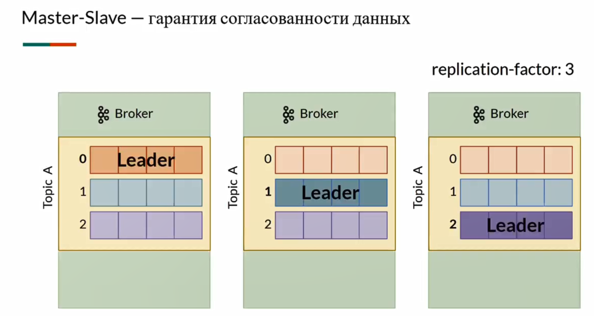
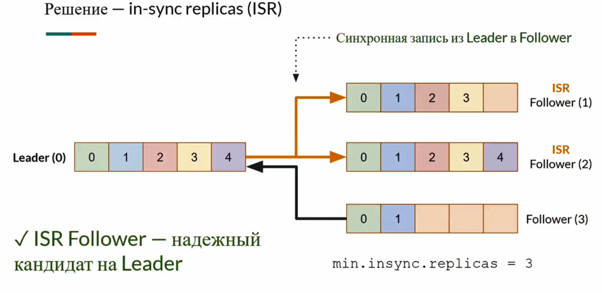
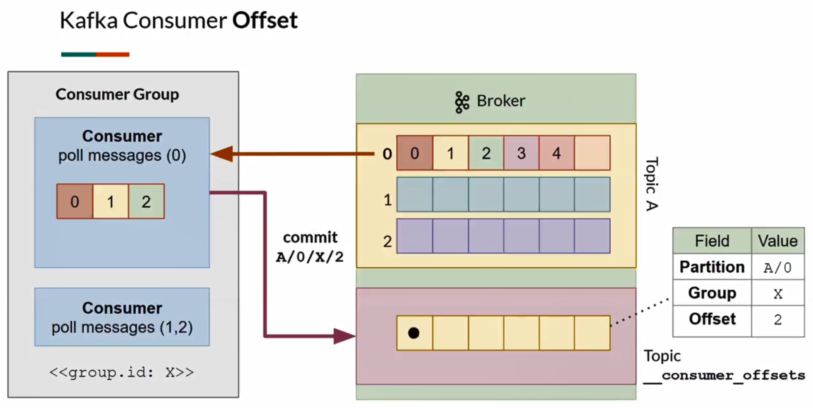

# Основные понятия

**Apache Kafka** – диспетчер сообщений на Java платформе. 

### Broker (Сервер)
Отвечает за:
+ прием сообщение от продюсеров
+ хранение сообщений
+ выдачу сообщений консьюмерам

Можно реплицировать/масштабировать, организуя тем самым Kafka-cluster

### Zookeeper (Координатор)
Хранит метаинформацию о брокерах, их адреса, конфигурация кластера, адреса данных (топиков, партиций) и др.

### Message/Record (Сообщение)
Структура сообщения:
+ `Key` - ключ (опциональный), используется для распределения сообщений по кластеру
+ `Value` - содержимое сообщения, массив байт
+ `Timestamp` - время сообщения (от эпохи). Устанавливается при отправке или обработке внутри кластера
+ `Headers` - набор key-value пар с пользовательскими атрибутами сообщения

### Topic (Тема)
Хранилище (очередь) сообщений

+ Гарантируется порядок получения (FIFO)
+ Данные из топика не удаляются после чтения
+ Данные хранятся в log-файлах на диске сервера

### Partition (Раздел)
+ Топик можно разделить на партиции для масштабирования.
+ Каждая партиция будет содержать часть сообщений топика
+ Порядок сообщений гарантируется внутри каждой партиции. 

#### replication-factor
+ Партиции могут быть реплицированы и размещены на разных брокерах для отказоустойчивости
+ У реплик всегда есть leader-реплика с которой работают продюсер и консюмер, а также follower-реплики
+ Пример с `replication-factor=3`:



#### insync-replicas
+ При записи в leader-реплику она может синхронно копировать данные в фоловеры (ISR) - такие фоловеры становятся лидерами при падении брокера с лидером. Есть также асинхронные фоловеры
+ `min.insync.replicas` обычно ставят на единицу меньше replication-factor. Важно, чтобы при падении одного брокера, insync реплик (ISR+Leader) не становилось меньше `min.insync.replicas`, т.к. иначе запись перестанет работать
+ Пример с `replication-factor=4` и `min.insync.replicas=3`:



### Producer (Издатель)
Те кто отправляют сообщения в топик

#### Определение партиции при отправке
+ `round-robin` по умолчанию. Распределение по партициям будет просто по кругу.
  + Пример. 
    + Имеем 2 партиции (`topic-name-0`, `topic-name-1`) и отправили сообщения в таком порядке: `m1, m2, m3, m4`
    + В партиции `topic-name-0` получим:  `0=m1, 1=m3`
    + В партиции `topic-name-1` получим:  `0=m2, 1=m4`
    + Но т. к. порядок гарантируется только в рамках партиции, то можем получить: `topic-name-0`\[`0=m2`, `1=m4`] и `topic-name-1`\[`0=m1`, `1=m3`]
+ `key-defined` - если есть ключ, то распределение будет по хэшу ключа, т.е. `partition_number = key_hash % n`, где n - число партиций. Это значит что сообщения с одинаковым ключом всегда будут в одной партиции
  + Пример. 
    + Имеем 2 партиции (`topic-name-0`, `topic-name-1`) и отправили сообщения (key:value): `k1:v1, k1:v2, k2:v1, k2:v2`
    + В партиции `topic-name-0` получим:  `0=k1:v1`, `1=k1:v2`
    + В партиции `topic-name-1` получим:  `0=k2:v1`, `1=k2:v2`
    + Но т. к. порядок гарантируется только в рамках партиции, то можем получить: `topic-name-0`\[`0=k2:v1`, `1=k2:v2`] и `topic-name-1`\[`0=k1:v1`, `1=k1:v2`]
+ `explicit-partition` - можно явно указать партицию

#### acks
+ `acks = 0`. Продюсер не ждет подтверждения об отправке. Сообщения могут теряться
+ `acks = 1`. Продюсер ждет подтверждения об отправке от leader-реплики. Сообщения могут теряться только если брокер с leader-репликой упал до копирования сообщений
+ `acks = -1(all)`. Продюсер ждет подтверждения об отправке от всех insync-реплик. Сообщения не могут потеряться

### Consumer (Подписчики)
Те кто читают сообщения из топика. Они еще называются клиентами, каждый имеет свой `client.id`, генерируемый автоматически

#### Group
+ Можно объединить консьюмеров в группу (указав `group.id`). Тогда каждый консьюмер из группы будет брать себе по партиции и читать из нее.
+ Консьюмеров в группе меньше чем партиций - один или несколько консьюмеров будут читать из нескольких партиций
+ Консьюмеров в группе больше чем партиций - один или несколько консьюмеров будут простаивать
+ Если число коньюмеров и партиций было поровну, но вдруг упал один консьюмер, то партиции автоматически перераспределяются (ребалансируются) по оставшимся консьюмерам

#### Offset
+ После того как консьюмер прочитал сообщение, он коммитит офсет в специальный топик `__consumer_offsets`. В этом топике хранится партиция, группа и офсет группы.
+ Если консьюмер упадет, то другой, который подхватит чтение из его партиции перечитает офсет партиции и не будет перечитывать уже обработанные сообщения



#### concurrency
+ Настройка `concurrency` в `ConcurrentKafkaListenerContainerFactory` позволяет создать несколько консьюмеров внутри одного приложения.
+ `concurrency=5` означает что будет поднято 5 консьюмеров внутри группы, каждый в отдельном потоке, им будут назначены соответствующие партиции по принципу описанному в [group](kafka.md#Group)
+ Такие консьюмеры также имеют свои `client.id`  и при появлении новых консьюмеров (других приложений с той же `group.id` или при перезапуске текущего приложения с новым `concurrency`) ребаланс произойдет автоматически с учетом общего числа консьюмеров

### Streams (Потоки)

# API
+ [Kafka Consumer API](https://www.baeldung.com/java-kafka-streams-vs-kafka-consumer)
```
<dependency>
	<groupId>org.apache.kafka</groupId>
	<artifactId>kafka-clients</artifactId>
</dependency>
```
+ [Kafka Streams API](https://www.baeldung.com/java-kafka-streams-vs-kafka-consumer)
```
<dependency>
	<groupId>org.apache.kafka</groupId>
	<artifactId>kafka-streams</artifactId>
</dependency>
```

### Message semantics
+ **At-most-once**. Messaging system will never duplicate a message but might miss the occasional message
+ **At-least-once**. It will never miss a message but might duplicate the occasional message
+ **Exactly-once**. It always delivers all messages without duplication. 
Это доступно при [транзкационном обмене](https://www.baeldung.com/kafka-exactly-once) или в [Streams API](https://www.baeldung.com/java-kafka-streams-vs-kafka-consumer). 
[Статья на эту тему](https://habr.com/ru/company/badoo/blog/333046/)


# Установка кафки
+ Полезные ссылки:
    + https://habr.com/ru/post/440400/
    + https://www.howtoforge.com/how-to-setup-apache-zookeeper-cluster-on-ubuntu-1804/
    + https://hevodata.com/blog/how-to-install-kafka-on-ubuntu/

+ Бинарники ставим сюда
```
/opt/zookeeper
/opt/kafka
```

+ Данные этих сервисов будем хранить тут
```
/var/zookeeper
/var/lib/kafka
```

# Работа с кафкой на VirtualBox
1. Открываем терминал 1
    + запуск зукиперов:
		```sudo /opt/zookeeper/bin/zkServer.sh start```
    + запуск кафки:
		```sudo /opt/kafka/bin/kafka-server-start.sh /opt/kafka/config/server.properties```

1. Открываем терминал 2
	+ создание топика (если его еще нет):
		```sudo /opt/kafka/bin/kafka-topics.sh --create --zookeeper localhost:2181 --replication-factor 1 --partitions 1 --topic "server.starship"```
 	+ создание продюсера:
		```sudo /opt/kafka/bin/kafka-console-producer.sh --broker-list localhost:9092 --topic "server.starship"```

1. Открываем терминал 3
	+ создание консьюмера:
		```sudo /opt/kafka/bin/kafka-console-consumer.sh --bootstrap-server localhost:9092 --topic "server.starship" --from-beginning```