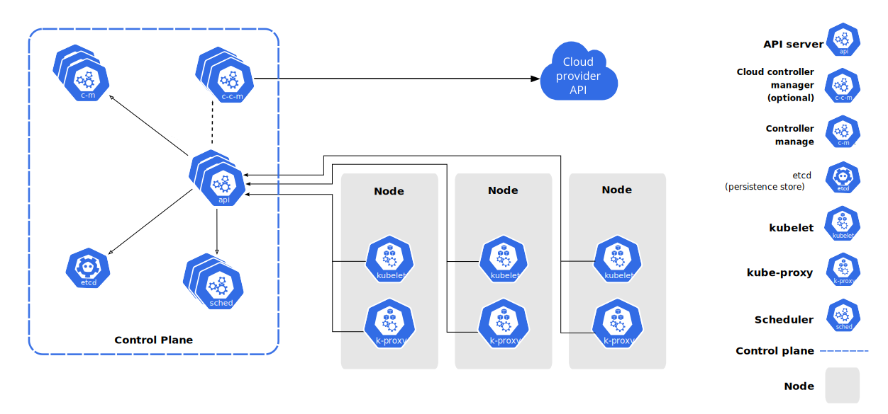

# Kubernetes

## Базовые команды

```bash
# get info
kubectl get all # Get all resources like pod, service, deployment etc
kubectl get all -n my-namespace
kubectl get nodes
kubectl get pod
kubectl get pod -o wide # Like get pod, but with additional columns
kubectl get services
kubectl get deployment
kubectl get deploy deploymentname -o yaml # Get the YAML definition of a deployment
kubectl get replicaset
kubectl get pv # Get persistent volumes
kubectl get pvc # Get persistent volume claims
kubectl top # The kubectl top command returns current CPU and memory usage for a cluster’s pods or nodes, or for a particular pod or node if specified.

# create/update/delete
kubectl create deployment {deployment-name} --image={image-name}:{version}
# Examples:
kubectl create deployment mm-back-depl --image=money-manager-backend:1.1.0
KUBE_EDITOR="nano" kubectl edit deployment mm-back-depl
kubectl delete deployment mm-back-depl
kubectl delete pod {pod-name}
kubectl delete pod --all # delete all pods

# debugging
kubectl logs {pod-name}
kubectl logs {full-deployment-name} # logs from pods of the deployment
kubectl exec -it {pod-name} -- bin/bash
kubectl describe pod {pod-name}
kubectl describe deployment {deployment-name} # Get the YAML definition of a deployment AND EVENTS of this deployment
kubectl get events # Get events (it's a k8s log of operations on resources) from the cluster
# Examples:
kubectl logs mm-back-depl-786d4bd669-kgj84
kubectl describe pod mm-back-depl-786d4bd669-kgj84

# Create/update/delete deployment with config file
kubectl apply -f my-deployment.yaml # First time it creates the deployment, and subsequent times it updates the deployment
kubectl delete -f my-deployment.yaml 

# Port-forwarding from local port to pod port. Then we can use forwarded port through localhost.
kubectl port-forward {pod-name} {local-port}:{pod-port}

# kubectx and kubens utilities for switching between contexts and namespaces
# https://github.com/ahmetb/kubectx
kubectx # get clusters that are in kubeconfig
kubectx minikube # switch to another cluster that's in kubeconfig
kubens # get namespaces in the cluster
kubens my-namespace # switch to another namespace
```

## Основные понятия и абстракции

+ **Node** - A node may be a virtual or physical machine, depending on the cluster. Each node is managed by the control plane and contains the services necessary to run Pods.
Official docs: https://kubernetes.io/docs/concepts/architecture/nodes/

+ **Pod** - Pods are the smallest deployable units of computing that you can create and manage in Kubernetes. 
A Pod is a group of one or more containers, with shared storage and network resources, and a specification for how to run the containers. Has a dynamic IP. 
Pod's lifecycle is managed by kube-controller-manager through kubelet. 
Official docs: https://kubernetes.io/docs/concepts/workloads/pods/

+ **Service** - is a method for exposing a network application that is running as one or more Pods in your cluster.
Official docs: https://kubernetes.io/docs/concepts/services-networking/service/

+ **Ingress** - An API object that manages external access to the services in a cluster, typically HTTP.
Ingress may provide load balancing, SSL termination and name-based virtual hosting.
Official docs: https://kubernetes.io/docs/concepts/services-networking/ingress/

+ **Deployment** - A Deployment manages a set of Pods to run an application workload. If pods have state, then you need to use StatefulSet instead.
Official docs: https://kubernetes.io/docs/concepts/workloads/controllers/deployment/

+ **ReplicaSet** - A ReplicaSet's purpose is to maintain a stable set of replica Pods running at any given time. Usually, you define a Deployment and let that Deployment manage ReplicaSets automatically.
Official docs: https://kubernetes.io/docs/concepts/workloads/controllers/replicaset/

+ **StatefulSet** - StatefulSet manages a set of Pods to run stateful applications. Each Pod in a StatefulSet has a persistent identity (in opposite to Deployment).
Official docs: https://kubernetes.io/docs/concepts/workloads/controllers/statefulset/

+ **ConfigMap** - A ConfigMap is an API object used to store non-confidential data in key-value pairs. Pods can consume ConfigMaps as environment variables, command-line arguments, or as configuration files in a volume.
Official docs: https://kubernetes.io/docs/concepts/configuration/configmap/

+ **Secret** - Secrets are similar to ConfigMaps but are specifically intended to hold confidential data. Can store data in encrypted form.
Official docs: https://kubernetes.io/docs/concepts/configuration/secret/

+ **Volumes**. Official docs: https://kubernetes.io/docs/concepts/storage/volumes/
  + On-disk files in a container are ephemeral, which presents some problems for non-trivial applications when running in containers. 
  + One problem occurs when a container crashes or is stopped. Container state is not saved so all of the files that were created or modified during the lifetime of the container are lost. 
  + During a crash, kubelet restarts the container with a clean state. 
  + Another problem occurs when multiple containers are running in a Pod and need to share files.
  + It can be challenging to setup and access a shared filesystem across all of the containers.
  + The Kubernetes volume abstraction solves both of these problems. 
  + Kubernetes supports many types of volumes. Ephemeral volume types have a lifetime of a pod, but persistent volumes exist beyond the lifetime of a pod.

+ **Persistent Volumes** - storage resource in the cluster (can't be in namespace, only in whole cluster), it can be either local or remote.
Official docs: https://kubernetes.io/docs/concepts/storage/persistent-volumes/

+ **Persistent Volume Claims** - requests a volume from the cluster. It's possible to request a specific volume, or a storage class.
Official docs: https://kubernetes.io/docs/concepts/storage/persistent-volumes/#persistentvolumeclaims

+ **Namespace** - In Kubernetes, namespaces provide a mechanism for isolating groups of resources within a single cluster. 
Names of resources need to be unique within a namespace, but not across namespaces. 
Namespaces are intended for use in environments with many users spread across multiple teams, projects and environments. 
For example, we have these namespaces: project-a-dev, project-a-prod, project-b-dev, project-b-prod.
Official docs: https://kubernetes.io/docs/concepts/overview/working-with-objects/namespaces/

Видео-обзор: https://www.youtube.com/watch?v=Krpb44XR0bk&list=PLy7NrYWoggjwPggqtFsI_zMAwvG0SqYCb&index=15&ab_channel=TechWorldwithNana


## Архитектура
<div></div>

### Control Plane (master nodes) Components
Manage the overall state of the cluster:

+ kube-apiserver - The core component server that exposes the Kubernetes HTTP API
+ etcd - Consistent and highly-available key value store for all API server data
+ kube-scheduler - Looks for Pods not yet bound to a node, and assigns each Pod to a suitable node.
+ kube-controller-manager - Runs controllers to implement Kubernetes API behavior.
+ cloud-controller-manager (optional) - Integrates with underlying cloud provider(s).

### Node (worker nodes) Components
Run on every node, maintaining running pods and providing the Kubernetes runtime environment:

+ kubelet - Ensures that Pods are running, including their containers.
+ kube-proxy (optional) - Maintains network rules on nodes to implement Services.
+ Container runtime - Software responsible for running containers. Read Container Runtimes to learn more.

Дока kubernetes: https://kubernetes.io/docs/concepts/overview/components/

Видео-обзор: https://www.youtube.com/watch?v=umXEmn3cMWY&list=PLy7NrYWoggjwPggqtFsI_zMAwvG0SqYCb&index=17&ab_channel=TechWorldwithNana

## Установка kubectl
https://kubernetes.io/docs/tasks/tools/install-kubectl-windows/

### Windows
+ Перейти сюда https://kubernetes.io/releases/download/#binaries
+ Выбрать свою архитектуру процессора (386 - intel, amd64 - amd)
+ Скачать .exe файл последней версии и установить
+ Проверить что kubectl установлен: `kubectl version --client`

Подробнее в документации https://kubernetes.io/docs/tasks/tools/install-kubectl-windows/


### Linux Ubuntu
+ Download the latest release with the command:
```bash
curl -LO "https://dl.k8s.io/release/$(curl -L -s https://dl.k8s.io/release/stable.txt)/bin/linux/amd64/kubectl
```
+ Validate the binary (optional):
  + Download the kubectl checksum file
    ```bash
    curl -LO "https://dl.k8s.io/release/$(curl -L -s https://dl.k8s.io/release/stable.txt)/bin/linux/amd64/kubectl.sha256"
    ```
  + Validate the kubectl binary against the checksum file:
    ```bash
    echo "$(cat kubectl.sha256)  kubectl" | sha256sum --check
    ```
  + If valid, the output is: `kubectl: OK`
+ Install kubectl:
```bash
sudo install -o root -g root -m 0755 kubectl /usr/local/bin/kubectl
```
+ Проверить что kubectl установлен: `kubectl version --client`

Подробнее в документации https://kubernetes.io/docs/tasks/tools/install-kubectl-linux/


# Minikube - kubernetes в локальном окружении

## Как поднять на linux
### Установить Minikube
```bash
curl -LO https://storage.googleapis.com/minikube/releases/latest/minikube-linux-amd64
sudo install minikube-linux-amd64 /usr/local/bin/minikube && rm minikube-linux-amd64
```
Подробнее в документации https://minikube.sigs.k8s.io/docs/start/?arch=%2Flinux%2Fx86-64%2Fstable%2Fbinary+download

### Установить драйвер виртуализации (например Docker)
Если докера нет в системе, то можно установить несколькими способами. Мы выберем ["apt repository"](https://docs.docker.com/engine/install/ubuntu/#install-using-the-repository)

+ Настраиваем apt repository:
```bash
# Add Docker's official GPG key:
sudo apt-get update
sudo apt-get install ca-certificates curl
sudo install -m 0755 -d /etc/apt/keyrings
sudo curl -fsSL https://download.docker.com/linux/ubuntu/gpg -o /etc/apt/keyrings/docker.asc
sudo chmod a+r /etc/apt/keyrings/docker.asc

# Add the repository to Apt sources:
echo \
  "deb [arch=$(dpkg --print-architecture) signed-by=/etc/apt/keyrings/docker.asc] https://download.docker.com/linux/ubuntu \
  $(. /etc/os-release && echo "$VERSION_CODENAME") stable" | \
  sudo tee /etc/apt/sources.list.d/docker.list > /dev/null
sudo apt-get update
```
+ Устанавливаем пакеты докера:
```bash
sudo apt-get install docker-ce docker-ce-cli containerd.io docker-buildx-plugin docker-compose-plugin
```
+ Create the docker group: `sudo groupadd docker`
+ Add your user to the docker group: `sudo usermod -aG docker $USER`
+ Activate the changes to groups: `newgrp docker`
+ Сделать docker драйвером по умолчанию для minikube: `minikube config set driver docker`

Дока minikube по драйверам: https://minikube.sigs.k8s.io/docs/drivers/docker/

### Запустить minikube
+ Запуск:
`minikube start`
+ Проверить состояние minikube:
`kubectl get po -A`
+ Также можно запустить дашборд: 
`minikube dashboard`
+ Посмотреть роутинги сервисов: 
`minikube service --all`
+ Запустить ingress controller nginx: 
`minikube addons enable ingress`


Подробнее в документации https://minikube.sigs.k8s.io/docs/start/?arch=%2Flinux%2Fx86-64%2Fstable%2Fbinary+download

### Установка локальных docker образов в minikube
As the [documentation](https://minikube.sigs.k8s.io/docs/handbook/pushing/#Linux) describes, you can reuse the Docker daemon from Minikube with `eval $(minikube docker-env)`.

So to use an image without uploading it, you can follow these steps:

+ Set the environment variables with `eval $(minikube docker-env)`
+ Build the image with the Docker daemon of Minikube (e.g., `docker build -t my-image .`)
+ Set the image in the pod specification like the build tag (e.g., `my-image`)
+ Set the `imagePullPolicy` to `Never` or `IfNotPresent`, otherwise Kubernetes will try to download the image.

Important note: You have to run `eval $(minikube docker-env)` on each terminal you want to use, since it only sets the environment variables for the current shell session.

# Helm
Менеджер файлов манифестов (deployment, service, ingress и т.д.) для kubernetes. 
Упрощает автоматизацию установки и обновления манифестов. 
Позволяет описывать шаблоны манифестов в так называемых чартах, которые можно переиспользовать в разных проектах.

Структура чарта:
```
.
└── my-chart
    ├── charts // в этом каталоге хранятся зависимости чарта
    ├── Chart.yaml // метаданные о чарте
    ├── values.yaml // дефолтные значения конфигурации чарта
    └── templates // в этом каталоге хранятся шаблоны манифестов
        ├── deployment.yaml
        ├── _helpers.tpl
        ├── NOTES.txt
        ├── hpa.yaml
        ├── ingress.yaml
        ├── service.yaml
        ├── service-account.yaml
        └── tests
            └── interaction-test.yaml
```

Документация: https://helm.sh/docs

Описание функций доступных в шаблонах: https://helm.sh/docs/chart_template_guide/function_list

## Базовые команды 
```bash
# Просмотр списка установленных чартов в текущем неймспейсе:
helm ls

# Установка из локальной директории:
helm install my-app-chart ./my-app-chart

# Установка из удаленного репозитория:
helm install my-postgres oci://registry-1.docker.io/bitnamicharts/postgresql

# Обновление или установка:
helm upgrade --install my-app-chart ./my-app-chart

# Установка с переопределением переменных:
helm install -f values.yaml my-app-chart ./my-app-chart

# Удаление:
helm uninstall my-app-chart

# Просмотр установленных в k8s манифестов по указанному чарту:
helm get manifest my-app-chart

# Генерация манифестов по указанному чарту без установки:
helm install --debug --dry-run my-app-chart ./my-app-chart

# Обновление:
helm upgrade my-app-chart ./my-app-chart

# Откатить последнюю установку чарта к предыдущей (если вызвать повторно, то последняя установка загрузится еще раз):
helm rollback my-app-chart

# Примеры:
helm install mm-config ./mm-config-chart
helm install -f values-postgres.yaml mm-pstgr ./mm-app-chart
helm install -f values-backend.yaml mm-back ./mm-app-chart
helm install -f values-frontend.yaml mm-front ./mm-app-chart

helm upgrade mm-config ./mm-config-chart
helm upgrade -f values-postgres.yaml mm-pstgr ./mm-app-chart
helm upgrade -f values-backend.yaml mm-back ./mm-app-chart
helm upgrade -f values-frontend.yaml mm-front ./mm-app-chart
```

## Установка Helm

Документация: https://helm.sh/docs/intro/install/

+ Установка на Windows:
```bash
winget install Helm.Helm
```

+ Установка на Linux Ubuntu/Debian:
```bash
curl https://baltocdn.com/helm/signing.asc | gpg --dearmor | sudo tee /usr/share/keyrings/helm.gpg > /dev/null
sudo apt-get install apt-transport-https --yes
echo "deb [arch=$(dpkg --print-architecture) signed-by=/usr/share/keyrings/helm.gpg] https://baltocdn.com/helm/stable/debian/ all main" | sudo tee /etc/apt/sources.list.d/helm-stable-debian.list
sudo apt-get update
sudo apt-get install helm
```
