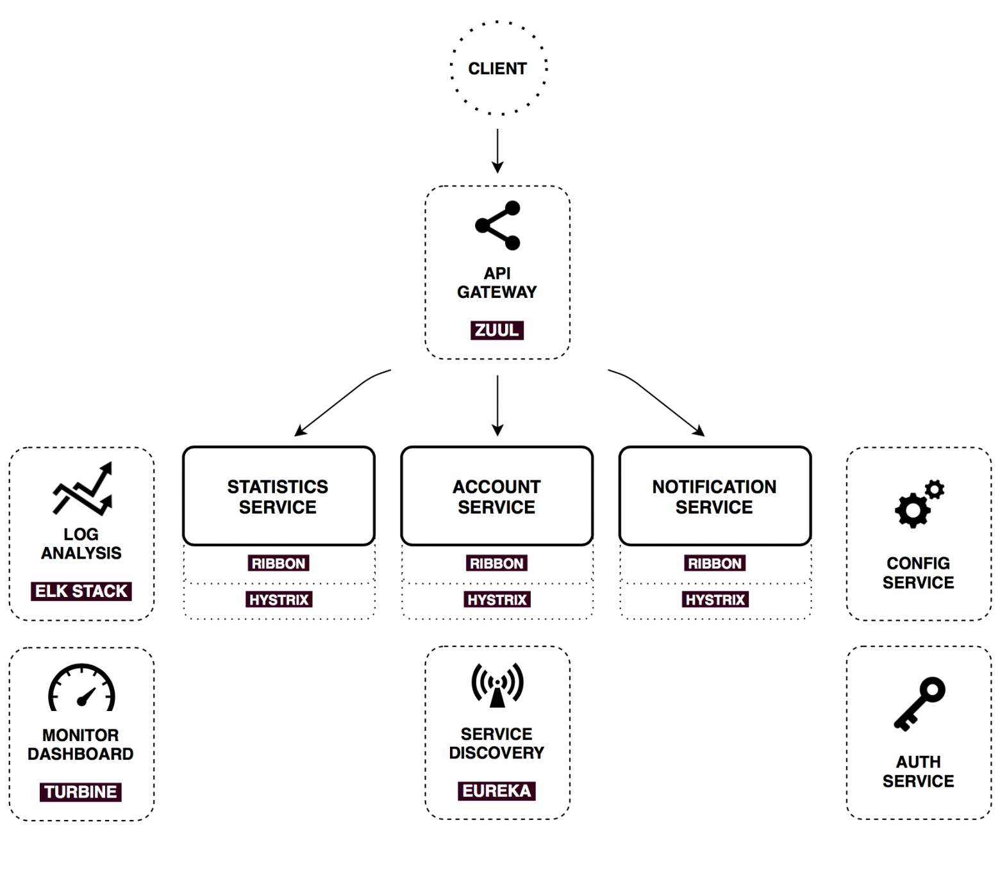

# Основные понятия по фреймворкам Spring

## Spring Core
+ Преимущества
    + Паттерн IoC - Inversion of Control - мы выносим контроль за подключением зависимостей (созданием и инжектом бинов) наружу из нашей бизнес логики. В спринге созданием бинов занимается ApplicationContext
    + Паттерн DI - Dependency Injection - с помощью этого паттерна мы реализуем IoC, т.е. инжектим зависимости из контейнера, а код, в который инжектим, не занимается созданием зависимости
    + Благодаря этому получаем гибкость реализаций. Т.к. мы инжектим бины через интерфейсы, то есть можем легко менять реализации
+ Основные этапы поднятия ApplicationContext:
    + ...BeanDefinitionReader - чтение конфигов и создание BeanDefinition
        + Виды конфигов:
            + xml - ClassPathXmlApplicationContext(“context.xml”)
            + javaConfig - класс с @Configuration: AnnotationConfigApplicationContext(JavaConfig.class)
            + annotations - пакета для сканирования: AnnotationConfigApplicationContext(“package.name”)
            + groovy - GenericGroovyApplicationContext(“context.groovy”)
        + На выходе мапа Map<BeanId, BeanDefinition>
	
    + Создание BeanFactory и настройка BeanDefinition (мета данные о бинах)
        можно перехватить и донастроить BeanDefinition через BeanFactoryPostProcessor
        на этом этапе парсятся проперти для @Value

    + Создание кастомных FactoryBean - фабрика создания бинов (актуально только для xml конфига)

    + Создание экземпляров бинов (только не lazy - например синглтон, он по умолчанию не lazy)
        + Созданием экземпляров бинов занимается BeanFactory при этом, если нужно, делегирует это кастомным FactoryBean
        + На выходе мапа Map<BeanId, Bean>
        + Тут происходит инжекция бинов 
        + Лучше инжектить через конструктор - так поля можно сделать final и создавать бин сразу со всеми необходимыми зависимостями (к тому же это не позволит создать циклическую зависимость, а например через поля или сеттеры это возможно)

    + Донастройка созданных бинов
        + Можем вклиниться с помощью BeanPostProcessor 

+ Циклические зависимости - `Bean A → Bean B → Bean A`
  + Лучше так не делать, и если такое появляется - значит есть проблемы в дизайне
  + Если все таки нужно, то можно сделать через @Autowired поля или сеттера, а также конструктора, но с @Lazy
  + Чтобы предотвратить случайное создание таких зависимостей - лучше инжектить через конструктор, тогда спринг выбросит BeanCurrentlyInCreationException при попытке создать зацикленные бины 

## Spring Boot
+ Отличия от простого Spring:
    + Использование так называемых Starter, которые позволяют получить набор сконфигурированных бинов, готовых к использованию и доступных для конфигурации через application.yml-файлы
        + `spring.factories` - при старте спринг сканирует этот файл и пытается создать прописанные в нем бины автоконфигураций, пример:
          ```properties
          # Auto Configure
          org.springframework.boot.autoconfigure.EnableAutoConfiguration=\
          .springframework.boot.autoconfigure.amqp.RabbitAutoConfiguration,\
          .springframework.boot.autoconfigure.cassandra.CassandraAutoConfiguration,\
          .springframework.boot.autoconfigure.mongo.MongoAutoConfiguration,\
          .springframework.boot.autoconfigure.orm.jpa.HibernateJpaAutoConfiguration
          ```
        + Бины автоконфигураций уже объявлены в `spring-boot-autoconfigure`, но создаются только по `@ConditionalOnClass`/`ConditionalOnProperty`
          + Например, конфиг-бин `FlywayAutoConfiguration` имеет аннотацию `@ConditionalOnClass(Flyway.class)`
          + Т.е. он создается когда мы подключаем зависимость, которая содержит класс `Flyway.class` и он попадает в classpath, например эту - `implementation "org.flywaydb:flyway-core"`
          + В модуле `spring-boot-autoconfigure` условные зависимости типа `flyway-core` добавлены как optional для корректной компиляции
        + Условные зависимости могут быть вшиты сразу в стартер, тогда подключать их дополнительно в приложении не требуется - только сам стартер
        + Пример реализации кастомного стартера есть локально: <a href = "file:///D:/Education/Java/Projects/custom_spring_boot_starter">custom_spring_boot_starter</a>
    + Стартеры позволяют решить проблемы конфликта зависимостей. Они содержат все необходимые для их сферы зависимости, а т.к. spring-boot подключается как родитель или dependency-менеджер, то мы имеем все их версии. Блок dependency-менеджмента не прописывает зависимости. Это блок, при помощи которого можно указать версии на случай, если эти зависимости будут нужны
    + Встроенный контейнер сервлетов - для Spring-MVC - Tomcat, для Spring-Webflux - Netty
+ Подробнее о Spring Boot [habr](https://habr.com/ru/company/jugru/blog/424503/)


## Spring Data
Состоит из transactionManager, dataSource и entityManagerFactory. 
Можно подключить различные реализации стандарта JPA (провайдеры), один из самых популярных - это Hibernate ORM

### @Transactional
1. Когда вызывается метод с `@Transactional`, proxy, который создал Spring, создаёт persistence context (берет соединение из пула и открывает его). 
2. Открывает в нём транзакцию и сохраняет всё это в контексте нити исполнения (в ThreadLocal). По мере надобности всё сохранённое достаётся и внедряется в бины. 
3. Как только транзакция закрывается (неважно, успешно она прошла или откатилась), соединение возвращается в пул, и его может использовать следующая бизнес-операция

Привязка транзакций к нитям (threads) позволяет использовать семантику серверов приложений J2EE, в которой гарантируется, что каждый запрос получает свою собственную нить.

### Isolation
+ `Isolation.READ_UNCOMMITTED` — читает неподтвержденные данные, самый быстрый, но небезопасный уровень, возможны все проблемы
+ `Isolation.READ_COMMITTED` — читает только подтвержденные данные, сохраняются проблемы неповторяемых и фантомных строк
+ `Isolation.REPEATABLE_READ` — читает только подтвержденные данные и решает проблему неповторяемых строк, остается проблема фантомных строк
+ `Isolation.SERIALIZABLE` — самый строгий, но самый медленный уровень - все транзакции выполняются последовательно

Подробнее о проблемах [databases.md](databases.md)

### Propagation
+ `Propagation.REQUIRED` — применяется по умолчанию. При входе в `@Transactional` метод будет использована уже существующая транзакция или создана новая транзакция, если никакой ещё нет
+ `Propagation.REQUIRES_NEW` — Транзакция всегда создаётся при входе метод с `Propagation.REQUIRES_NEW`, ранее созданные транзакции **приостанавливаются*** до момента возврата из метода.
+ `Propagation.NESTED` — корректно работает только с базами данных, которые умеют savepoints. Все изменения, внесённые методом, подтвердятся только позднее, с подтверждением всей транзакции. Если текущей транзакции не существует, будет создана новая.
+ `Propagation.MANDATORY` — всегда используется существующая транзакция и кидается исключение, если текущей транзакции нет.
+ `Propagation.SUPPORTS` — метод с этим правилом будет использовать текущую транзакцию, если она есть, либо исполняться без транзакции, если её нет.
+ `Propagation.NOT_SUPPORTED` — При входе в метод текущая транзакция, если она есть, будет **приостановлена*** и метод будет выполняться без транзакции.
+ `Propagation.NEVER` — правило, которое явно запрещает исполнение в контексте транзакции. Если при входе в метод будет существовать транзакция, будет выброшено исключение.

"Приостановки" транзакций (REQUIRES_NEW и NOT_SUPPORTED) реализованы в коде, без участия БД, примерно так:
```
if (isExistingTransaction()) {
    suspend(existing);
    try {
        return createNewTransaction();
    } catch (exception) {
        resumeAfterBeginException();
        throw exception;
    }
}
return createNewTransaction();
```
+ Подробнее [www.baeldung.com](https://www.baeldung.com/spring-transactional-propagation-isolation)

### Optimistic lock
Оптимистичное блокирование в JPA реализовано с внедрением специального поля `@Version` в сущность, оно может быть целочисленным или временнЫм.
Для включения необходимо добавить аннотацию `@Lock` над методами репозиториев. Блокировка будет автоматически снята при завершении транзакции
+ `LockModeType.OPTIMISTIC` — блокировка на чтение: если при завершении транзакции кто-то извне изменит поле `@Version`, то транзакция автоматически будет откачена и будет выброшено OptimisticLockException.
+ `LockModeType.OPTIMISTIC_FORCE_INCREMENT` — блокировка на запись. Ведёт себя как и блокировка на чтение, но при этом увеличивает значение поля `@Version`

### Pessimistic lock
Пессимистичное блокирование выполняется на уровне базы (с помощью `SELECT FOR UPDATE`) и поэтому не требует вмешательств в код сущности.
Для включения необходимо добавить аннотацию `@Lock` над методами репозиториев. Блокировка будет автоматически снята при завершении транзакции
+ `LockModeType.PESSIMISTIC_READ` — данные блокируются в момент чтения и это гарантирует, что никто в ходе выполнения транзакции не сможет их изменить или удалить. Остальные транзакции, тем не менее, смогут параллельно читать эти данные. Использование этой блокировки может вызывать долгое ожидание блокировки или выкидывание PessimisticLockException.
+ `LockModeType.PESSIMISTIC_WRITE` — то же что и `PESSIMISTIC_READ` но также и запрет на чтение. Использование этой блокировки может вызывать долгое ожидание блокировки или выкидывание PessimisticLockException.
+ `LockModeType.PESSIMISTIC_FORCE_INCREMENT` — ведёт себя как `PESSIMISTIC_WRITE`, но в конце транзакции увеличивает значение поля `@Version`, даже если фактически сущность не изменилась.

Пример лок-метода в репозитории:
```java
@Transactional
@Lock(LockModeType.PESSIMISTIC_WRITE)
@Query("SELECT i FROM Income i WHERE i.id = ?1 and i.account.id = ?2")
Optional<Income> findByIdAndAccountIdLock(Long id, Long accountId);
```

### readOnly = true
Одно из свойств в [@Transactional](#transactional). В Spring Data его имплементация зависит от провайдера. 
+ Hibernate - атрибут readOnly только устанавливает текущий режим сброса сеанса на FlushType.MANUAL, это отключает механизм dirty checking (автоматическое сохранение изменений объектов сессии хибернейта).
+ Некоторые другие провайдеры будут просто бросать исключение при попытке произвести изменения в БД

### Важные нюансы
#### Проблемы с FetchType.LAZY
+ Свойство `FetchType.LAZY` – означает ленивое заполнение вложенных сущностей. 
Автоматически заполнятся хибернейтом, если к ним обращаются в рамках одной сессии (той же, в которой получили родительскую сущность), либо внутри метода `@Transactional` (который также инициирует открытие сессии).
Иначе при любом обращении к таким сущностям мы получим org.hibernate.LazyInitializationException, т.к. сессия уже закрылась.

#### Удаление сирот и каскады
+ Если установлено более лояльное свойство чем Cascade=all-delete-orphan, например Cascade=all или Cascade=save-update, то сирот придется удалять вручную - удаляя зависимые объекты.

#### Транзакции
+ Транзакции + ошибки transaction-synchronized
    + Метод помеченный [@Transactional](#transactional) будет транзакцией. Если вызывать внутри него методы с такой же аннотацией, то внутренняя транзакция станет частью внешней (если свойство propagation не изменено).
    + Получение сессии методом getCurrentSession() необходимо осуществлять только в методе аннотированном @Transactional, иначе ошибка ... transaction-synchronized
    + Если внутри транзакции была получена сессия методом getCurrentSession(), то закроется она с завершением последнего метода с @Transactional
+ Вызов метода с [@Transactional](#transactional) в другом методе в том же бине
    + Т.к. перехват @Transactional реализован с помощью аспектов Spring AOP (на основе проксирования), то такие вызовы не стартуют транзакцию
    + Выхода 2: переключиться на аспекты AspectJ или вынести метод в другой бин
+ Hibernate Session != DB Connection. Сессия получают коннект из пула коннектов, открывает транзакцию внутри него и в конце преобразует набор действий над сущностями в DML SQL-запрос

#### Проблема N+1
+ N+1 проблема в Hibernate состоит в том, что вместо одного явного select выполняется N+1 неявных select-ов, что сильно сказывается на производительности
+ Например, есть связь One-to-many - сущность Новость содержит несколько Комментариев
    + При попытке получить новости со всеми комментариями к ним, hibernate сделает 1 селект для получения списка новостей и N (где N - кол-во новостей) селектов для получения комментариев    
+ Решения
    + `@Fetch(FetchMode.JOIN)`
        + Вложенные сущности будут подтягиваться джойном. Минус в том что ограничение limit будет работать на общее кол-во записей, а не на главные сущности. Также есть ограничение на вытягивание других вложенных сущностей (если нужно получить несколько one-to-many зависимостей)
    + `@Fetch(FetchMode.SUBSELECT)`
        + Вложенные сущности будут подтягиваться субселектом


## Spring Security
+ [Spring Security (habr)](https://habr.com/ru/post/203318/)
+ [Протокол OAuth 2.0](security.md#Протокол-OAuth-20)
+ [Spring Boot OAuth2 и JWT (habr)](https://habr.com/ru/company/otus/blog/453664/)


## Spring Cloud
Spring Cloud предоставляет инструменты для быстрого создания некоторых распространенных шаблонов в распределенных системах.

+ `Distributed configuration - Spring Cloud Config`. Это горизонтально масштабируемое хранилище конфигураций для распределенной системы. В качестве источника данных на данный момент поддерживаются Git, Subversion и простые файлы, хранящиеся локально.
+ `Routing - Zuul`. Единая точка входа для приема внешних запросов и маршрутизации в нужные сервисы внутренней инфраструктуры, отдачи статического контента, аутентификации, стресс тестирования, канареечного развертывания, миграции сервисов, динамического управления трафиком.
+ `Service discovery - Netflix Eureka` (но есть еще Consul, Zookeeper, Etcd и другие). Позволяет автоматически определять сетевые адреса для доступных инстансов приложений, которые могут динамически изменяться по причинам масштабирования, падений и обновлений.
+ `Load balancing - Ribbon`. Балансировщик. Из коробки он интегрирован с механизмом Service Discovery, который предоставляет динамический список доступных инстансов для балансировки между ними.
+ `Circuit Breaker - Hystrix`. Это предохранитель, который дает контроль над задержками и ошибками при вызовах по сети. Основная идея состоит в том, чтобы остановить каскадный отказ в распределенной системе, состоящей из большого числа компонентов. Это позволяет отдавать ошибку как можно быстрее, не задерживаясь при запросе к зависшему сервису, давая ему восстановиться.
+ `Service-to-service calls - Feign`. Простой и гибкий http-клиент, который нативно интегрирован с Ribbon и Hystrix.

Статья с практическим применением - [habr](https://habr.com/ru/post/280786/), пример приложения на Spring Cloud из статьи:



## Spring Actuator 
Spring Actuator предоставляет несколько готовых конечных точек (endpoint), которые могут быть полезны для мониторинга приложения.

Статья - [habr](https://habr.com/ru/company/otus/blog/452624/)


## Spring Webflux
+ Отличия от Spring MVC (подробно о Webflux [habr](https://habr.com/ru/company/funcorp/blog/350996/))
	+ В основе WebFlux лежит библиотека Reactor
	+ Вместо tomcat использует netty
	+ Использует неблокирующую многопоточность
	+ Текущий поток выполнения не блокируется и ждет, а переключается на что-нибудь полезное, вернувшись к текущему процессу, когда асинхронная обработка будет завершена
	+ Требуется меньше потоков благодаря предыдущему пункту
	+ Дебаг и разработка сложнее
	+ Работает лучше чем Spring-MVC при большом количестве легких запросов
	+ Работает хуже чем Spring-MVC если имеются тяжелые/длительные процессы
	+ Что произойдет под большой нагрузкой?
        + Spring MVC с блокирующей многопоточностью будет просто висеть заблокированным, если количество одновременно обрабатываемых запросов достигло предела количества тредов (другие запросы будут ждать освобождения треда)
        + Spring WebFlux с неблокирующей многопоточностью будет постоянно брать в работу новые реквесты (даже если их больше чем тредов), создавать на каждый отложенную задачу и, если их обработка будет медленнее (например долгое обращение к бд, даже не блокирующей) чем поступление новых, то переполнится буфер
   
# Hibernate
## Стратегии наследования

#### TABLE_PER_CLASS
+ Отдельные таблицы для каждого класса кроме родителя (его поля будут во всех таблицах БД)
+ Полиморфные запросы будут через UNION - лучше для производительности
+ Id обязательно должен быть вынесен в родителя
+ [TABLE_PER_CLASS](/hibertest/tableperclass)

#### SINGLE_TABLE
+ Единая таблица для всей иерархии классов, поля всех классов собраны в кучу
+ Очень плохо для структуры БД и поддержки, но очень быстро
+ [SINGLE_TABLE](/hibertest/singletable)

#### JOINED_TABLE
+ Отдельные таблицы для каждого класса (даже для родителя)
+ Родитель с детьми в БД будут иметь связь по внешнему ключу
+ Полиморфные запросы будут через JOIN - возможны проблемы с производительностью
+ Но хорошо нормализованная БД
+ [JOINED_TABLE](/hibertest/joinedtable)

#### MAPPED_SUPERCLASS
+ Не является стратегией наследования в прямом смысле, т.к. родитель не entity
+ Отдельные таблицы для каждого класса кроме родителя (его поля будут во всех таблицах БД)
+ Полиморфные запросы (через вызов родителя) будут через отдельные селекты - плохо для производительности
+ [MAPPED_SUPERCLASS](/hibertest/mappedsuperclass)
