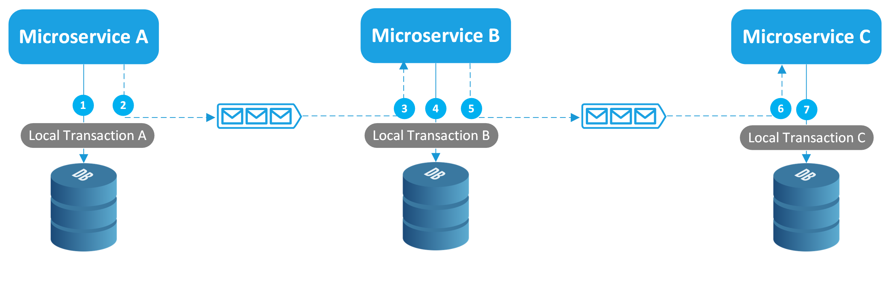
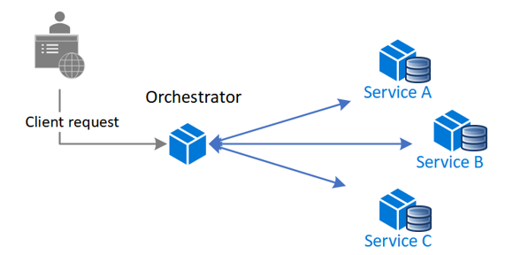

# System design

### Вопросы по требованиям для проектирования архитектуры
+ Сколько DAU (Daily Active Users)? Либо сколько всего юзеров. 
  + Доля DAU от всех юзеров обычно небольшая (5-20%) если это не популярная соц. сеть типа VK (там около 50%)
+ Сколько запросов в секунду (RPS)? Либо сколько юзер делает запросов в день, если известно DAU
  + Важно определить также какая доля запросов на запись, а какая на чтение.
  + От 1000 RPS надо внимательнее. Тут уже некоторые БД в зависимости от объема и типа запросов могут стать узким местом
+ Объем и сроки хранения данных? 
  + Уточнить возможность переноса архивных данных в DWH
+ Требуемая latency?
  + Нужно уточнить возможен ли переход на заявочную систему. Например, медленное обновление данных или получение тяжелого отчета можно выполнять асинхронно через очередь, отправив ответ пользователю позже
+ Требуемая availability?
  + Если HA (high availability - выше 99%, например 99,9% - 1,44 минуты простоя в день), нужно уточнить какие именно части системы требуют HA
+ Остальные вопросы по функциональным требованиям

### Расчет размера данных на примере PostgreSQL
Numeric Types:
  + smallint: 2 bytes
  + integer (int): 4 bytes
  + bigint: 8 bytes
  + real: 4 bytes (single-precision floating-point)
  + double precision: 8 bytes (double-precision floating-point)
  + numeric (decimal): Variable. The actual storage requirement is 2 bytes for each group of 4 decimal digits, plus 3-8 bytes overhead. 

Character Types:
  + char(n): n chars (fixed-length, padded with spaces)
  + varchar(n): Variable, up to n chars plus overhead (variable-length, no padding)
  + text: Variable, plus overhead (variable-length, no explicit length limit)

Each letter takes 1-4 bytes, depending on the encoding (Latin - 1b, Russian - 2b, some Chinese characters or emojis - 4b)

Date/Time Types:
  + date: 4 bytes
  + time [without time zone]: 8 bytes
  + timestamp [without time zone]: 8 bytes
  + time with time zone: 8 bytes
  + timestamp with time zone: 8 bytes

Boolean Type:
  + boolean: 1 byte

Binary Data Types:
  + bytea: Variable, plus overhead

JSON Types:
  + json: Variable, plus overhead
  + jsonb: Variable, plus overhead (stored in a decomposed binary format, potentially larger than json for the same data but faster to query)

### Нотация моделирования C4

Это подход к визуализации архитектуры программного обеспечения, созданный Саймоном Брауном. Появился он в результате чтения лекций по архитектуре на курсе.

C4 включает четыре уровня представления:

1. [Context](C4_example/C4_level1_Context.jpg): высокоуровневый взгляд на систему. Показывает приложения и пользователей, без технических деталей.
2. [Container](C4_example/C4_level2_Container.jpg): углубляет представление системы, описывая основные части, или "контейнеры" (backend-приложение, веб-приложение, мобильного приложение, базы данных, файловая система), которые входят в состав системы. На этом уровне определены функции каждого контейнера, технологические решения по языкам программирования, протоколы взаимодействия.
3. [Component](C4_example/C4_level3_Component.jpg): детализирует каждый контейнер, описывая его компоненты и их взаимодействие.
4. Code: наиболее детальный уровень, описывающий внутреннюю структуру каждого компонента. Часто используются UML-диаграммы для его описания. Не обязателен.

### Основные подходы в High load
+ Масштабирование (модульные монолиты, микросервисы) - вертикальное и горизонтальное. Горизонтальное также улучшает availability, т.к. резервирует ноды на случай падений
  + Вертикальное - за счет увеличения ресурсов
  + Горизонтальное - за счет реплицирования микросервисов и/или БД.
  + Репликации БД. Это запуск БД в режиме нескольких нод-копий, обычно 1 master нода - запись и чтение и N slave нод - только чтение (поддерживают из коробки MongoDB и многие NoSql, Postgres только с плагинами). Также есть подходы multi master (поддерживает Cassandra)
  + Шардирование БД. Можно применить при большом объеме данных. Это разбиение данных на шарды и распределение их между нодами, обычно с помощью хэш-функций по какому-то полю. Например, node = hash(column)%nodes, или с помощью consistent hashing. Однако запросы должны иметь фильтр по этому полю, иначе будет сканирование всех шардов и тогда это бессмысленно.
  + Партицирование таблицы по какому-то полю, например по дате. Это еще один подход при больших объемах таблиц (Postgres поддерживает из коробки). Т.е. таблица будет разбита на части по периодам дат. Запросы также должны иметь фильтр по этой дате, иначе будет сканирование всех партиций и тогда это бессмысленно.
+ Кэширование на разных уровнях (in-memory кэши, Redis, Memcached и др.)
+ CDN в качестве кэша для статических ресурсов (images, CSS, JavaScript files), video и других публичных, но не конфиденциальных данных. Это компании имеющие сервера, которые располагаются в разных географических регионах. 
+ Георезерв - датацентры размещенные в разных географических регионах. Это позволит уменьшить сетевые latency у местных жителей, а также помогает обеспечить HA (>= 99,9%).
+ Обычно для операционных задач выбираются БД типа OLTP (Postgres, MongoDB и др.), но они не очень хороши для тяжелых запросов чтения - тут нужны OLAP (Greenplum, ClickHouse и др.)
+ У каждого микросервиса должна быть своя БД
+ Микросервисы должны быть stateless, т.к. stateful приложение масштабировать очень сложно
+ Асинхронный обмен сообщениями между микросервисами обычно организуют через брокеры сообщений (Rabbit MQ, [Kafka](kafka.md) и др.)
+ Распределенные транзакции между микросервисами с разными БД следует избегать, например стараться объединять транзакционную логику в один микросервис. Но если все таки требуется, то обеспечиваются такими паттернами как, например, [Сага](system_design.md#Сага)
+ Обеспечение observability
  + Логирование (ELK - elasticsearch, logstash и kibana)
  + Мониторинг и алертинг (grafana, prometheus и др.)
  + Трейсинг (zipkin, jaeger и др.)
+ Переход на реактивщину - позволит обеспечить работу сервиса при большом количестве запросов (используется асинхронный и неблокирующий код) - см. [Reactivity](concurrency.md#Реактивность)
+ Эзотерические подходы с прогревом JIT для ускорения динамической компиляции

### Паттерны микросервисов

#### Сага
+ Этот паттерн предназначен для управления распределенными транзакциями в микросервисной архитектуре.
+ При использовании паттерна каждая локальная транзакция обновляет данные в хранилище в рамках одного микросервиса и публикует событие или сообщение, которые, в свою очередь, запускают следующую локальную транзакцию и так далее.
+ Если локальная транзакция завершается с ошибкой, выполняется серия компенсирующих транзакций, которые отменяют изменения предыдущих транзакций.

Для координации транзакций существует два основных способа:

+ Хореография. Децентрализованная координация, при которой каждый микросервис прослушивает события/сообщения другого микросервиса и решает, следует предпринять действие или нет.

+ Оркестровка. Централизованная координация, при которой отдельный компонент (оркестратор) сообщает микросервисам, какое действие необходимо выполнить далее.

