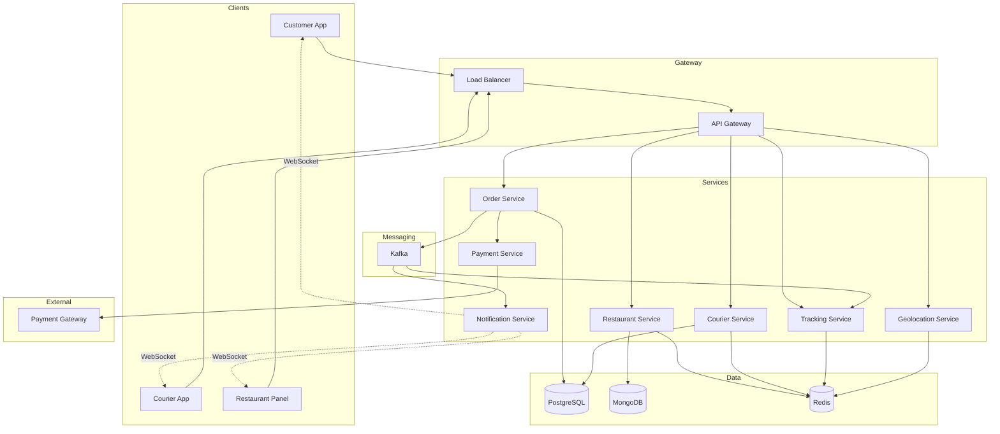
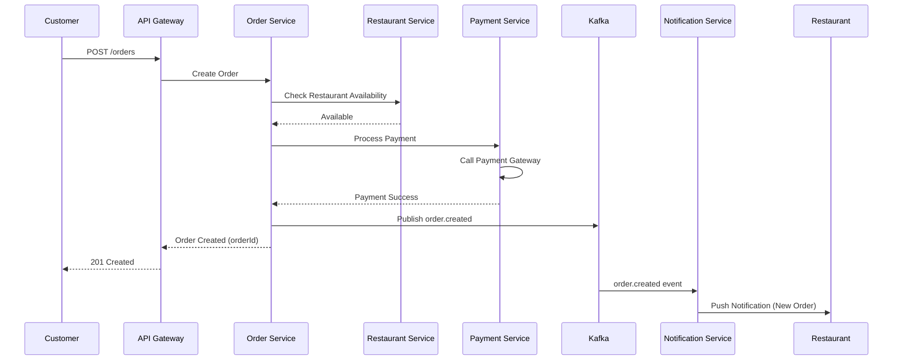
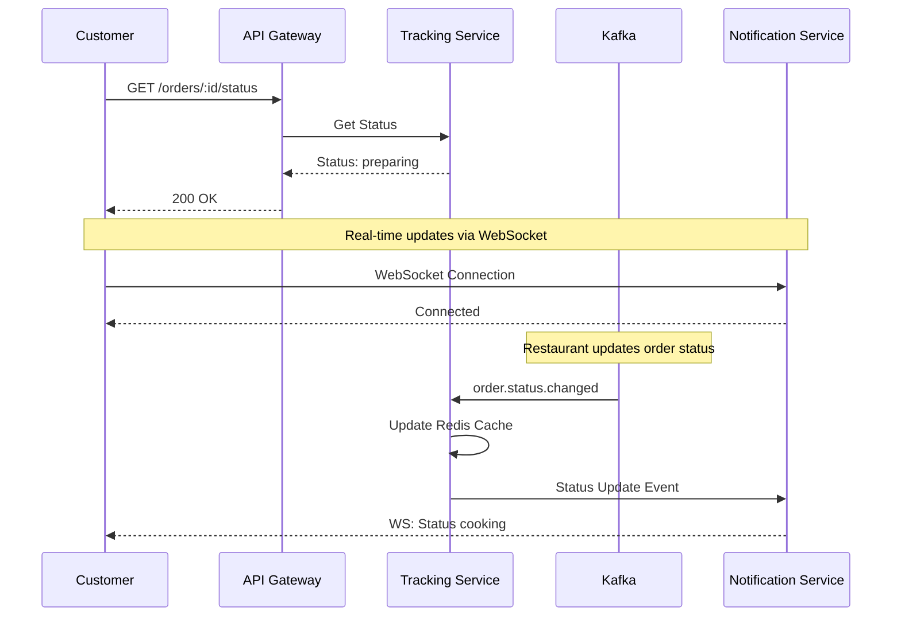
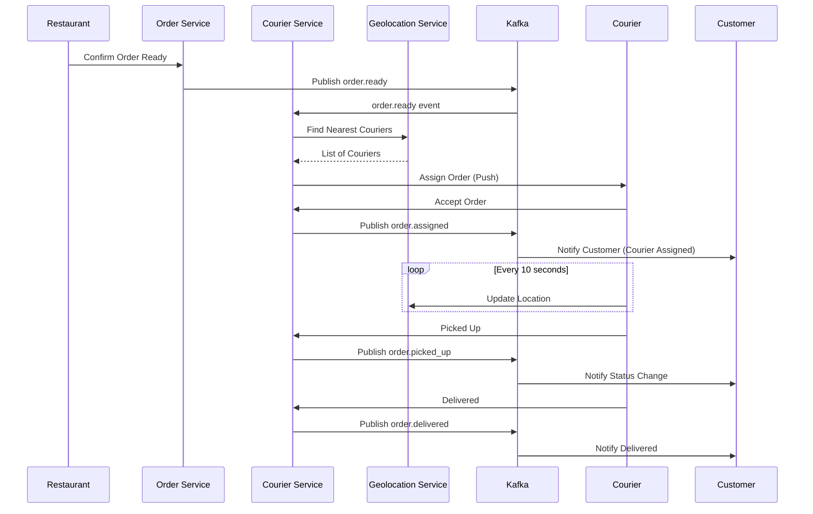
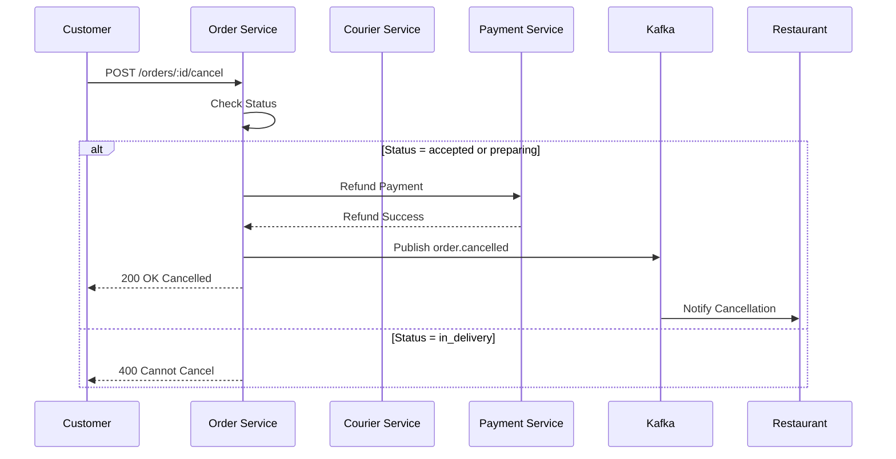

# Food Delivery System Design

Требуется спроектировать систему, которая позволит пользователям заказывать доставку готовой еды из ресторанов. Аналоги известны — Delivery Club, Yandex Eats, Uber Eats.

### Функциональные требования

Система должна позволять реализовать следующие фичи:

- Пользователь может выбрать ресторан и оформить заказ.
- Пользователь может отслеживать статус заказа (принят, готовится, в пути, доставлен).
- Курьеры могут принимать заказы, видеть адреса доставки и отмечать этапы выполнения.
- Рестораны получают уведомления о новых заказах и подтверждают возможность их выполнения.

### Нефункциональные требования

Решение должно обладать следующими архитектурными характеристиками:

- Система должна быть высокодоступной.
- Система должна поддерживать высокую нагрузку в часы пик.
- Обновления статуса заказа должны происходить в реальном времени (максимум 1–2 секунды задержки).
- Мы хотим минимизировать задержки между этапами выполнения заказа (end-to-end latency — не более 5 секунд на обработку транзакции).

### Формализация задачи

В этой задаче мне было бы интересно задать следующие вопросы для уточнения требований:

- Надо ли учитывать аутентификацию пользователей, курьеров и ресторанов?
  — Нет, считаем, что у нас есть базовая система авторизации.
- Нужно ли учитывать оплату заказа?
  — Да, но через внешний платежный шлюз.
- Считаем ли, что пользователи могут отменить заказ?
  — Да, но только до момента, когда курьер принял заказ.
- Нужно ли нам реализовывать рекомендации ресторанов или блюд?
  — Нет, считаем это отдельной задачей.
- Требуется ли нам поддержка геолокации курьеров в реальном времени?
  — Да, хотя с умеренной точностью (обновление координат раз в 10 секунд).

Отдельно зададим вопросы по нагрузке:

- Какое количество активных пользователей?
  — Около 5 млн DAU.
- Какое среднее количество заказов в день?
  — Около 1 млн заказов.
- Какова пиковая нагрузка?
  — До 100 тыс. заказов в час.
- Географическое распределение пользователей?
  — Основные города России, с плотной концентрацией в Москве и Санкт-Петербурге.
- Средний размер данных о заказе?
  — Порядка 5–10 KB.

## Архитектурные решения

### Общая архитектура
Микросервисная архитектура для обеспечения масштабируемости, отказоустойчивости и независимого развертывания компонентов.

### Ключевые компоненты

**API Layer:**
- API Gateway (Kong/AWS API Gateway) - единая точка входа, rate limiting, маршрутизация
- Load Balancer (Nginx) - распределение нагрузки

**Core Services:**
- **Order Service** - создание, управление и валидация заказов
- **Restaurant Service** - каталог ресторанов, меню, доступность
- **Courier Service** - управление курьерами, назначение заказов
- **Tracking Service** - отслеживание статусов в real-time
- **Payment Service** - интеграция с внешним платежным шлюзом
- **Notification Service** - уведомления пользователям, курьерам, ресторанам
- **Geolocation Service** - отслеживание позиций курьеров

**Data Layer:**
- **PostgreSQL** - транзакционные данные (заказы, пользователи, платежи)
- **MongoDB** - каталоги ресторанов и меню (гибкая схема)
- **Redis** - кэширование, сессии, real-time данные, геолокация
- **Redis Geospatial** - хранение координат курьеров

**Messaging & Events:**
- **Apache Kafka** - event streaming для асинхронной обработки, гарантированная доставка событий
- Topics: order-created, order-status-changed, courier-location-updated

**Real-time Communication:**
- **WebSockets** - двунаправленная связь для обновления статусов в реальном времени

### Выбранные технологии

| Компонент | Технология | Обоснование |
|-----------|------------|-------------|
| Backend | Go/Node.js | Высокая производительность, асинхронность |
| API Gateway | Kong | Масштабируемость, плагины |
| Database (OLTP) | PostgreSQL | ACID, надежность для заказов |
| Database (Catalog) | MongoDB | Гибкая схема для меню |
| Cache | Redis | In-memory, low latency, геолокация |
| Message Queue | Apache Kafka | Высокая пропускная способность, durability |
| Real-time | WebSockets | Bidirectional, low latency |
| CDN | CloudFlare/AWS CloudFront | Статика (изображения меню) |

### Масштабирование под нагрузку

**Расчет нагрузки:**
- 1M заказов/день ≈ 12 заказов/сек (средняя)
- Пиковая: 100K заказов/час ≈ 28 заказов/сек
- 5M DAU → поиск ресторанов, меню (read-heavy)

**Стратегии:**
1. **Horizontal Scaling** - реплики сервисов (Order, Restaurant Service)
2. **Database Sharding** - по географическому признаку (города)
3. **Read Replicas** - для PostgreSQL (read-heavy операции)
4. **Caching Strategy**:
   - Redis для каталогов ресторанов (TTL 5 мин)
   - CDN для изображений блюд
   - Cache-aside pattern
5. **Rate Limiting** - защита от DDoS на API Gateway
6. **Circuit Breaker** - изоляция сбоев между сервисами

### Обеспечение real-time обновлений (< 2 сек)

1. **Event-Driven Architecture** - изменение статуса → событие в Kafka
2. **WebSocket Connections** - постоянное соединение с клиентами
3. **Notification Service** подписан на Kafka topics, пушит обновления через WebSockets
4. **Fallback**: Server-Sent Events (SSE) для клиентов без WS

### Обеспечение высокой доступности

1. **Multi-AZ Deployment** - распределение по зонам доступности
2. **Database Replication** - Primary-Replica для PostgreSQL
3. **Kafka Replication Factor** = 3
4. **Health Checks** - автоматический failover
5. **Graceful Degradation** - при недоступности Payment Gateway заказ сохраняется, оплата повторяется

### Геолокация курьеров

- Redis Geospatial (GEOADD, GEORADIUS) - хранение координат
- Обновление каждые 10 сек с клиента курьера
- Поиск ближайших курьеров - O(log N)
- TTL для координат - 30 сек (защита от "зависших" курьеров)

## Верхнеуровневая архитектура



## Основные флоу

### 1. Создание заказа



### 2. Отслеживание статуса заказа



### 3. Назначение и доставка курьера



### 4. Отмена заказа



## Основные сущности и модели данных

### Order (PostgreSQL)
```
id, user_id, restaurant_id, courier_id, status, 
items (JSON), total_amount, delivery_address, 
created_at, updated_at
```

### Restaurant (MongoDB)
```
id, name, description, address, menu (embedded), 
rating, available, opening_hours
```

### Courier (PostgreSQL)
```
id, name, phone, status (available/busy), 
current_order_id, rating
```

### Geolocation (Redis)
```
Key: courier:location
GeoHash: courier_id -> (lat, lng, timestamp)
```

## Мониторинг и метрики

- **Latency**: p50, p95, p99 для всех API endpoints
- **Throughput**: orders/sec, requests/sec
- **Error Rate**: 4xx, 5xx responses
- **Database Performance**: query time, connection pool
- **Kafka Lag**: consumer lag monitoring
- **Business Metrics**: order completion rate, average delivery time

---

**Итого:** Микросервисная архитектура с event-driven подходом обеспечивает масштабируемость (горизонтальное масштабирование сервисов), высокую доступность (репликация БД, multi-AZ), low latency (Redis cache, WebSockets для real-time), и отказоустойчивость (Kafka для гарантированной доставки событий, circuit breakers).

