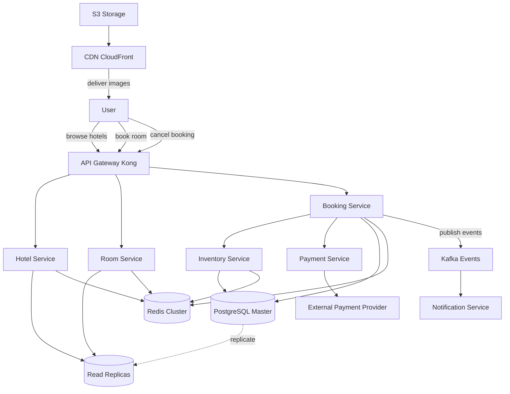
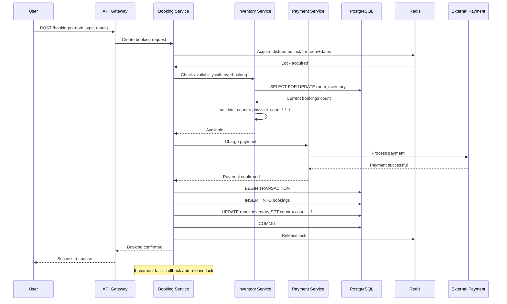
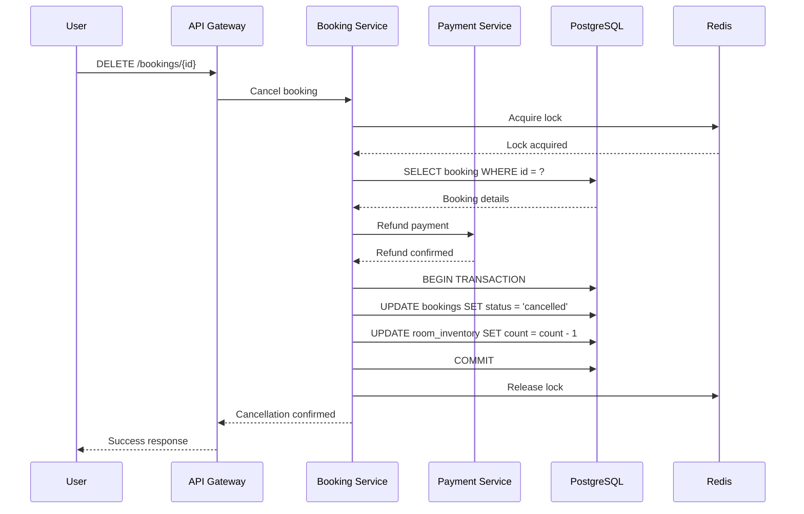
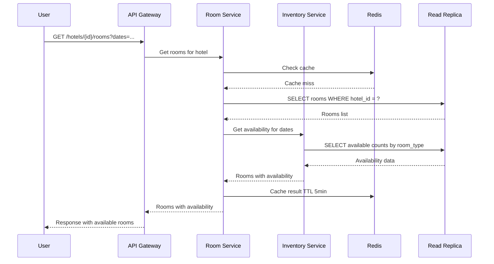

# System Design: Система бронирования отелей
В этой задаче мы будем проектировать систему для бронирования номеров в отелях. Самые крупные игроки ушли с российского рынка и мы решили занять их нишу.

### Функциональные требования

Нам требуется спроектировать сервис, которые позволит реализовать следующие фичи

    Система позволяет пользователю посмотреть информацию по отелю, по номеру (поиск номеров out of scope для задачи)
    Система позволяет пользователям забронировать номер онлайн (оплата в момент бронирования)
    Система позволяет пользователям отменить бронирование
    Система реализует работу с overbooking для бронирования номеров (можно забронировать на 10% больше номеров, чем их есть)

### Нефункциональные требования

Решение должно обладать следующими архитектурными характеристиками

    Система должна обладать свойством высокой доступности
    Система должна поддерживать high concurrency, когда много пользователей одновременно бронируют номера
    Система должна обладать приемлемым latency на бронирование номеров — чем меньше, тем лучше, но при любых раскладах мы должны укладываться в несколько секунд при ответе на запрос бронирования

### Формализация задачи

В этой задаче мне было бы интересно задать следующие вопросы для уточнения требований

    Надо ли нам учитывать аутентификацию и авторизацию клиентов?
    Нет, она тут достаточно типовая и лучше не тратить на нее время
    Надо ли нам проектировать административную панель для сотрудников отелей для управления информацией об отеле, номерах и так далее
    Нет, эта часть нас в данной задаче не интересует
    Мы в задаче выкинули поиск, поэтому можно предполагать, что стандартный сценарий использования выглядит так: посмотреть отель, посмотреть комнаты в отеле, выбрать интервал дат и посмотреть доступные комнаты в этот интервал, а потом забронировать, правильно?
    В целом да — этот путь пользователя нас и интересует
    А что по оплате? Мы же не хотим хранить сами карточную информацию и попадать на соблюдение PCI DSS
    Да, мы можем считать, что у нас есть внешний платежный, через который мы проводим оплату с карты
    А как выглядит сам процесс оплаты? Пользователь каждый раз оплачивает отдельно или мы списываем с привязанной карты?
    Давай для простоты считать, что карта у пользователя привязана и мы должны просто списать с нее деньги

Отдельно зададим вопросы по нагрузке, которые влияют на то как нам потребуется масштабировать нашу систему:

    Какое количество пользователей у нашего сервиса мы ожидаем?
    Давай пойдем не от количества пользователей, а от размера рынка, который мы хотим захватить, а это вся Россия
    Ок, тогда какой размер российского рынка?
    Если ориентироваться на статистику 2021 года по России , то у нас будет порядка 20к отелей и порядка 1M номеров. Предположим, что у нас 60% заполняемость отелей и средняя длительность проживания 3 дня
    Все классно, но для того, чтобы посчитать количество пользователей, что смотрят информацию по отелям и номерам нам надо знать как будет выглядеть воронка переходов по сайт. У нас есть понимание какая она?
    Отличный вопрос. Давай предположим, что воронка выглядит так
    — просмотр страниц номера 100%
    — просмотр страницы букинга и уточнения деталей бронирования 10%
    — успешный букинг 1%
    Наши пользователи географически распределены?
    Они расположены по всей России, преимущественно в ее европейской части
    Сайты бронирования часто работают за счет красивых картинок и видео. Мы понимаем сколько у нас лимиты на видео и картинки в разрезе отелей и комнат?
    Хороший вопрос. Давай считать, что у нас будут пока только картинки и их будет до 100 на отель и до 20 на типовую комнату.
    
## Архитектурные решения

### Основные компоненты

**1. Booking Service**
- Orchestrator процесса бронирования
- Pessimistic locking через SELECT FOR UPDATE для предотвращения race conditions
- Saga pattern для обеспечения консистентности между бронированием и оплатой
- Idempotency keys для защиты от duplicate bookings

**2. Inventory Service**
- Управление доступностью номеров по датам
- Overbooking logic: лимит = физическое количество × 1.1
- Materialized view для быстрой проверки доступности
- Атомарные операции через distributed locks (Redis)

**3. Payment Service**
- Интеграция с внешним платежным провайдером
- Retry механизмы и circuit breaker
- Идемпотентность платежей
- Webhook обработка для асинхронных уведомлений

**4. Hotel/Room Service**
- Read-heavy сервис для информации об отелях и номерах
- Агрессивное кэширование в Redis (TTL 1-24 часа)
- CDN для доставки изображений

**5. Storage Layer**
- PostgreSQL с read replicas для метаданных (отели, номера, бронирования)
- Redis для distributed locks и кэширования
- S3 + CloudFront CDN для изображений (до 100/отель, до 20/номер)

### Ключевые технологии

- **API Gateway**: Kong/Nginx - rate limiting, routing, auth
- **Backend**: Go/Java - high concurrency, strong typing
- **Database**: PostgreSQL + Read Replicas - ACID, isolation levels
- **Cache/Locks**: Redis Cluster - distributed locking, caching
- **Message Queue**: Kafka - асинхронная обработка событий
- **CDN**: CloudFront/Cloudflare - доставка изображений
- **Monitoring**: Prometheus + Grafana + Jaeger tracing

### Обработка race conditions и overbooking

**Pessimistic Locking:**
```sql
BEGIN;
SELECT available_count FROM room_inventory 
WHERE room_type_id = ? AND date >= ? AND date <= ?
FOR UPDATE;
-- проверка доступности с учетом overbooking
-- создание бронирования
COMMIT;
```

**Overbooking Logic:**
- Для каждого типа номера: max_bookings = physical_count × 1.1
- Проверка: current_bookings < max_bookings
- Separate tracking для физических и overbooked номеров

**Распределенные блокировки:**
- Redis SETNX для атомарной блокировки конкретного типа номера и дат
- TTL на lock для автоматического освобождения при сбоях

### Обоснование NFR

**Высокая доступность:**
- Multi-AZ deployment сервисов
- PostgreSQL master-slave replication (sync для bookings, async для reads)
- Redis Sentinel/Cluster для failover
- Health checks и auto-restart

**High Concurrency:**
- Stateless сервисы с горизонтальным масштабированием
- Connection pooling для БД
- Pessimistic locks + row-level locking
- Partition по hotel_id для снижения lock contention

**Низкая Latency:**
- Read replicas для просмотра информации
- Redis кэширование популярных отелей и номеров
- CDN для изображений (edge locations по России)
- Database indexes на critical queries
- Async processing для некритичных операций

## Архитектурная диаграмма



## Sequence диаграммы

### Бронирование номера



### Отмена бронирования



### Просмотр доступных номеров



## Масштабирование и оптимизация

**При росте нагрузки:**
- Горизонтальное масштабирование всех сервисов
- Партиционирование БД по hotel_id для снижения contention
- Увеличение read replicas для read-heavy операций
- Regional deployment для снижения latency
- Dedicated clusters для hot hotels

**Database оптимизации:**
- Indexes: (hotel_id, date), (room_type_id, date), (user_id, created_at)
- Partitioning bookings table по датам
- Materialized views для популярных запросов
- Archive старых бронирований (> 1 год)

**Метрики:**
- Booking success rate
- Payment processing latency (p95, p99)
- Lock acquisition time
- Database connection pool saturation
- Cache hit ratio
- Overbooking utilization rate

