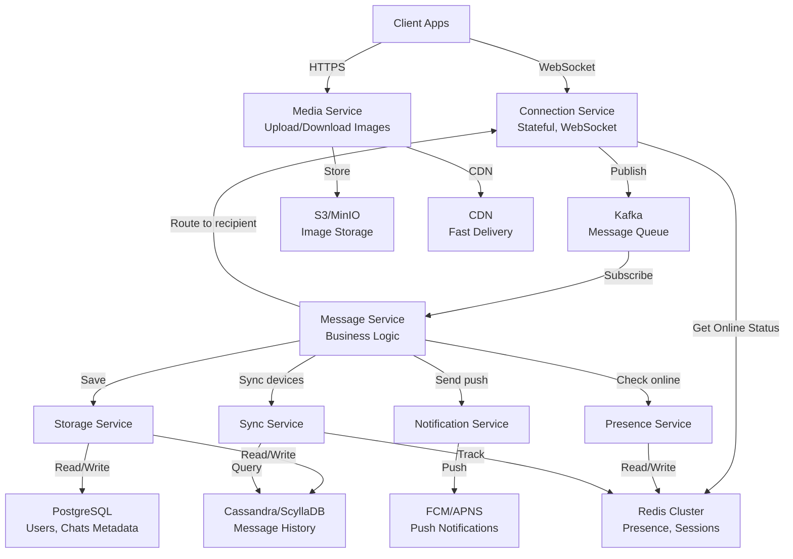
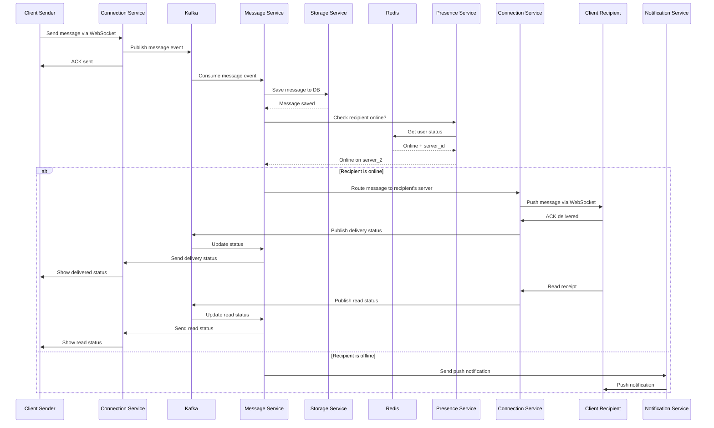
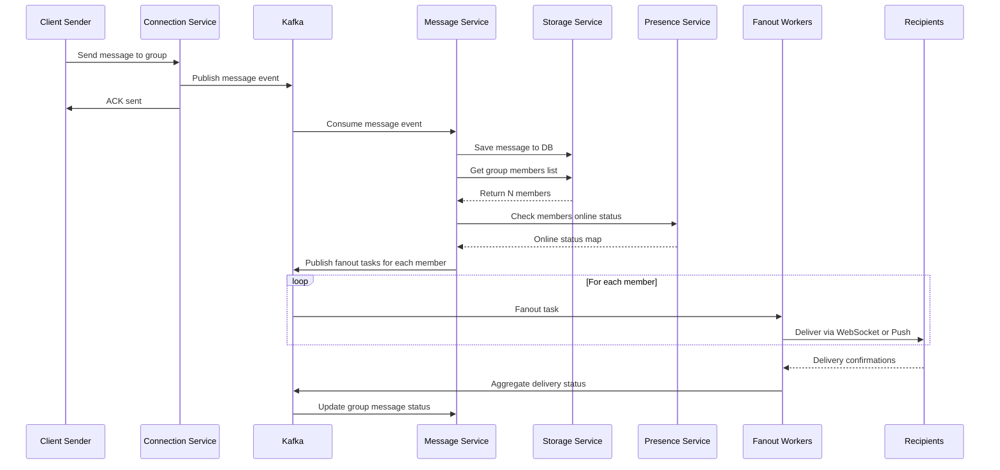
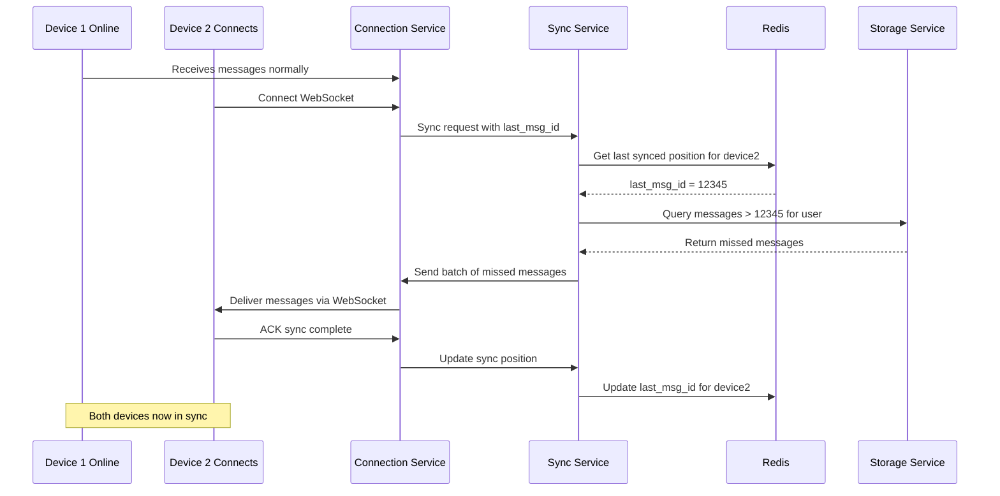
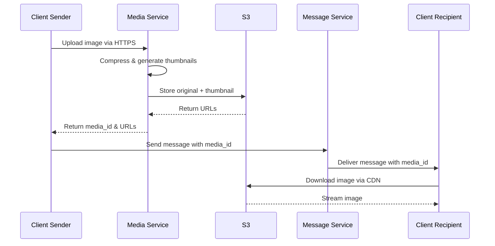

# Система обмена сообщениями в реальном времени

Требуется спроектировать систему для обмена сообщениями в реальном времени между пользователями. Аналоги — WhatsApp, Telegram, Signal.

### Функциональные требования

Система должна позволять реализовать следующие фичи:

- Пользователи могут отправлять и получать текстовые сообщения в диалогах и групповых чатах.
- Система должна обеспечивать доставку сообщений в реальном времени.
- Пользователи должны иметь возможность видеть статус сообщений (“доставлено”, “прочитано”).
- Сообщения должны храниться и быть доступны после повторного входа пользователя.
- Система должна поддерживать синхронизацию сообщений между несколькими устройствами одного пользователя.

### Нефункциональные требования

Решение должно обладать следующими архитектурными характеристиками:

- Высокая доступность.
- Минимальная задержка при доставке сообщений (в идеале < 100 мс при стабильном соединении).
- Система должна поддерживать масштабирование до десятков миллионов активных соединений.
- Сообщения должны храниться с учётом требований к конфиденциальности и безопасности.

### Формализация задачи

В этой задаче мне было бы интересно задать следующие вопросы для уточнения требований:

- Нужно ли учитывать аутентификацию пользователей?
  — Нет, считаем, что она реализована отдельно.
- Должна ли система поддерживать передачу медиафайлов (изображений, видео)?
  — Да, но только изображений, видео оставляем вне рамок задачи.
- Должны ли сообщения быть зашифрованы?
  — Да, end-to-end шифрование желательно.
- Нужно ли хранить историю сообщений бессрочно?
  — Да, удаление сообщений — отдельная задача.
- Нужно ли поддерживать push-уведомления для офлайн-пользователей?
  — Да, с использованием внешнего push-сервиса.

Отдельно зададим вопросы по нагрузке:

- Сколько у нас пользователей?
  — 50 млн зарегистрированных, 10 млн DAU.
- Сколько сообщений в день?
  — В среднем 500 млн сообщений в день.
- Средний размер сообщения?
  — Около 1 KB для текста и 100 KB для изображений.
- Географическое распределение пользователей?
  — В основном Россия и СНГ, но с небольшим процентом зарубежных пользователей.
- Среднее количество активных соединений одновременно?
  — 2–3 млн.

## Архитектурные решения

### Ключевые компоненты

**Connection Service** - управление WebSocket соединениями для real-time коммуникации. Stateful сервис, горизонтально масштабируется, каждый инстанс держит 100-150K соединений.

**Message Service** - обработка бизнес-логики сообщений (валидация, обогащение, маршрутизация). Stateless, легко масштабируется.

**Storage Service** - абстракция над БД для работы с сообщениями и чатами.

**Media Service** - обработка и хранение изображений (сжатие, генерация превью).

**Presence Service** - отслеживание онлайн статусов пользователей через Redis.

**Notification Service** - отправка push-уведомлений оффлайн пользователям.

**Sync Service** - синхронизация сообщений между устройствами пользователя.

### Технологический стек

**Real-time коммуникация**: WebSocket (протокол для bidirectional связи с клиентами)

**Message Broker**: Apache Kafka - для асинхронной обработки, гарантии доставки, буферизации нагрузки

**Основная БД**: Cassandra/ScyllaDB - write-optimized, линейная масштабируемость, хранение истории сообщений. Партиционирование по chat_id + timestamp.

**Кэш/Session Store**: Redis Cluster - онлайн статусы, маппинг user → connection_server, кэш недавних сообщений

**Объектное хранилище**: S3/MinIO - хранение изображений с CDN для быстрой доставки

**Search**: Elasticsearch (опционально) - поиск по истории сообщений

### Ключевые решения

**Масштабирование соединений**: Connection Service шардируется горизонтально. Redis хранит маппинг user_id → connection_server_id для быстрой маршрутизации.

**Доставка сообщений**: 
- Online юзеры: WebSocket push через Connection Service
- Offline юзеры: Push-уведомления + сообщения хранятся в БД для последующей синхронизации

**Статусы сообщений**: 
- "sent" - сохранено в БД
- "delivered" - доставлено на устройство
- "read" - прочитано пользователем
Статусы отправляются через отдельные acknowledgment сообщения в Kafka.

**Групповые чаты**: Fan-out on write - Message Service отправляет N копий сообщения для каждого участника группы. Для больших групп (>100 участников) используется fan-out on read.

**End-to-end шифрование**: Клиенты шифруют/дешифруют сообщения локально. Сервер хранит зашифрованный payload, не имеет доступа к ключам.

**Синхронизация устройств**: Sync Service отслеживает последний синхронизированный message_id для каждого устройства. При подключении устройство получает дельту.

**Гарантия доставки**: At-least-once delivery через Kafka с idempotency keys для дедупликации на клиенте.

### Fan-out стратегии для групповых чатов

```mermaid
graph TB
    subgraph "Fan-out on Write - Малые группы до 100 чел"
        U1[User отправляет<br/>в группу 50 чел]
        MS1[Message Service]
        Q1[Kafka Queue]
        T1[50 задач доставки]
        CS1[Connection Service]
        R1[50 получателей<br/>WebSocket push]
        
        U1 --> MS1
        MS1 -->|Создает 50 задач| Q1
        Q1 --> T1
        T1 --> CS1
        CS1 --> R1
        
        style MS1 fill:#90EE90
        style T1 fill:#FFB6C6
    end
    
    subgraph "Fan-out on Read - Большие каналы 1000+ чел"
        U2[User отправляет<br/>в канал 10K подписчиков]
        MS2[Message Service]
        DB2[Cassandra<br/>1 запись]
        PS2[Redis Pub/Sub<br/>Lightweight notify]
        CS2[Connection Service]
        CL2[Клиенты online]
        HTTP2[HTTP GET /messages]
        
        U2 --> MS2
        MS2 -->|1 сохранение| DB2
        MS2 -->|1 событие| PS2
        PS2 -->|notify| CS2
        CS2 -->|WebSocket: has_new=true| CL2
        CL2 -->|Запрашивают при необходимости| HTTP2
        HTTP2 --> DB2
        
        style MS2 fill:#90EE90
        style DB2 fill:#87CEEB
        style PS2 fill:#FFD700
    end
```

**Сравнение подходов:**

| Критерий | Fan-out on Write | Fan-out on Read |
|----------|------------------|-----------------|
| Записей в БД | N (по одной на юзера) | 1 (на chat_id) |
| Задач в очереди | N задач доставки | 1 pub/sub событие |
| Нагрузка на очередь | Высокая при росте группы | Константная |
| Latency online | Минимальная (push) | Чуть выше (pull) |
| Offline push | Да, всем | Нет (только каналы) |
| Масштабируемость | До ~1K участников | До миллионов |

### Масштабирование и производительность

**Расчеты**:
- 500M сообщений/день ≈ 6K msg/sec (средний), 20-30K msg/sec (пик)
- 2-3M одновременных соединений → 20-30 инстансов Connection Service
- Storage: 500M × 1KB × 365 дней ≈ 180TB/год (текст), compressed ≈ 50-70TB/год

**Оптимизации**:
- Batching сообщений в Kafka для снижения latency
- Кэширование последних сообщений чата в Redis (последние 100-200 сообщений)
- Сжатие текстовых сообщений (gzip/lz4)
- CDN для медиафайлов
- Connection pooling между внутренними сервисами

## Архитектура системы

## Основные флоу

### 1. Отправка сообщения в диалог (1-1 chat)

### 2. Отправка сообщения в групповой чат

### 3. Синхронизация между устройствами

### 4. Отправка изображения

## Обеспечение требований

**Высокая доступность**: Все сервисы stateless (кроме Connection), multi-AZ deployment, Kafka replication, Cassandra replication factor 3.

**Низкая latency (<100ms)**: WebSocket для real-time, Redis для быстрого lookup, кэширование, geographic distribution Connection Service.

**Масштабирование**: Горизонтальное масштабирование всех компонентов, шардирование БД, Connection Service масштабируется по числу соединений.

**Безопасность**: E2E шифрование, TLS для транспорта, хранение только зашифрованных данных, rate limiting, DDoS protection.

