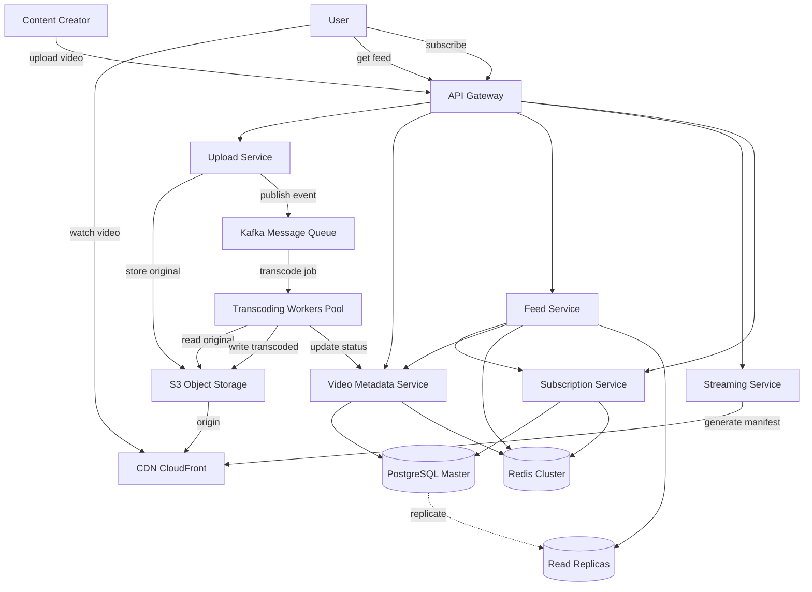
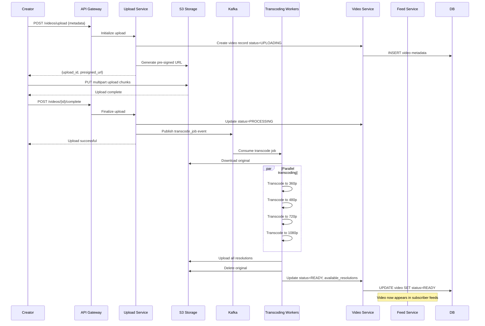
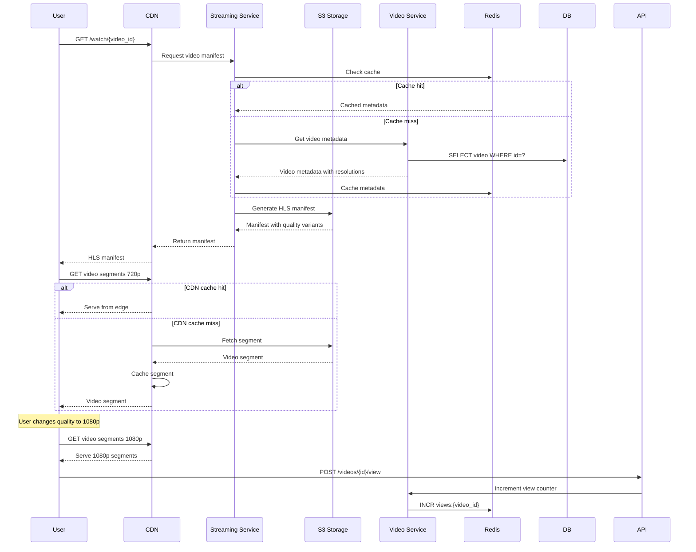
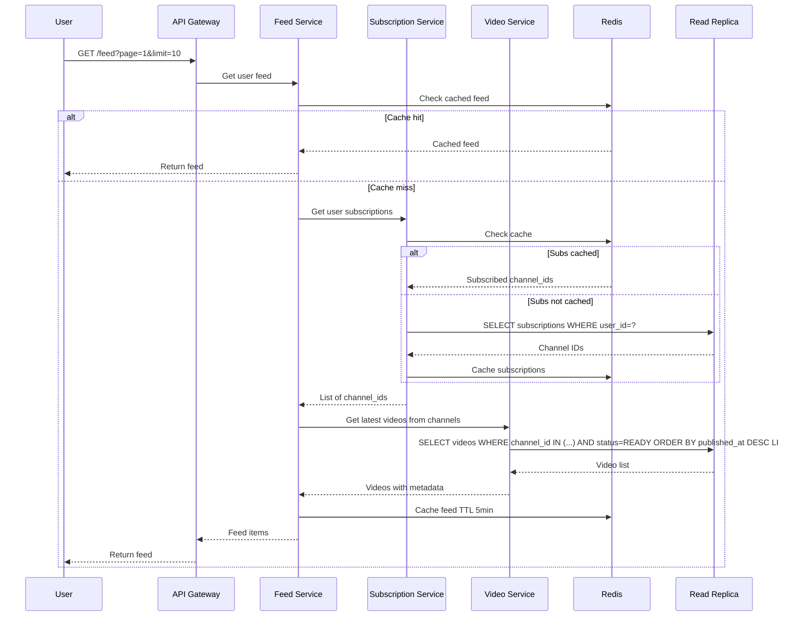

# System Design: Видеохостинг

Требуется спроектировать приложение, которое будет позволять загружать видео создателям контента и просматривать это видео всем остальным. Аналоги всем известны.

### Функциональные требования

Нам требуется спроектировать сервис, которые позволит реализовать следующие фичи

    Система должна позволять создателям каналов быстро заливать видео
    Видео должно по готовности попадать в ленты подписчиков каналов
    Зрители должны иметь возможность поменять качество видео при просмотре

### Нефункциональные требования

Решение должно обладать следующими архитектурными характеристиками

    Система должна обладать высокой доступностью
    Система должна быть масштабируемой и отказоустойчивой
    Мы должны по возможности обеспечить низкие затраты на инфраструктуру сервиса

### Формализация задачи

В этой задаче мне было бы интересно задать следующие вопросы для уточнения требований (ответы интервьюера я буду отмечать курсивом)

    Надо ли нам учитывать аутентификацию и авторизацию клиентов?
    Нет, она тут достаточно типовая и лучше не тратить на нее время
    Можем ли мы использовать внешние сервисы, например, CDN для раздачи контента?
    Да, можем, если обоснуем зачем они нам нужны и как мы будем с ними взаимодействовать. Конкретно по поводу CDN могу сказать, что создание полноценной CDN тянет на отдельную задачу по System Design
    Будем ли мы глубоко копать в транскодирование видео?
    Нет не будем, так как это уже достаточно специфичный домен и у нас нет цели проверять у всех кандидатов их знания
    В какие разрешения нам стоит конвертировать видео?
    Допустим в 360, 480, 720, 1080
    Оригинальное видео сохраняем после всех конвертаций или нет?
    Оригинальное видео будем удалять после всех конвертаций
    Видео должно становиться доступным у подписчиков когда все разрешения готовы или хотя бы одно?
    Видео будет становиться доступным после того, как все разрешения будут подготовлены
    Ленты подписчиков формируются умным образом или это просто последние видео, добавленные авторами, на которых мы подписаны
    Пускай ленты в нашем случае будут простыми с сортировкой по времени от самых последних к самым ранним, ленту мы будем получать порциями по 10 элементов

Отдельно зададим вопросы по нагрузке, которые влияют на то как нам потребуется масштабировать нашу систему:

    Какое количество пользователей у нашего сервиса мы ожидаем?
    DAU (Daily Active Users) нашего сервиса будет 10 mln
    Наши пользователи географически распределены?
    Да, они расположены в разных регионах
    Сколько видео в день будут смотреть наши пользователи?
    В среднем 10 видео в день
    Сколько видео в день будет загружаться
    В среднем пользователи загружают по 0.1 видео в день
    Какой средний размер видео будет загружаться в наш сервис?
    Средний размер видео будет 300 Mb
    Как часто пользователи будут запрашивать свой feed с видео?
    В среднем 5 раз в день
    Сколько храним загруженное видео
    Время хранения не ограничено сверху

## Архитектурные решения

### Основные компоненты

**1. Upload Service**
- Multipart upload для больших файлов (чанки по 10-20MB)
- Resumable uploads для надежности
- Прямая загрузка в Object Storage через pre-signed URLs
- Генерация upload_id и инициация transcoding pipeline

**2. Transcoding Service**
- Асинхронная обработка через message queue
- Параллельное транскодирование в разные разрешения (360p, 480p, 720p, 1080p)
- Использование специализированных воркеров (ffmpeg, GPU acceleration)
- Удаление оригинала после успешного транскодирования
- Отказоустойчивость: retry механизмы, dead letter queue

**3. Video Metadata Service**
- CRUD операции для метаданных видео (title, description, channel_id, upload_date)
- Хранение статусов: UPLOADING → PROCESSING → READY
- Tracking доступных разрешений для каждого видео
- View counters, likes, comments (out of scope детали)

**4. Feed Service**
- Генерация ленты подписок: последние видео от каналов, на которые подписан пользователь
- Пагинация по 10 элементов, сортировка по дате публикации
- Fan-out on read: при запросе собираем ленту из видео подписок
- Кэширование лент популярных пользователей (Redis)

**5. Streaming Service**
- Adaptive bitrate streaming (HLS/DASH)
- Генерация манифестов с разными качествами
- Поддержка переключения качества на лету

**6. Subscription Service**
- Управление подписками пользователей на каналы
- Fast lookups: кто на кого подписан

**7. Storage Layer**
- **Object Storage (S3)**: хранение оригиналов и транскодированных видео
- **PostgreSQL**: метаданные видео, каналов, пользователей, подписок
- **Redis**: кэширование лент, метаданных популярных видео, view counters
- **Message Queue (Kafka/RabbitMQ)**: асинхронная обработка транскодирования

**8. CDN**
- Географически распределенная раздача видео контента
- Кэширование популярных видео на edge локациях
- Снижение latency и нагрузки на origin
- Cost optimization: меньше egress traffic из S3

### Ключевые технологии

- **API Gateway**: Nginx/Kong - routing, rate limiting, auth
- **Backend**: Go/Python - Upload/Metadata сервисы
- **Transcoding**: FFmpeg на воркерах (CPU/GPU), автомасштабирование
- **Database**: PostgreSQL + Read Replicas - метаданные, подписки
- **Cache**: Redis Cluster - ленты, hot metadata, counters
- **Queue**: Kafka - транскодирование pipeline, event streaming
- **Storage**: S3-compatible object storage - видео файлы
- **CDN**: CloudFront/Cloudflare - global content delivery
- **Streaming**: HLS/DASH протоколы
- **Monitoring**: Prometheus + Grafana + distributed tracing

### Оптимизации для NFR

**Высокая доступность:**
- Multi-region deployment для критичных сервисов
- PostgreSQL master-replica setup с автоматическим failover
- Redis cluster с репликацией
- S3 с cross-region replication для критичного контента
- Health checks и автоматический restart

**Масштабируемость:**
- Stateless микросервисы с горизонтальным масштабированием
- Автоскейлинг transcoding воркеров по длине очереди
- Database sharding по channel_id при необходимости
- Партиционирование таблиц по времени
- CDN edge caching снижает нагрузку на origin

**Отказоустойчивость:**
- Retry механизмы с exponential backoff
- Circuit breakers для внешних зависимостей
- Dead letter queues для failed jobs
- Graceful degradation: если transcoding не готов, показываем статус
- Multi-AZ deployment

**Низкие затраты:**
- CDN кэширование снижает egress из S3 (основная статья расходов)
- Удаление оригиналов после транскодирования (экономия 300TB/день)
- Object Storage lifecycle policies: архивирование редко просматриваемых видео в Glacier
- Spot instances для transcoding воркеров (до 70% экономии)
- Сжатие видео с оптимальными bitrate для каждого разрешения

## Архитектурная диаграмма

## Sequence диаграммы

### Загрузка видео

### Просмотр видео

### Получение ленты

## Масштабирование и метрики

**При росте нагрузки:**
- Горизонтальное масштабирование всех stateless сервисов
- Увеличение transcoding workers pool (auto-scaling)
- Database sharding по channel_id или video_id ranges
- Региональное разворачивание для снижения latency
- Использование multiple CDN providers

**Database оптимизации:**
- Indexes: (channel_id, published_at), (user_id, created_at), (status)
- Partitioning videos table по датам (monthly)
- Separate DB для аналитики (ClickHouse)
- Archive старых метрик

**CDN стратегия:**
- Популярные видео cache на edge максимально долго
- Редкие видео - pull from origin по запросу
- Разные TTL для разных тиров контента

**Ключевые метрики:**
- Upload success rate и время загрузки (p95, p99)
- Transcoding queue length и processing time
- Video startup time и buffering rate
- CDN cache hit ratio (target >90%)
- Feed generation latency
- Storage costs per TB
- Egress traffic costs

