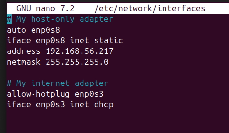
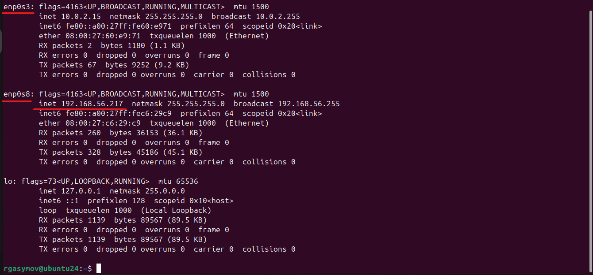
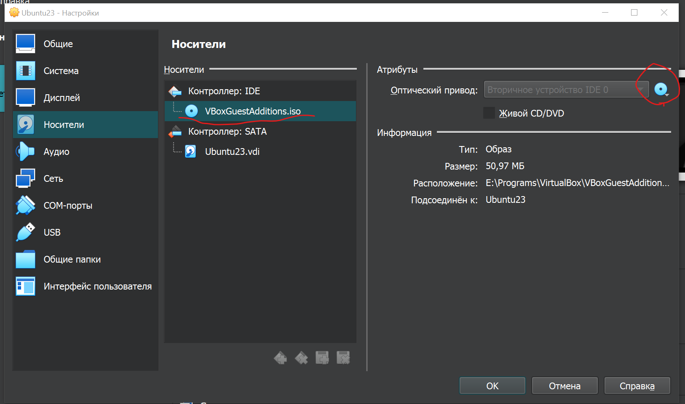

# Настройки БД и VM VirtualBox

### Настройка сети виртуалки
+ Настраиваем сеть с динамическим IP для доступа в интернет из гостевой ОС.
    + Добавляем сетевой адаптер 1 типа NAT в настройках виртуалки
    + Находим в ubuntu название сетевого порта этого адаптера через `ifconfig` - у меня появился под именем `enp0s3`
    + Открываем файл командой ```sudo nano /etc/network/interfaces``` и добавляем (см. [ubuntu_interfaces.png](ubuntu_interfaces.png)):
        ```
        # My internet adapter
        allow-hotplug enp0s3
        iface enp0s3 inet dhcp
        ```
    + Применяем изменения адаптера 1 командой ```ifup enp0s3```
    + Перезапускаем Ubuntu командой ```reboot```

+ Настраиваем сеть со статическим IP для доступа с машины-хоста.
    + В настройках виртуальных сетей VirtualBox создаем сеть `VirtualBox Host-Only Ethernet Adapter` - см. [vm_net_settings.png](vm_net_settings.png)
    + В ее свойствах указываем IP 192.168.56.1, dhcp отключаем
    + Для нашей ВМ добавляем сетевой адаптер 2 типа `Виртуальный адаптер хоста` под именем `VirtualBox Host-Only Ethernet Adapter`
    + Находим в ubuntu название сетевого порта этого адаптера через `ifconfig` - у меня появился под именем `enp0s8`
    + В ubuntu настраиваем для него IP 192.168.56.217 (или другой, но больше 192.168.56.1). Открываем файл командой ```sudo nano /etc/network/interfaces``` и добавляем (см. [ubuntu_interfaces.png](ubuntu_interfaces.png)):
        ```
        # My host-only adapter
        auto enp0s8
        iface enp0s8 inet static
        address 192.168.56.217
        netmask 255.255.255.0
        ```
    + Применяем изменения адаптера 2 командой ```ifup enp0s8```
    + Перезапускаем Ubuntu командой ```reboot```

+ Настраиваем сеть для одновременной работы адаптеров 1 и 2. Открываем файл командой ```sudo nano /etc/netplan/00-installer-config.yaml``` (название файла может отличаться) и редактируем:
  ```yaml
  # This is the network config written by 'subiquity'
  network:
    ethernets:
      enp0s3: #This is your network adapter attached to NAT
        dhcp4: yes
        dhcp4-overrides:
          use-dns: false
        nameservers:
          addresses: #Below I chose to use google as the DNS servers. You can choose other DNS servers if you'd like.
            - 8.8.8.8
            - 8.8.4.4
      enp0s8: #This is your network adapter attached to Host-only
        dhcp4: no
        addresses: [192.168.56.217/24] #This is the static IP
        routes:
          - to: default
            via: 192.168.56.1 #This is the IP from VirtualBox Host-Only Ethernet Adapter
            metric: 100
    version: 2
  ```
  + Вызываем команды `sudo netplan generate` и `sudo netplan apply`
  + На всякий случай выполнить команды: 
  ```bash
  sudo systemctl disable systemd-resolved.service
  sudo systemctl stop systemd-resolved.service
  sudo rm /etc/resolv.conf
  # Add a manually created resolv.conf in /etc/
  sudo nano /etc/resolv.conf
  # Add this line to the new file:
  nameserver 8.8.8.8
  ```
  + Перезапускаем Ubuntu командой ```reboot```

Примечание 1. В ubuntu названия сетевых портов (`enp0s3`, `enp0s8` …) привязаны к адаптерам виртуалки, т.е. Адаптер1 - `enp0s3`, Адаптер2 - `enp0s8` и т.д. - см. [ubuntu_ifconfig.png](ubuntu_ifconfig.png)

+ Проверяем файл ```/etc/network/interfaces``` - должно быть примерно как на [ubuntu_interfaces.png](ubuntu_interfaces.png):
<div></div>

+ Проверяем командой `ifconfig` - должно выглядеть как на [ubuntu_ifconfig.png](ubuntu_ifconfig.png) после выполнение всех настроек выше:
<div></div>

+ Проверить работу адаптера 1 можно командой `ping google.com`, а адаптера 2 - подключением по SSH из хост-машины (см. [подключение к виртуалке по SSH](#подключение-к-виртуалке-по-ssh)) 


### Настройка буфера обмена и общей директории
1. Включить в настройках виртуальной машины
2. Чтобы заработало, необходимо подключить диск VBoxGuestAdditions.iso (обычно лежит в папке установки VirtualBox, например E:\Programs\VirtualBox)

3. Затем запустить ВМ и выполнить установку с диска командой: `sudo rcvboxadd setup`. 
4. Для доступа к общей директории выполнить: `sudo adduser $USER vboxsf`

[Подробная дока от Oracle](https://www.virtualbox.org/manual/ch04.html#additions-linux)


### Подключение к виртуалке по SSH
1. Настраиваем сеть виртуалки: добавляем host-only adapter, прописываем ему ip, например 192.168.56.217 (см. [выше](#настройка-сети-виртуалки))
1. Устанавливаем SSH сервер в Ubuntu командой: `sudo apt install openssh-server`
1. Включаем его: `sudo systemctl enable ssh`
1. Открываем порт для firewall: `sudo ufw allow ssh`
1. Запускаем: `sudo systemctl start ssh`
1. Подключаемся из хост-машины: `ssh rgasymov@192.168.56.217`


### Настройка mysql на Ubuntu для подлкючения с удаленной машины (или с локальной к виртуалке)
+ Изменяем адреса которые будет слушать mysql в файле в секции [mysqlid]:
```
sudo nano /etc/mysql/my.cnf
```
если там нет такой секции, то в файле:
```
/etc/mysql/mysql.conf.d/mysqld.cnf
```
Вместо: 
```
bind-address=127.0.0.1
```
Вписываем: 
```
bind-address=0.0.0.0
```

И в файле ```/etc/mysql/mysql.conf.d/mysqld.cnf``` добавляем строку:
```
skip-grant-tables
```
Перезагружаем: ```service mysql restart```
+ Чтобы подключиться из вне нам необходим ip виртаулки (можно посмотреть командой ifconfig), порт mysql (по умолчанию 3306) и созданные имя пользователя+пароль


### Настройка postgres на Ubuntu для подлкючения с удаленной машины (или с локальной к виртуалке)
Раскоментить и заменить в файле (9.5 – это версия постгреса):
```
sudo nano /etc/postgresql/9.5/main/postgresql.conf
```
строку:
```listen_addresses = '*'```

Изменяем права для пользователей в файле:
```
sudo nano /etc/postgresql/9.5/main/pg_hba.conf
```
Вместо: 
```
# IPv4 local connections:
host    all             all             127.0.0.1         md5
```
Вписываем: 
```
# IPv4 local connections:
host    all             all             0.0.0.0/0         md5
```

В процессе установки был создан аккаунт пользователя Ubuntu с именем postgres.
Создаем пользователя БД:
```
sudo -i -u postgres
createuser -s -r -d -P admin
4 # это пароль
Exit
```
Перезагружаем: ```service postgresql restart```
+ Чтобы подключиться из вне нам необходим ip виртаулки (можно посмотреть командой ifconfig), порт постгреса (по умолчанию 5432) и созданные имя пользователя+пароль (в примере это – admin, 4)

Теперь можно подключаться удаленно к БД  - см. [postgres_connect.jpg](postgres_connect.jpg)
+ Имя/адрес сервера - ip настроенный в ubuntu
+ Порт - порт postgres (по умолчанию 5432, можно изменить в файле ```/etc/postgresql/9.5/main/postgresql.conf```)

### Проверка в какой кодировке таблицы в mysql
```mysql
SELECT
  `tables`.`TABLE_NAME`,
  `collations`.`character_set_name`
FROM
  `information_schema`.`TABLES` AS `tables`,
  `information_schema`.`COLLATION_CHARACTER_SET_APPLICABILITY` AS `collations`
WHERE
  `tables`.`table_schema` = DATABASE()
  AND `collations`.`collation_name` = `tables`.`table_collation`;
```
